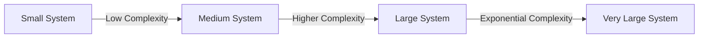
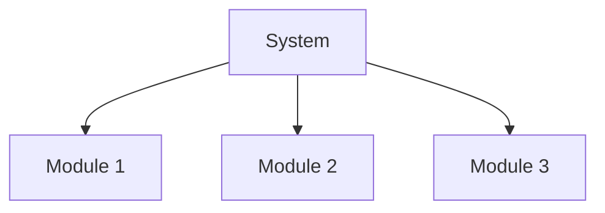
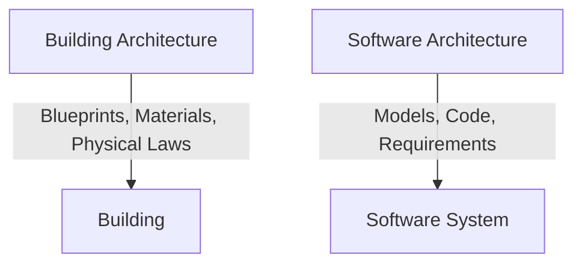
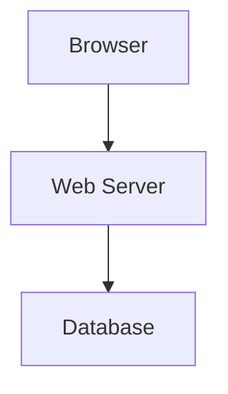

# Lecture 1: The Big Idea

## Table of Contents
1. The Origins
2. Software Engineering Difficulties
   - Accidental Difficulties
   - Essential Difficulties
3. Complexity
4. Conformity
5. Changeability
6. Intangibility
7. Promising Attacks on Complexity
8. Primacy of Design
9. Analogy: Architecture of Buildings
   - Some Obvious Parallels
   - Deeper Parallels
   - More About Architecture
   - Limitations of Analogy
   - Power of Architecture
10. Architecture in Action
    - WWW
    - WWW in a (Big) Nutshell
    - WWW's Architecture
    - Desktop
    - Product Line
    - The Necessity and Benefit of PLs
    - Reuse as the Big Win
    - Added Benefit: Product Population
    - The Centerpiece: Architecture
11. Summary

---

## 1. The Origins
- Software engineering emerged to address the "software crisis"—projects were late, over budget, and unreliable.
- Early software was simple, but as systems grew, so did the challenges.

## 2. Software Engineering Difficulties
### Accidental Difficulties
- Issues arising from current technology, tools, or languages.
- Example: Learning a new programming language, setting up build tools.

### Essential Difficulties
- Inherent to the nature of software itself.
- Examples: Managing complexity, requirements ambiguity, change over time.

## 3. Complexity
- Software systems are among the most complex human-made artifacts.
- Complexity grows non-linearly with system size.
- **Diagram:**

## 4. Conformity
- Software must conform to external realities (laws, standards, legacy systems).
- Unlike physical systems, software is shaped by arbitrary rules and exceptions.

## 5. Changeability
- Software is expected to change more than physical artifacts.
- Requirements evolve, bugs are fixed, environments change.

## 6. Intangibility
- Software is invisible and abstract—no physical form.
- Hard to visualize, measure, or manage compared to hardware.

## 7. Promising Attacks on Complexity
- **Abstraction:** Hiding details to focus on high-level concepts.
- **Modularization:** Breaking systems into manageable parts.
- **Hierarchy:** Organizing modules in layers.
- **Modeling:** Using diagrams (UML, flowcharts) to visualize structure and behavior.

**Diagram: Modularization Example**

## 8. Primacy of Design
- Good design is the key to managing complexity and ensuring quality.
- Design decisions have long-term impact on maintainability, scalability, and performance.

## 9. Analogy: Architecture of Buildings
### Some Obvious Parallels
- Both require planning, design, and construction.
- Both have stakeholders (users, builders, owners).

### Deeper Parallels
- Both use blueprints/diagrams to communicate structure.
- Both must balance function, aesthetics, and constraints.

### More About Architecture
- Architecture defines the high-level structure and relationships of components.
- Sets the foundation for detailed design and implementation.

### Limitations of Analogy
- Software is more flexible and changeable than buildings.
- Software can be copied at zero cost; buildings cannot.
- Software requirements change more frequently.

### Power of Architecture
- Good architecture enables reuse, scalability, and adaptability.
- Poor architecture leads to technical debt and rigidity.

**Diagram: Software vs. Building Architecture**

## 10. Architecture in Action
### WWW (World Wide Web)
- A global system of interconnected documents and resources.

#### WWW in a (Big) Nutshell
- Uses HTTP protocol, URLs, and browsers to access information.
- Decentralized, scalable, and robust.

#### WWW's Architecture
- **Client-Server Model:** Browsers (clients) request resources from web servers.
- **Layers:** Presentation (HTML/CSS), Application (Web servers), Data (Databases).

**Diagram: WWW Architecture**

### Desktop
- Standalone applications running on personal computers.
- Examples: Word processors, spreadsheets.

### Product Line (PL)
- A set of related products sharing common architecture and components.
- Example: Microsoft Office suite (Word, Excel, PowerPoint).

#### The Necessity and Benefit of PLs
- Reduces development time and cost.
- Ensures consistency and quality across products.

#### Reuse as the Big Win
- Reusing components and designs accelerates development and reduces errors.

#### Added Benefit: Product Population
- Easier to create variations for different markets or needs.

#### The Centerpiece: Architecture
- Architecture is the foundation enabling reuse, scalability, and product line success.

## 11. Summary
- Software engineering faces unique, inherent difficulties (complexity, conformity, changeability, intangibility).
- Good design and architecture are essential to manage these challenges.
- Learning from other fields (like building architecture) provides valuable insights, but software's flexibility and changeability set it apart.
- Modern systems (WWW, product lines) demonstrate the power and necessity of strong architectural foundations. 