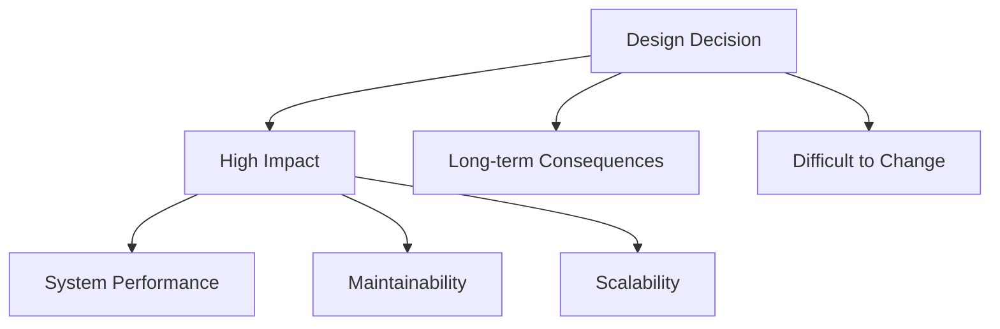
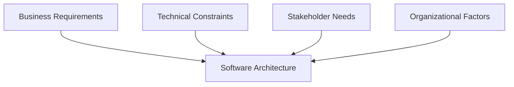

# Fundamentals and Design Decisions

## Fundamental Understanding
Software architecture is the fundamental structure of a software system. It defines the system's components, their relationships, and the principles governing their design and evolution. Architecture is not just about code—it's about the system's organization and behavior.

**Key Points:**
- High-level structure
- Components and their relationships
- Governing principles
- System organization and behavior

## Design Decisions
Architecture involves making high-level design decisions that have long-term impact. These decisions are difficult to change once implemented.

**Examples:**
- Choice of architectural style (e.g., layered, client-server)
- Technology stack (e.g., Java, .NET, Python)
- Communication patterns (e.g., REST, message queues)

**Diagram: Design Decision Impact**

## Wrong View: Architecture as a Phase
Architecture is NOT just a phase in the development lifecycle. It's a continuous concern throughout the entire software lifecycle. Architecture evolves and must be maintained as the system grows.

**Example:**
- Initial architecture may change as requirements evolve
- Refactoring may be needed to maintain architectural integrity

## Context of Software Architecture
Architecture exists within a broader context including:
- Business requirements
- Technical constraints
- Stakeholder needs
- Organizational factors

**Diagram: Architecture Context**

## Practice Questions

### Question 1: Why is software architecture not just a phase?
**Question:** Explain why software architecture should be considered a continuous concern rather than a single phase in the software development lifecycle. Provide an example.

**Solution:**
- Architecture must adapt as requirements and technologies change.
- Treating it as a phase leads to architectural drift and technical debt.
- Example: A web application initially designed for a small user base may need architectural changes (e.g., introducing load balancing) as usage grows.

### Question 2: Design Decision Impact
**Question:** Draw a diagram showing how a single design decision can impact system performance, maintainability, and scalability. Explain with an example.

**Solution:**
- See the "Design Decision Impact" diagram above.
- Example: Choosing a monolithic architecture may simplify deployment but can hurt scalability and maintainability as the system grows. 