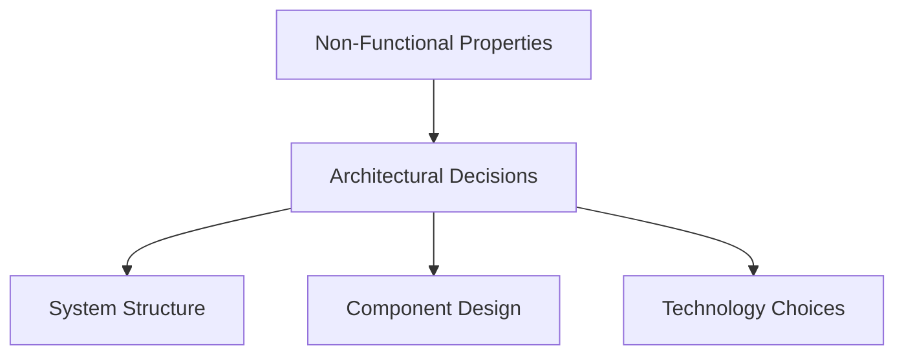
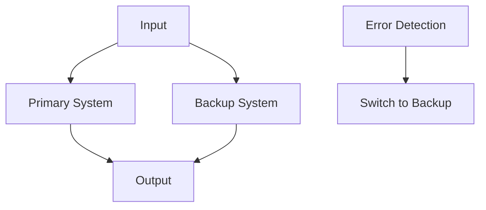

# Requirement Analysis and Non-Functional Properties

## Requirement Analysis
Requirements should be analyzed from an architectural perspective. Focus on how requirements influence architectural decisions. Consider both functional and non-functional requirements.

**Functional Requirements:**
- What the system should do (features, behaviors)

**Non-Functional Requirements:**
- How the system should perform (quality attributes)

## New Perspective on Requirement Analysis
- Requirements analysis is not just about listing features.
- It involves understanding how requirements affect architecture.
- Both functional and non-functional requirements drive architectural choices.

## Non-Functional Properties
- **Performance:** Response time, throughput, resource utilization
- **Reliability:** Fault tolerance, availability, error handling
- **Security:** Authentication, authorization, data protection
- **Scalability:** Ability to handle increased load
- **Maintainability:** Ease of modification and enhancement
- **Usability:** User experience and interface design

**Diagram: Non-Functional Properties Influence**

## NASA's Fault Tolerant System
- Example of how non-functional requirements drive architectural decisions.
- Requires redundant components, error detection, and recovery mechanisms.
- Demonstrates the importance of reliability in critical systems.

**Diagram: Fault Tolerant Architecture**

## Practice Questions

### Question 1: Functional vs Non-Functional Requirements
**Question:** Differentiate between functional and non-functional requirements. Give two examples of each.

**Solution:**
- Functional: User login, order processing
- Non-functional: Response time < 2s, 99.99% uptime

### Question 2: Non-Functional Properties Impact
**Question:** How do non-functional properties influence architectural decisions? Illustrate with a diagram.

**Solution:**
- See the "Non-Functional Properties Influence" diagram above.
- Example: High reliability may require redundant servers and failover mechanisms. 