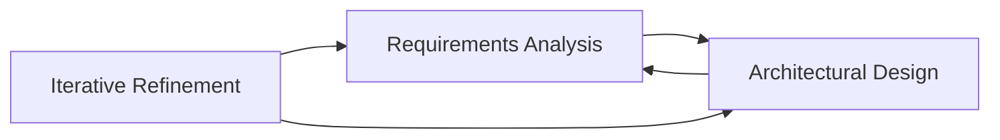
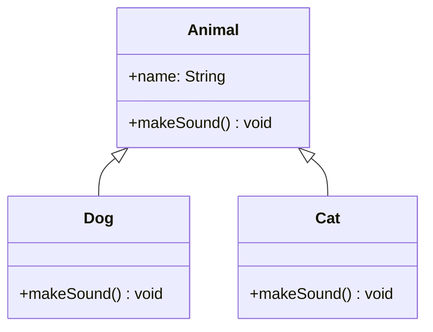
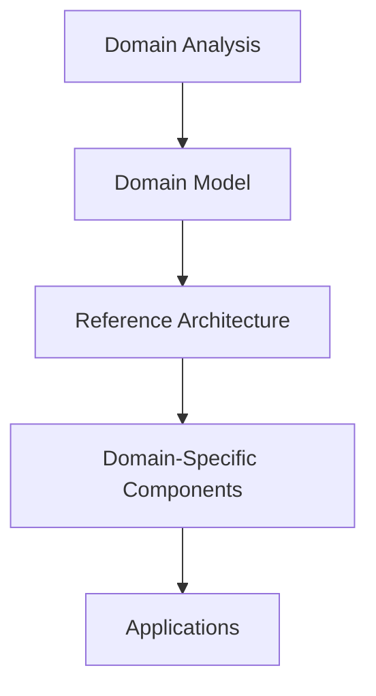

# Twin Peak Model and Design Techniques

## The Twin Peak Model
The Twin Peak Model shows the relationship between requirements and architecture. The two "peaks" represent requirements analysis and architectural design, and the process is iterative—each influences the other.

**Diagram: Twin Peak Model**

## Design and Architecture
- Design is the process of creating a solution to a problem.
- Architecture is the high-level structure that guides design decisions.
- Good architecture enables good design.

## Architecture-Centric Design
- Design decisions are guided by architectural principles.
- Architecture provides constraints and guidelines for design.
- Ensures consistency and coherence across the system.

## Design Techniques
### Object-Oriented Design (OOD)
- Organizes software around objects that contain data and behavior.
- Principles: encapsulation, inheritance, polymorphism.

**Diagram: Object-Oriented Design**

#### Pros and Cons of OOD
**Pros:**
- Encapsulation and information hiding
- Reusability through inheritance
- Polymorphism for flexibility
- Natural modeling of real-world entities

**Cons:**
- Can lead to complex inheritance hierarchies
- Performance overhead
- Not suitable for all problem domains

### DSSA - Domain-Specific Software Architecture
- Architecture tailored to a specific application domain.
- Captures common patterns and solutions for that domain.
- Examples: banking systems, e-commerce platforms, healthcare systems.

**Diagram: DSSA Components**

## Practice Questions

### Question 1: Twin Peak Model
**Question:** Explain the Twin Peak Model and draw a diagram to illustrate the relationship between requirements analysis and architectural design.

**Solution:**
- The Twin Peak Model shows that requirements analysis and architectural design are iterative and influence each other.
- See the diagram above.

### Question 2: OOD Pros and Cons
**Question:** List two pros and two cons of object-oriented design. Give an example where OOD is beneficial.

**Solution:**
- Pros: Encapsulation, reusability
- Cons: Complex hierarchies, performance overhead
- Example: OOD is beneficial in a simulation system where real-world entities are modeled as objects.

### Question 3: DSSA Example
**Question:** What is DSSA? Provide an example of a domain-specific software architecture.

**Solution:**
- DSSA is an architecture tailored to a specific domain, capturing common patterns and solutions.
- Example: An e-commerce platform with reusable components for shopping cart, payment, and inventory management. 