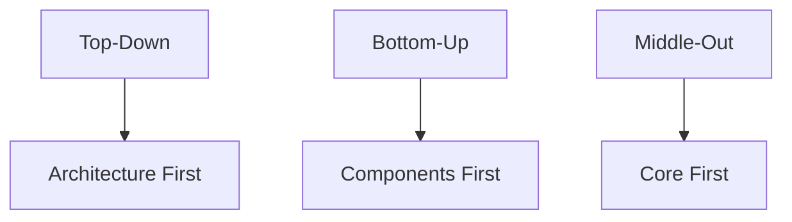
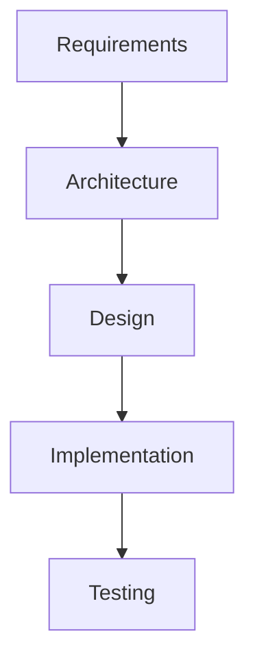

# Implementation, Integration, and Analysis

## Implementation
### Faithful Implementation
- Closely follows the architectural design.
- Maintains the intended structure and relationships.
- Easier to maintain and evolve.

### Unfaithful Implementation
- Deviates from the architectural design.
- Can lead to technical debt and maintenance issues.
- Often occurs due to time pressure or changing requirements.

### Implementation Strategies
- **Top-down:** Start with architecture, then implement details
- **Bottom-up:** Build components first, then integrate
- **Middle-out:** Start with core components, expand outward

**Diagram: Implementation Strategies**

## How It All Fits Together
- Architecture provides the framework for implementation.
- Design techniques guide the creation of components.
- Implementation brings the architecture to life.
- All must work together cohesively.

**Diagram: Architecture Context**

## Analysis and Testing
### Analysis of Architecture Models
- Evaluating architectural models for quality attributes (performance, reliability, etc.)
- Techniques: scenario-based analysis, simulation, prototyping

**Example:**
- Use scenarios to test if the architecture meets performance requirements.
- Prototype critical components to validate design decisions.

## Practice Questions

### Question 1: Implementation Strategies
**Question:** Compare top-down, bottom-up, and middle-out implementation strategies. When would you use each?

**Solution:**
- Top-down: Use when architecture is well-defined and guides development.
- Bottom-up: Use when reusable components are available.
- Middle-out: Use when core functionality is clear, but details and extensions are developed iteratively.

### Question 2: Faithful vs Unfaithful Implementation
**Question:** What are the risks of unfaithful implementation? How can they be mitigated?

**Solution:**
- Risks: Technical debt, maintenance issues, loss of architectural integrity.
- Mitigation: Regular code reviews, architectural enforcement, refactoring.

### Question 3: Architecture Model Analysis
**Question:** Describe a method for analyzing an architectural model for reliability.

**Solution:**
- Use scenario-based analysis: Define failure scenarios and evaluate how the architecture handles them (e.g., failover, redundancy). 