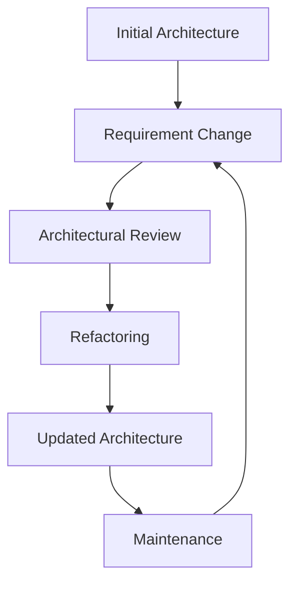

# Evolution, Processes, and Summary

## Evolution and Maintenance
Software architecture evolves over time due to:
- New requirements
- Technology changes
- Performance improvements
- Bug fixes
- Feature additions

### Architecture-Centric Evolution Process
- Focuses on maintaining architectural integrity as the system evolves.
- Involves regular architectural reviews and refactoring.
- Helps manage technical debt and prevent architectural degradation.

**Diagram: Evolution Process**

## Processes
- Software architecture is supported by processes that guide its development and evolution.
- Examples: Agile, Waterfall, Spiral, DevOps
- Each process has implications for how architecture is designed, implemented, and maintained.

**Example:**
- Agile emphasizes iterative development and continuous architectural evolution.
- Waterfall relies on upfront architectural design and less frequent changes.

## Summary
- Architecture is a continuous concern throughout the software lifecycle.
- Both functional and non-functional requirements drive architectural decisions.
- Design techniques and implementation strategies must align with architectural goals.
- Regular evolution and maintenance are essential for long-term system health.

## Practice Questions

### Question 1: Evolution Process
**Question:** Describe the architecture-centric evolution process. Why is it important?

**Solution:**
- The process involves regular reviews and refactoring to maintain architectural integrity as requirements change.
- It prevents architectural degradation and manages technical debt.

### Question 2: Process Impact
**Question:** How does the choice of software development process (e.g., Agile vs Waterfall) impact architectural evolution?

**Solution:**
- Agile: Encourages continuous evolution and adaptation of architecture.
- Waterfall: Favors upfront design and less frequent architectural changes.

### Question 3: Maintenance Strategies
**Question:** List two strategies for maintaining architectural integrity during system evolution.

**Solution:**
- Regular architectural reviews
- Refactoring to address technical debt and design drift 