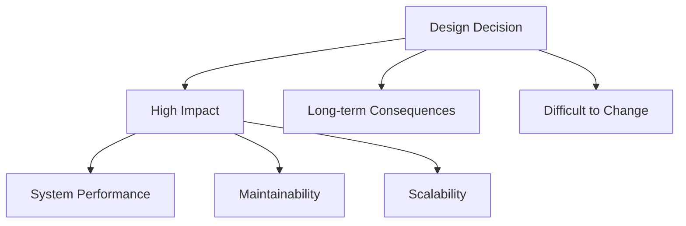
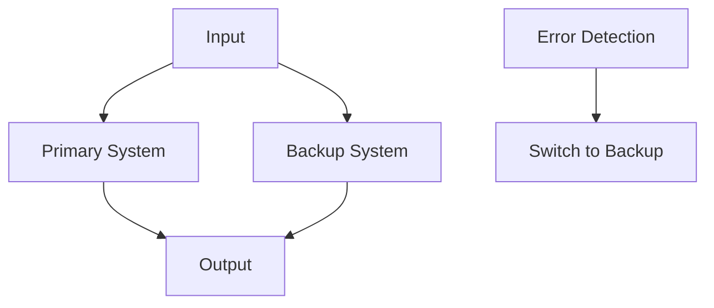
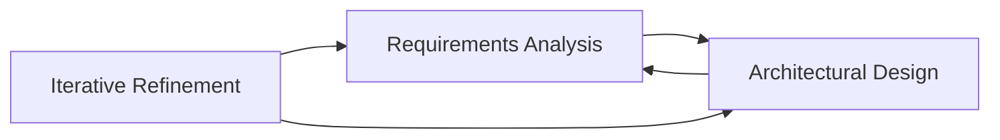
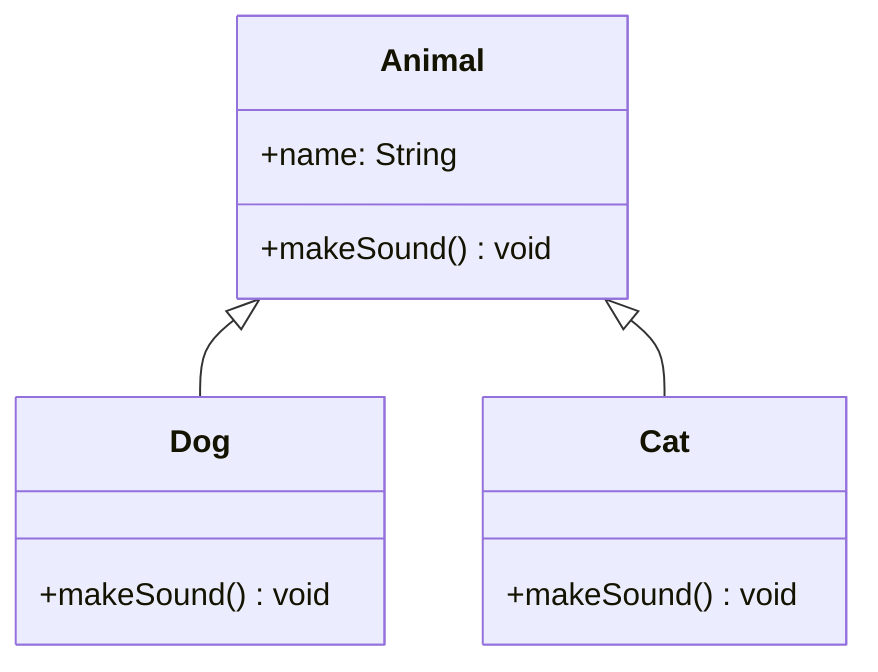
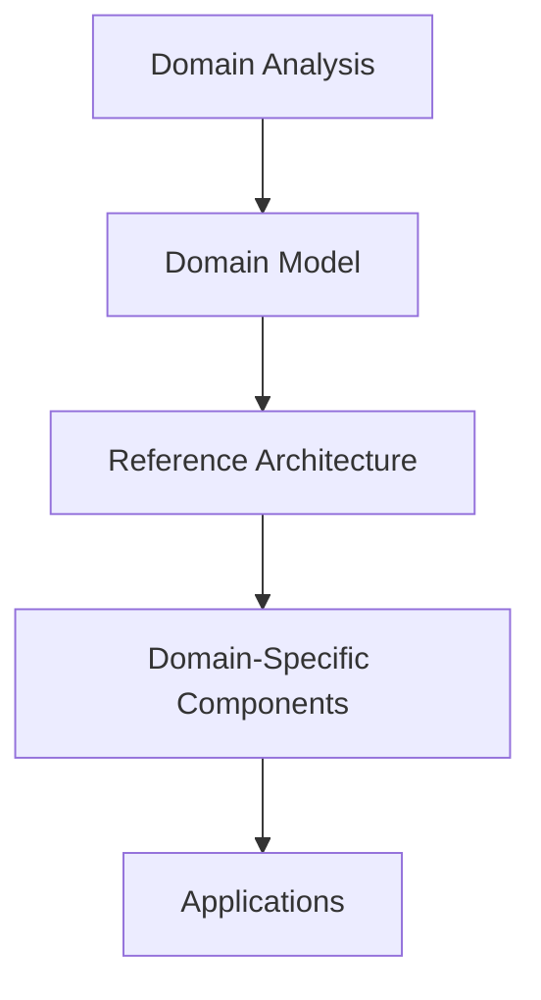
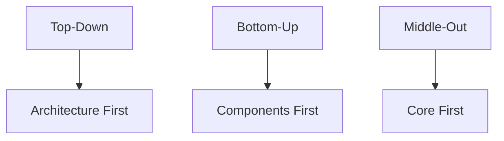
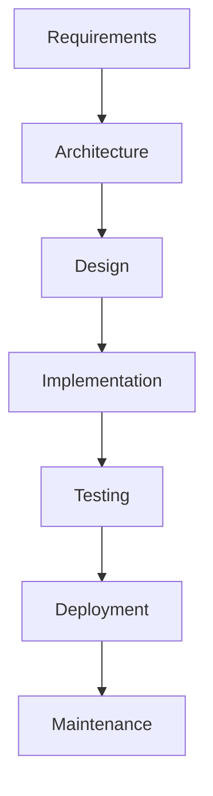

# Lecture 2: Architecture in Context

## Table of Contents
1. Fundamental Understanding
2. Design Decisions
3. Wrong View: Architecture as a Phase
4. Context of Software Architecture
5. Requirement Analysis
   - New Perspective on Requirement Analysis
   - Non-Functional Properties
   - NASA's Fault Tolerant System
6. The Twin Peak Model
7. Design and Architecture
8. Architecture-Centric Design
9. Design Techniques
   - Object-Oriented Design
   - Pros and Cons of OOD
   - DSSA - Domain-Specific Software Architecture
10. Implementation
    - Faithful Implementation
    - Unfaithful Implementation
    - Implementation Strategies
11. How It All Fits Together
12. Analysis and Testing
    - Analysis of Architecture Models
13. Evolution and Maintenance
    - Architecture-Centric Evolution Process
14. Processes
15. Summary

---

## 1. Fundamental Understanding
- Software architecture is the fundamental structure of a software system.
- It defines the system's components, their relationships, and the principles governing their design and evolution.
- Architecture is not just about code—it's about the system's organization and behavior.

## 2. Design Decisions
- Architecture involves making high-level design decisions that have long-term impact.
- These decisions are difficult to change once implemented.
- Examples: choice of architectural style, technology stack, communication patterns.

**Diagram: Design Decision Impact**

## 3. Wrong View: Architecture as a Phase
- Architecture is NOT just a phase in the development lifecycle.
- It's a continuous concern throughout the entire software lifecycle.
- Architecture evolves and must be maintained as the system grows.

## 4. Context of Software Architecture
- Architecture exists within a broader context including:
  - Business requirements
  - Technical constraints
  - Stakeholder needs
  - Organizational factors

## 5. Requirement Analysis
### New Perspective on Requirement Analysis
- Requirements should be analyzed from an architectural perspective.
- Focus on how requirements influence architectural decisions.
- Consider both functional and non-functional requirements.

### Non-Functional Properties
- **Performance:** Response time, throughput, resource utilization
- **Reliability:** Fault tolerance, availability, error handling
- **Security:** Authentication, authorization, data protection
- **Scalability:** Ability to handle increased load
- **Maintainability:** Ease of modification and enhancement
- **Usability:** User experience and interface design

### NASA's Fault Tolerant System
- Example of how non-functional requirements drive architectural decisions.
- Requires redundant components, error detection, and recovery mechanisms.
- Demonstrates the importance of reliability in critical systems.

**Diagram: Fault Tolerant Architecture**

## 6. The Twin Peak Model
- Shows the relationship between requirements and architecture.
- Two "peaks" represent requirements analysis and architectural design.
- Iterative process where each influences the other.

**Diagram: Twin Peak Model**

## 7. Design and Architecture
- Design is the process of creating a solution to a problem.
- Architecture is the high-level structure that guides design decisions.
- Good architecture enables good design.

## 8. Architecture-Centric Design
- Design decisions are guided by architectural principles.
- Architecture provides constraints and guidelines for design.
- Ensures consistency and coherence across the system.

## 9. Design Techniques
### Object-Oriented Design (OOD)
- Organizes software around objects that contain data and behavior.
- Principles: encapsulation, inheritance, polymorphism.

**Diagram: Object-Oriented Design**

### Pros and Cons of OOD
**Pros:**
- Encapsulation and information hiding
- Reusability through inheritance
- Polymorphism for flexibility
- Natural modeling of real-world entities

**Cons:**
- Can lead to complex inheritance hierarchies
- Performance overhead
- Not suitable for all problem domains

### DSSA - Domain-Specific Software Architecture
- Architecture tailored to a specific application domain.
- Captures common patterns and solutions for that domain.
- Examples: banking systems, e-commerce platforms, healthcare systems.

**Diagram: DSSA Components**

## 10. Implementation
### Faithful Implementation
- Implementation that closely follows the architectural design.
- Maintains the intended structure and relationships.
- Easier to maintain and evolve.

### Unfaithful Implementation
- Implementation that deviates from the architectural design.
- Can lead to technical debt and maintenance issues.
- Often occurs due to time pressure or changing requirements.

### Implementation Strategies
- **Top-down:** Start with architecture, then implement details
- **Bottom-up:** Build components first, then integrate
- **Middle-out:** Start with core components, expand outward

**Diagram: Implementation Strategies**

## 11. How It All Fits Together
- Architecture provides the framework for implementation.
- Design techniques guide the creation of components.
- Implementation brings the architecture to life.
- All must work together cohesively.

**Diagram: Architecture Context**

## 12. Analysis and Testing
### Analysis of Architecture Models
- Evaluate architecture against requirements.
- Identify potential issues and risks.
- Ensure architectural decisions are sound.

**Methods:**
- **Scenario-based analysis:** Test architecture with specific scenarios
- **Checklist-based analysis:** Use predefined criteria
- **Prototyping:** Build prototypes to validate decisions

## 13. Evolution and Maintenance
### Architecture-Centric Evolution Process
- Architecture must evolve as requirements change.
- Maintain architectural integrity during evolution.
- Consider impact of changes on the entire system.

**Diagram: Evolution Process**

## 14. Processes
- Architecture development follows defined processes.
- Processes ensure consistency and quality.
- Examples: TOGAF, Zachman Framework, 4+1 View Model.

## 15. Summary
- Architecture is fundamental to software development, not just a phase.
- It exists within a broader context of requirements, constraints, and stakeholders.
- The Twin Peak Model shows the iterative relationship between requirements and architecture.
- Design techniques like OOD and DSSA provide structured approaches to design.
- Implementation must be faithful to the architecture to maintain system quality.
- Architecture requires continuous analysis, testing, and evolution throughout the system's lifecycle.
- Processes provide frameworks for systematic architecture development and maintenance.

---

## Key Takeaways
1. **Architecture is continuous** - not just a phase
2. **Requirements and architecture** influence each other iteratively
3. **Non-functional properties** are as important as functional requirements
4. **Design techniques** provide structured approaches to problem-solving
5. **Faithful implementation** is crucial for system quality
6. **Architecture evolves** with changing requirements and technology
7. **Processes** ensure systematic and consistent architecture development 