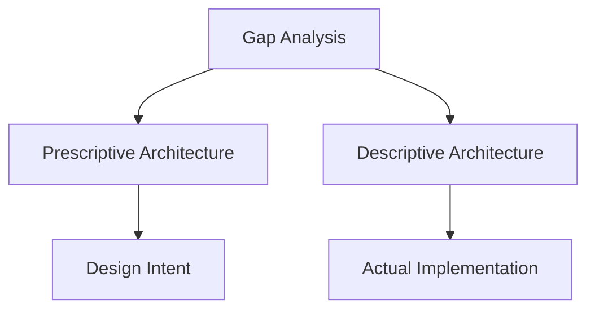
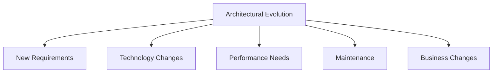
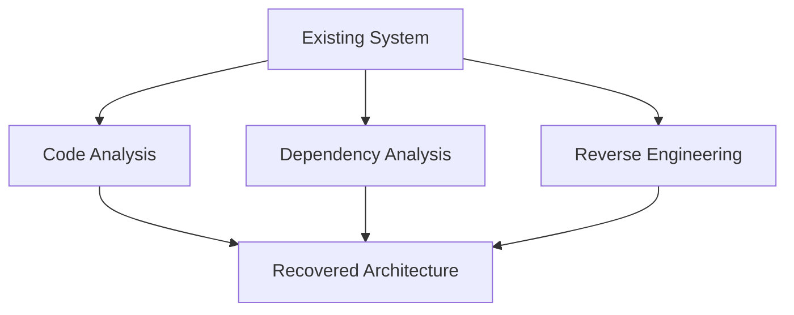

# Architecture Views and Evolution

## Temporal Aspect
- Architecture exists and evolves **over time**
- Different architectural views at different points in the system's lifecycle
- Architecture changes as requirements, technology, and business needs evolve

**Diagram: Temporal Evolution**


## Prescriptive vs Descriptive Architecture

### Prescriptive Architecture
- **"As-designed"** - how the system should be structured
- Represents the intended architecture
- Used for planning and development guidance

### Descriptive Architecture
- **"As-built"** - how the system is actually structured
- Represents the implemented architecture
- Used for understanding and maintenance

**Diagram: Prescriptive vs Descriptive**


## As-Designed vs As-Implemented Architecture

### As-Designed Architecture
- The architecture as specified in design documents
- Represents the architect's vision and intent
- May not perfectly match the final implementation

### As-Implemented Architecture
- The architecture as it exists in the actual code
- Reflects what was actually built
- May deviate from the original design due to implementation constraints

**Example:**
```
As-Designed: Three-tier architecture with clear separation
As-Implemented: Business logic mixed with presentation layer
```

## Architectural Evolution
- Architecture changes over time due to:
  - New requirements
  - Technology changes
  - Performance improvements
  - Bug fixes
  - Feature additions

**Diagram: Evolution Factors**


## Architectural Degradation
- Gradual deterioration of architectural quality over time
- Caused by:
  - Quick fixes and workarounds
  - Lack of architectural enforcement
  - Changing requirements without architectural updates
  - Technical debt accumulation

**Diagram: Degradation Process**


## Architectural Recovery
- Process of understanding the actual architecture of an existing system
- Techniques:
  - Code analysis
  - Dependency analysis
  - Reverse engineering
  - Documentation review

**Diagram: Recovery Process**


## Practice Questions

### Question 1: Prescriptive vs Descriptive
**Question:** Explain the difference between prescriptive and descriptive architecture. Why might they differ?

**Solution:**
- **Prescriptive**: How the system should be structured (design intent)
- **Descriptive**: How the system is actually structured (implementation reality)
- They may differ due to implementation constraints, time pressure, or changing requirements during development.

### Question 2: Architectural Evolution
**Question:** List three factors that drive architectural evolution. Draw a diagram showing how these factors interact.

**Solution:**
Factors: New requirements, technology changes, performance needs
- See the "Evolution Factors" diagram above.

### Question 3: Architectural Recovery
**Question:** Describe the process of architectural recovery. What techniques would you use?

**Solution:**
- Process: Understanding the actual architecture of an existing system
- Techniques: Code analysis, dependency analysis, reverse engineering, documentation review
- Goal: Create an accurate model of the as-implemented architecture 