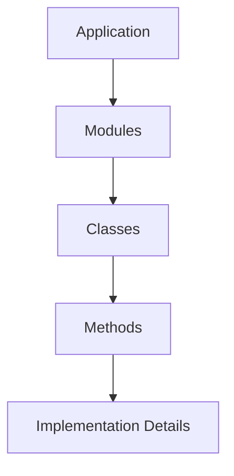
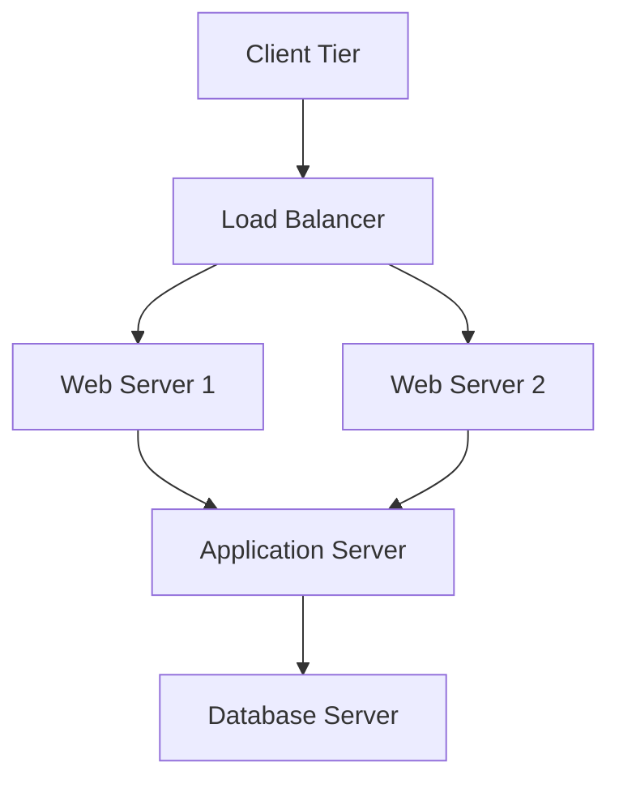

# Implementation and Deployment

## Implementation Level View of an Application
- Detailed view of how architecture is implemented in code
- Includes:
  - Classes and objects
  - Functions and methods
  - Data structures
  - Algorithms

**Diagram: Implementation View**


**Example Implementation Structure:**
```
Application/
├── Presentation Layer/
│   ├── Controllers/
│   ├── Views/
│   └── UI Components/
├── Business Layer/
│   ├── Services/
│   ├── Business Logic/
│   └── Domain Models/
└── Data Layer/
    ├── Repositories/
    ├── Data Access/
    └── Database Models/
```

## Deployment
- How the software system is deployed in its target environment
- Includes:
  - Hardware configuration
  - Network topology
  - Software dependencies
  - Runtime environment

**Deployment Considerations:**
- **Scalability**: Can the system handle increased load?
- **Reliability**: How is fault tolerance achieved?
- **Security**: How are security measures implemented?
- **Performance**: How is performance optimized?

## A System's Deployment Architectural Perspective
- Architecture from a deployment viewpoint
- Focuses on:
  - Physical distribution of components
  - Network communication
  - Resource allocation
  - Scalability considerations

**Diagram: Deployment Architecture**


**Example: Three-Tier Deployment**
```
┌─────────────────────────────────────────────────────────────┐
│                Three-Tier Deployment                        │
├─────────────────┬─────────────────┬─────────────────────────┤
│   Client Tier   │   Application   │   Data Tier             │
│                 │     Tier        │                         │
│ ┌─────────────┐ │ ┌─────────────┐ │ ┌─────────────────────┐ │
│ │Web Browser  │ │ │App Server 1 │ │ │Primary Database     │ │
│ │Mobile App   │ │ │App Server 2 │ │ │Backup Database      │ │
│ │Desktop App  │ │ │Load Balancer│ │ │File Storage         │ │
│ └─────────────┘ │ └─────────────┘ │ └─────────────────────┘ │
└─────────────────┴─────────────────┴─────────────────────────┘
```

## Practice Questions

### Question 1: Implementation View
**Question:** Draw a diagram showing the implementation view of a web application. Include the main layers and their components.

**Solution:**
```
┌─────────────────────────────────────────────────────────────┐
│                Web Application Implementation               │
├─────────────────┬─────────────────┬─────────────────────────┤
│   Presentation  │   Business      │   Data                  │
│     Layer       │     Layer       │   Layer                 │
│                 │                 │                         │
│ ┌─────────────┐ │ ┌─────────────┐ │ ┌─────────────────────┐ │
│ │Controllers  │ │ │Services     │ │ │Repositories         │ │
│ │Views        │ │ │Business     │ │ │Data Access          │ │
│ │UI Components│ │ │Logic        │ │ │Database Models      │ │
│ └─────────────┘ │ └─────────────┘ │ └─────────────────────┘ │
└─────────────────┴─────────────────┴─────────────────────────┘
```

### Question 2: Deployment Architecture
**Question:** Design a deployment architecture for a high-availability web application. Include load balancing and fault tolerance.

**Solution:**
- See the "Deployment Architecture" diagram above
- Key components: Load balancer, multiple web servers, application servers, redundant databases
- Fault tolerance: Multiple instances at each tier, automatic failover

### Question 3: Deployment Considerations
**Question:** List four key considerations when designing a deployment architecture. Explain why each is important.

**Solution:**
1. **Scalability**: Ensures the system can handle growth
2. **Reliability**: Provides fault tolerance and high availability
3. **Security**: Protects against threats and vulnerabilities
4. **Performance**: Optimizes response times and throughput 