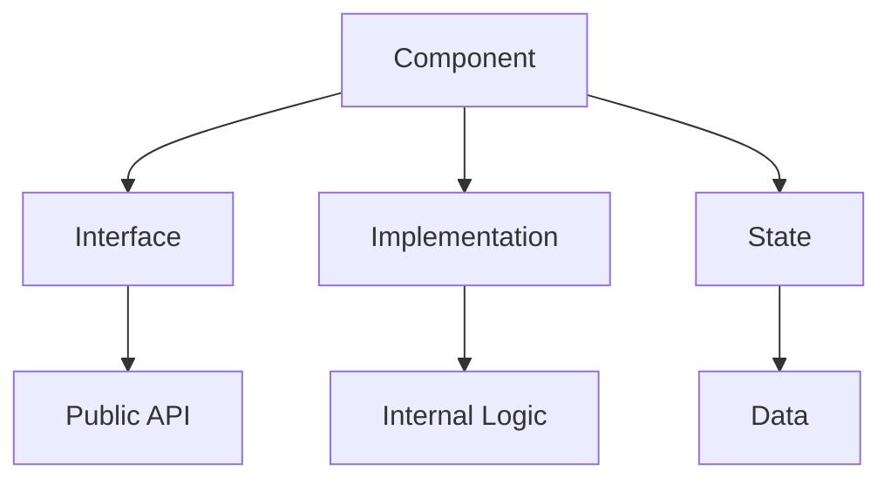
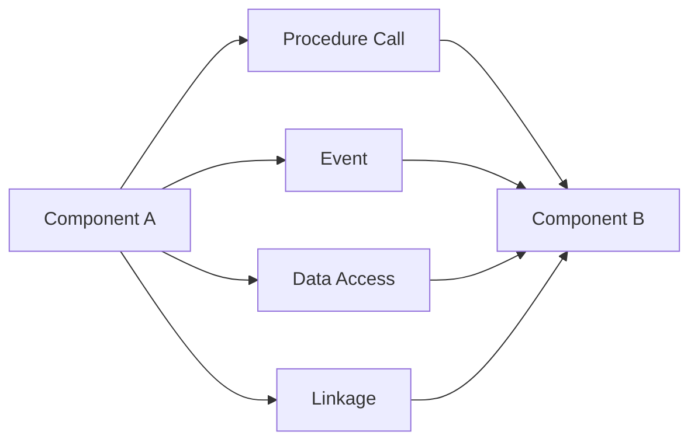
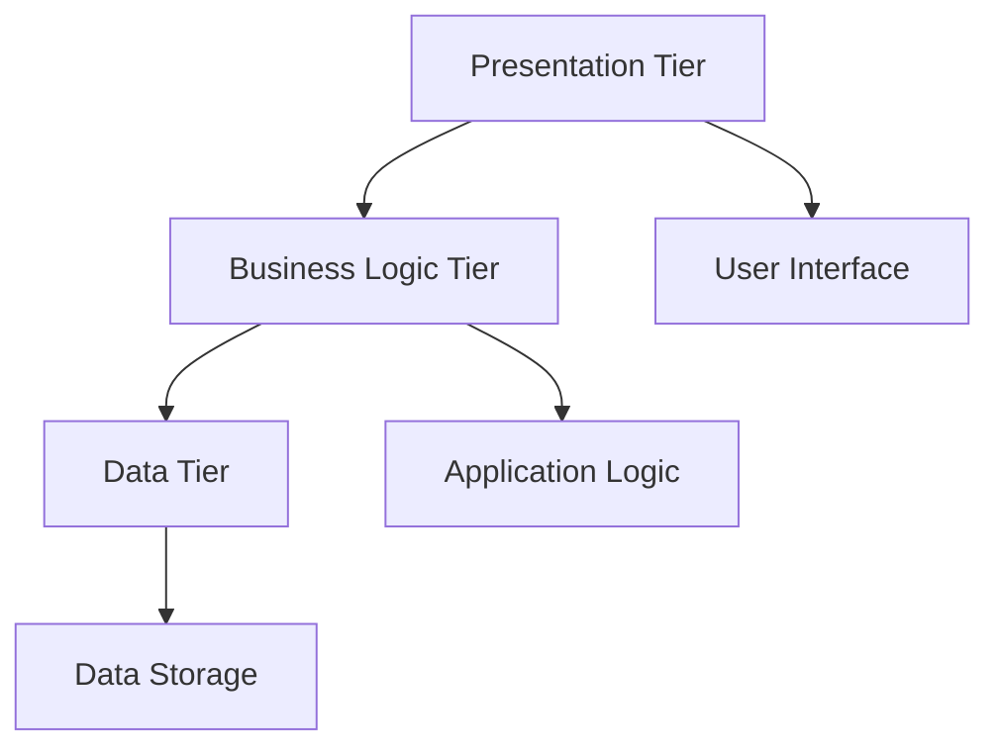

# Architecture Elements and Patterns

## Software Architecture's Elements

### Components
- **Definition:** Computational elements that encapsulate functionality
- **Characteristics:**
  - Have well-defined interfaces
  - Can be developed independently
  - Can be reused across systems

**Examples of Components:**
- User interface components
- Business logic modules
- Database access components
- External service adapters

**Diagram: Component Structure**


### Connectors
- **Definition:** Communication mechanisms between components
- **Types:**
  - Procedure calls
  - Message passing
  - Shared memory
  - Remote procedure calls (RPC)

**Examples of Connectors:**
- **Procedure Call**: Function calls within the same process
- **Event**: Asynchronous communication between components
- **Data Access**: Database queries and file I/O
- **Linkage**: Compile-time linking of components

**Diagram: Connector Types**


### Configurations
- **Definition:** Topological arrangement of components and connectors
- **Purpose:** Defines the overall structure and communication patterns
- **Examples:** Three-tier, client-server, microservices

**Example Configuration: Three-Tier Architecture**
```
┌─────────────────────────────────────────────────────────────┐
│                Three-Tier Configuration                     │
├─────────────────┬─────────────────┬─────────────────────────┤
│   Presentation  │   Business      │   Data                  │
│     Tier        │     Logic       │   Tier                  │
│                 │     Tier        │                         │
│ ┌─────────────┐ │ ┌─────────────┐ │ ┌─────────────────────┐ │
│ │Web Browser  │ │ │Controllers  │ │ │Database Server      │ │
│ │Mobile App   │ │ │Services     │ │ │File System          │ │
│ │Desktop App  │ │ │Business     │ │ │External APIs        │ │
│ └─────────────┘ │ │Logic        │ │ └─────────────────────┘ │
│                 │ └─────────────┘ │                         │
└─────────────────┴─────────────────┴─────────────────────────┘
```

## Architectural Patterns

### Three-Tiered Pattern
- **Purpose:** Separates concerns into three distinct layers
- **Layers:**
  1. **Presentation Tier**: User interface and interaction
  2. **Business Logic Tier**: Application logic and rules
  3. **Data Tier**: Data storage and access

**Benefits:**
- Clear separation of concerns
- Independent development of layers
- Scalability and maintainability
- Technology independence

**Diagram: Three-Tier Pattern**


**Example Implementation:**
```
┌─────────────────────────────────────────────────────────────┐
│                E-commerce Three-Tier                        │
├─────────────────┬─────────────────┬─────────────────────────┤
│   Presentation  │   Business      │   Data                  │
│     Tier        │     Logic       │   Tier                  │
│                 │     Tier        │                         │
│ ┌─────────────┐ │ ┌─────────────┐ │ ┌─────────────────────┐ │
│ │Shopping Cart│ │ │Order        │ │ │Product Database     │ │
│ │User Profile │ │ │Processing   │ │ │User Database        │ │
│ │Payment Form │ │ │Inventory    │ │ │Order Database       │ │
│ └─────────────┘ │ │Management   │ │ └─────────────────────┘ │
│                 │ └─────────────┘ │                         │
└─────────────────┴─────────────────┴─────────────────────────┘
```

## Practice Questions

### Question 1: Components and Connectors
**Question:** Define components and connectors in software architecture. Provide two examples of each.

**Solution:**
- **Components**: Computational elements that encapsulate functionality
  - Examples: User interface, business logic module, database access component
- **Connectors**: Communication mechanisms between components
  - Examples: Procedure calls, message queues, database connections

### Question 2: Three-Tier Architecture
**Question:** Draw a diagram of a three-tier architecture for a library management system. Label each tier and provide examples of components in each.

**Solution:**
```
┌─────────────────────────────────────────────────────────────┐
│                Library Management System                    │
├─────────────────┬─────────────────┬─────────────────────────┤
│   Presentation  │   Business      │   Data                  │
│     Tier        │     Logic       │   Tier                  │
│                 │     Tier        │                         │
│ ┌─────────────┐ │ ┌─────────────┐ │ ┌─────────────────────┐ │
│ │Book Search  │ │ │Loan         │ │ │Book Database        │ │
│ │User Login   │ │ │Processing   │ │ │User Database        │ │
│ │Admin Panel  │ │ │Fine         │ │ │Loan Database        │ │
│ └─────────────┘ │ │Calculation  │ │ └─────────────────────┘ │
│                 │ └─────────────┘ │                         │
└─────────────────┴─────────────────┴─────────────────────────┘
```

### Question 3: Configuration Design
**Question:** Design a configuration for a real-time chat application. Identify the components, connectors, and overall structure.

**Solution:**
```
┌─────────────────────────────────────────────────────────────┐
│                Real-Time Chat Configuration                 │
├─────────────────┬─────────────────┬─────────────────────────┤
│   Client        │   Server        │   Storage               │
│   Components    │   Components    │   Components            │
│                 │                 │                         │
│ ┌─────────────┐ │ ┌─────────────┐ │ ┌─────────────────────┐ │
│ │Chat UI      │ │ │Message      │ │ │User Database        │ │
│ │User Auth    │ │ │Router       │ │ │Message History      │ │
│ │Real-time    │ │ │WebSocket    │ │ │File Storage         │ │
│ │Connection   │ │ │Handler      │ │ └─────────────────────┘ │
│ └─────────────┘ │ └─────────────┘ │                         │
└─────────────────┴─────────────────┴─────────────────────────┘
``` 