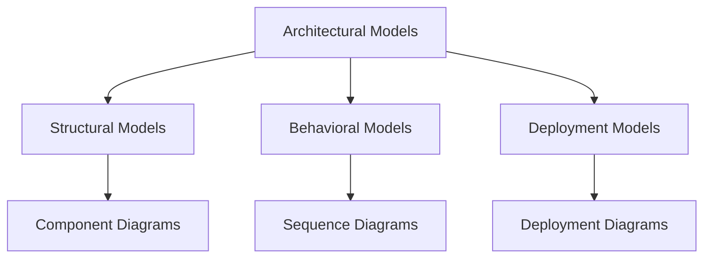
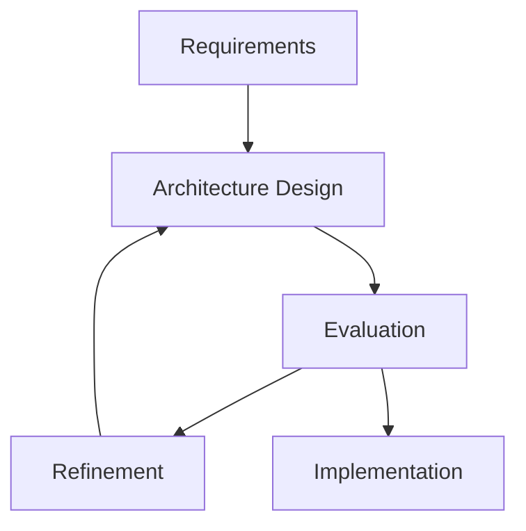
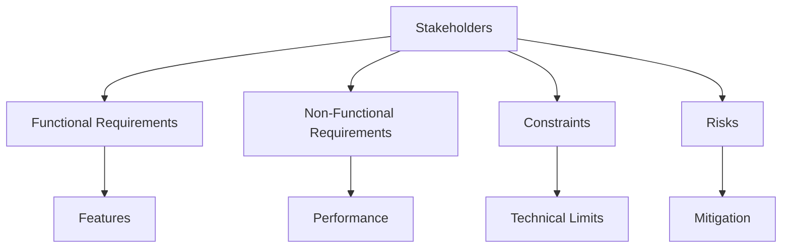

# Models, Views, Processes, and Stakeholders

## Architectural Models, Views, and Visualizations

### Architectural Models
- **Purpose:** Represent the architecture in a structured way
- **Types:**
  - **Structural Models**: Show components and their relationships
  - **Behavioral Models**: Show system behavior and interactions
  - **Deployment Models**: Show physical distribution

**Diagram: Model Types**


### Views
- **Purpose:** Show the architecture from different perspectives
- **Common Views:**
  - **Logical View**: Shows the system's logical structure
  - **Process View**: Shows concurrency and process structure
  - **Development View**: Shows the development organization
  - **Physical View**: Shows the deployment architecture

**Example: 4+1 View Model**
```
┌─────────────────────────────────────────────────────────────┐
│                    4+1 View Model                          │
├─────────────────┬─────────────────┬─────────────────────────┤
│   Logical View  │   Process View  │   Development View      │
│                 │                 │                         │
│ ┌─────────────┐ │ ┌─────────────┐ │ ┌─────────────────────┐ │
│ │Components   │ │ │Processes    │ │ │Modules              │ │
│ │Classes      │ │ │Threads      │ │ │Packages             │ │
│ │Objects      │ │ │Tasks        │ │ │Subsystems           │ │
│ └─────────────┘ │ └─────────────┘ │ └─────────────────────┘ │
└─────────────────┴─────────────────┴─────────────────────────┘
```

### Visualizations
- **Purpose:** Make architecture understandable to stakeholders
- **Types:**
  - **Diagrams**: UML, Archimate, custom notations
  - **Documentation**: Text descriptions, tables, matrices
  - **Tools**: Architecture modeling tools, visualization software

## Architectural Processes

### Design Process
1. **Requirements Analysis**: Understand what the system should do
2. **Architecture Design**: Create the high-level structure
3. **Evaluation**: Assess the architecture against requirements
4. **Refinement**: Improve the architecture based on feedback

**Diagram: Design Process**


### Maintenance Process
1. **Monitoring**: Track system performance and behavior
2. **Analysis**: Identify issues and improvement opportunities
3. **Planning**: Plan architectural changes
4. **Implementation**: Execute the changes

## Stakeholders in a System's Architecture

### Types of Stakeholders
- **Developers**: Need to understand how to implement the system
- **Testers**: Need to understand how to test the system
- **Users**: Need to understand how to use the system
- **Managers**: Need to understand project status and risks
- **System Administrators**: Need to understand deployment and operations

### Stakeholder Concerns
- **Functional Requirements**: What the system should do
- **Non-Functional Requirements**: How the system should perform
- **Constraints**: Technical, business, and regulatory constraints
- **Risks**: Potential problems and mitigation strategies

**Diagram: Stakeholder Concerns**


## Summary

### Key Concepts Covered
1. **Software Architecture**: Fundamental structure of a software system
2. **Architecture Elements**: Components, connectors, and configurations
3. **Architecture Views**: Different perspectives on the same system
4. **Architecture Evolution**: How architecture changes over time
5. **Stakeholder Management**: Addressing different stakeholder needs

### Importance of Architecture
- **Foundation**: Provides the foundation for system development
- **Communication**: Enables communication among stakeholders
- **Quality**: Influences system quality attributes
- **Evolution**: Guides system evolution and maintenance

## Practice Questions

### Question 1: Architecture Views
**Question:** Explain the 4+1 view model. What are the four main views and the +1 view?

**Solution:**
- **Logical View**: Shows the system's logical structure (components, classes)
- **Process View**: Shows concurrency and process structure (processes, threads)
- **Development View**: Shows the development organization (modules, packages)
- **Physical View**: Shows the deployment architecture (nodes, networks)
- **+1 View**: Scenarios that show how the other views work together

### Question 2: Stakeholder Analysis
**Question:** Identify three stakeholders for a banking system and their primary concerns.

**Solution:**
1. **Customers**: Functional requirements (transactions, account management), security
2. **Bank Staff**: Usability, performance, reliability
3. **Regulators**: Compliance, audit trails, data protection

### Question 3: Architecture Process
**Question:** Describe the architectural design process. What are the main steps?

**Solution:**
1. **Requirements Analysis**: Understand system requirements
2. **Architecture Design**: Create high-level structure
3. **Evaluation**: Assess against requirements and constraints
4. **Refinement**: Improve based on feedback and evaluation results 