# Lecture 3: Basic Concepts

## Table of Contents
1. What is Software Architecture?
2. What is "Principal"?
3. Other Definitions of Software Architecture
4. Temporal Aspect
5. Prescriptive vs Descriptive Architecture
6. As-Designed vs As-Implemented Architecture
7. Architectural Evolution
8. Architectural Degradation
9. Architectural Recovery
10. Implementation Level View of an Application
11. Deployment
12. A System's Deployment Architectural Perspective
13. Software Architecture's Elements
    - Components
    - Connectors
    - Examples of Connectors
    - Configurations
    - An Example Configuration
14. Architectural Patterns
    - Three-Tiered Pattern
15. Architectural Models, Views, and Visualizations
16. Architectural Processes
17. Stakeholders in a System's Architecture
18. Summary

---

## 1. What is Software Architecture?
Software architecture is the **fundamental structure** of a software system, encompassing:
- The system's **components** and their **relationships**
- The **principles** governing the system's design and evolution
- The **decisions** that are difficult to change once implemented

**Key Characteristics:**
- High-level abstraction of the system
- Focuses on system structure and behavior
- Influences system quality attributes
- Provides a common understanding for stakeholders

## 2. What is "Principal"?
- **Principal** refers to the **fundamental** or **primary** aspects of software architecture
- These are the core concepts and elements that form the foundation of architectural thinking
- Examples: components, connectors, configurations, patterns

## 3. Other Definitions of Software Architecture
Different perspectives on software architecture:

**IEEE Definition:**
- "The fundamental organization of a system embodied in its components, their relationships to each other and to the environment, and the principles governing its design and evolution."

**SEI Definition:**
- "The software architecture of a program or computing system is the structure or structures of the system, which comprise software elements, the externally visible properties of those elements, and the relationships among them."

**Garlan & Shaw Definition:**
- "Software architecture involves the description of elements from which systems are built, interactions among those elements, patterns that guide their composition, and constraints on these patterns."

## 4. Temporal Aspect
- Architecture exists and evolves **over time**
- Different architectural views at different points in the system's lifecycle
- Architecture changes as requirements, technology, and business needs evolve

**Diagram: Temporal Evolution**
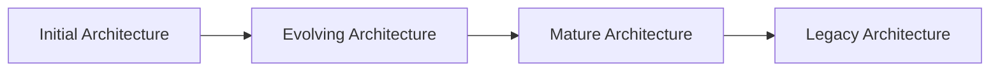

## 5. Prescriptive vs Descriptive Architecture
### Prescriptive Architecture
- **"As-designed"** - how the system should be structured
- Represents the intended architecture
- Used for planning and development guidance

### Descriptive Architecture
- **"As-built"** - how the system is actually structured
- Represents the implemented architecture
- Used for understanding and maintenance

**Diagram: Prescriptive vs Descriptive**
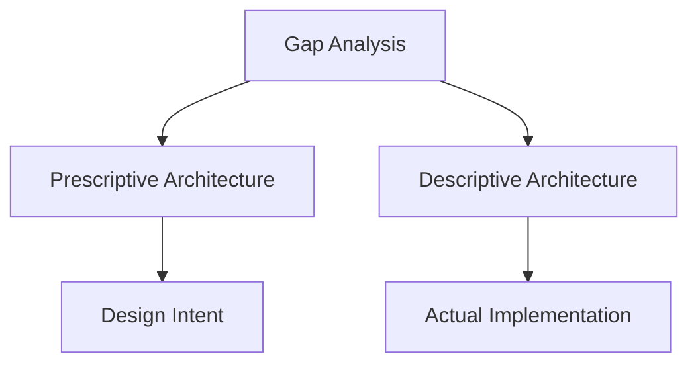

## 6. As-Designed vs As-Implemented Architecture
### As-Designed Architecture
- The architecture as specified in design documents
- Represents the architect's vision and intent
- May not perfectly match the final implementation

### As-Implemented Architecture
- The architecture as it exists in the actual code
- Reflects what was actually built
- May deviate from the original design due to implementation constraints

## 7. Architectural Evolution
- Architecture changes over time due to:
  - New requirements
  - Technology changes
  - Performance improvements
  - Bug fixes
  - Feature additions

**Diagram: Evolution Factors**
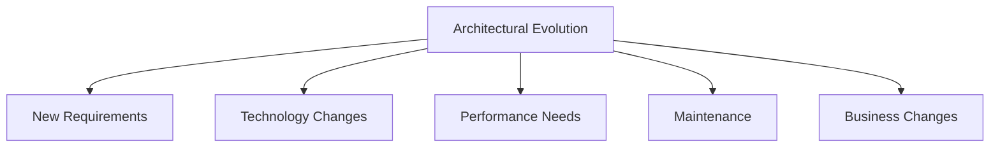

## 8. Architectural Degradation
- Gradual deterioration of architectural quality over time
- Caused by:
  - Quick fixes and workarounds
  - Lack of architectural enforcement
  - Changing requirements without architectural updates
  - Technical debt accumulation

**Diagram: Degradation Process**

## 9. Architectural Recovery
- Process of understanding the actual architecture of an existing system
- Techniques:
  - Code analysis
  - Dependency analysis
  - Reverse engineering
  - Documentation review

## 10. Implementation Level View of an Application
- Detailed view of how architecture is implemented in code
- Includes:
  - Classes and objects
  - Functions and methods
  - Data structures
  - Algorithms

**Diagram: Implementation View**
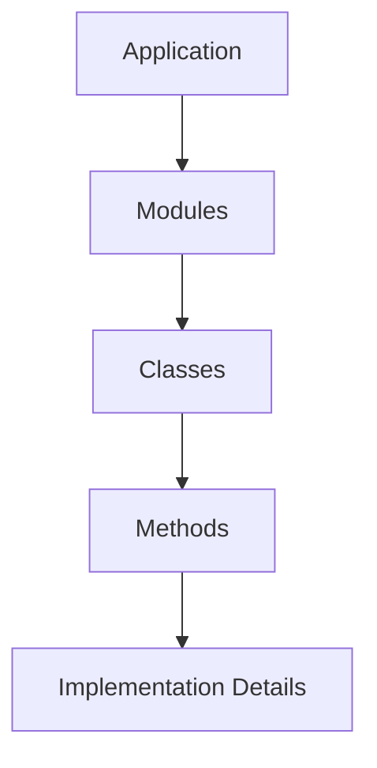

## 11. Deployment
- How the software system is deployed in its target environment
- Includes:
  - Hardware configuration
  - Network topology
  - Software dependencies
  - Runtime environment

## 12. A System's Deployment Architectural Perspective
- Architecture from a deployment viewpoint
- Focuses on:
  - Physical distribution of components
  - Network communication
  - Resource allocation
  - Scalability considerations

**Diagram: Deployment Architecture**
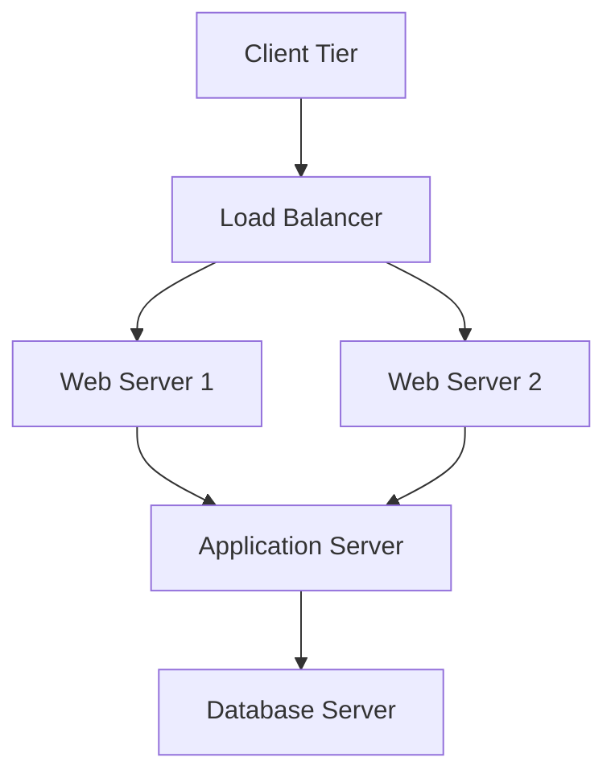

## 13. Software Architecture's Elements

### Components
- **Definition:** Computational elements that encapsulate functionality
- **Characteristics:**
  - Have well-defined interfaces
  - Can be developed independently
  - Can be reused across systems

**Examples:**
- User interface components
- Business logic components
- Data access components
- Utility components

**Diagram: Component Structure**
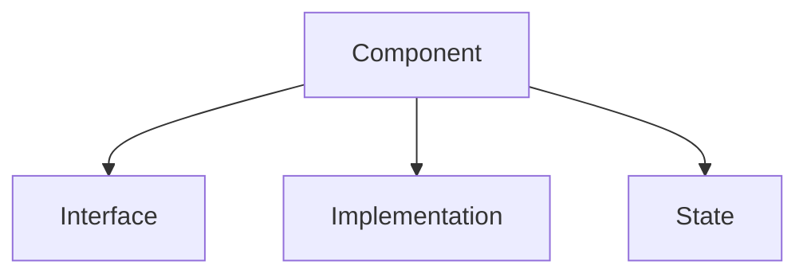

### Connectors
- **Definition:** Elements that enable communication and coordination between components
- **Purpose:** Define how components interact

### Examples of Connectors
1. **Procedure Calls:** Synchronous communication between components
2. **Message Passing:** Asynchronous communication
3. **Shared Memory:** Components communicate through shared data structures
4. **Remote Procedure Calls (RPC):** Communication across network boundaries
5. **Event Systems:** Components communicate through events
6. **Pipes and Filters:** Data flows through a series of processing steps

**Diagram: Connector Types**
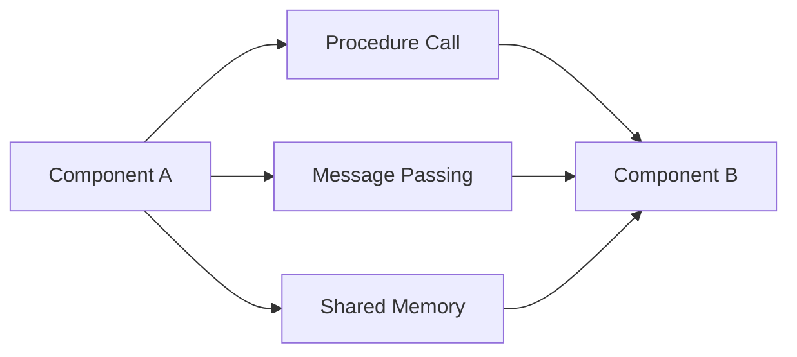

### Configurations
- **Definition:** The arrangement of components and connectors in the system
- **Purpose:** Defines the system's structure and behavior

### An Example Configuration
**Three-Tier Architecture Configuration:**
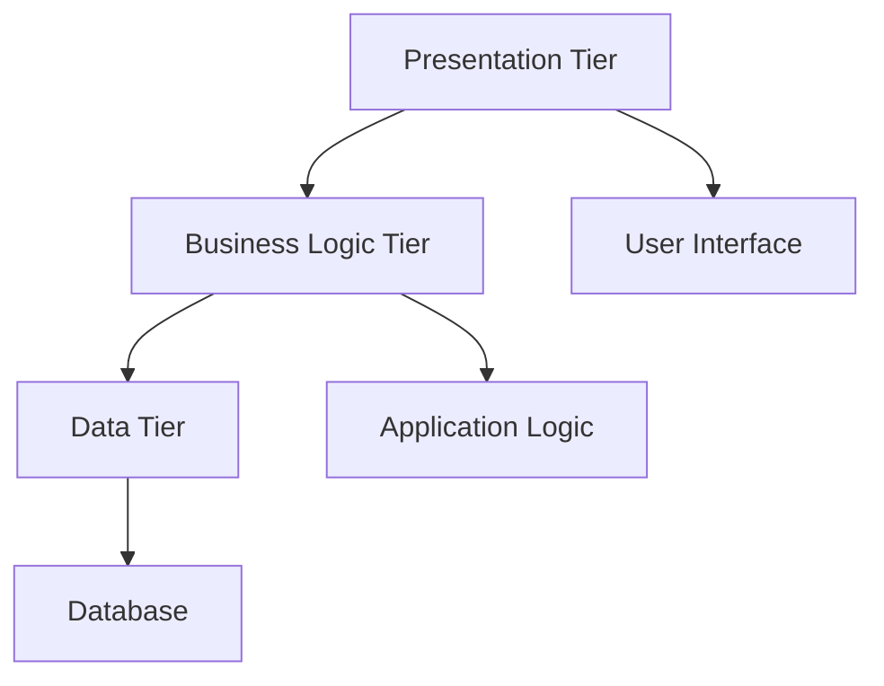

## 14. Architectural Patterns

### Three-Tiered Pattern
- **Purpose:** Separates concerns into three distinct layers
- **Layers:**
  1. **Presentation Tier:** User interface and user interaction
  2. **Business Logic Tier:** Application logic and business rules
  3. **Data Tier:** Data storage and data access

**Diagram: Three-Tier Pattern**
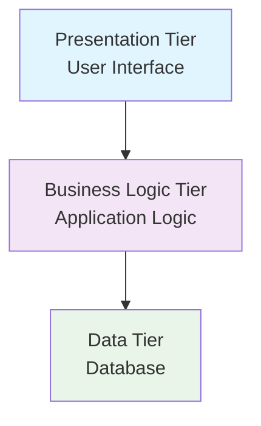

**Benefits:**
- Clear separation of concerns
- Independent development of tiers
- Scalability and maintainability
- Technology independence

## 15. Architectural Models, Views, and Visualizations
- **Models:** Abstract representations of the architecture
- **Views:** Different perspectives of the same architecture
- **Visualizations:** Graphical representations of architectural elements

**Common Views:**
1. **Logical View:** Shows key abstractions and their relationships
2. **Process View:** Shows runtime behavior and concurrency
3. **Physical View:** Shows deployment and hardware configuration
4. **Development View:** Shows organization of software modules

**Diagram: Multiple Views**
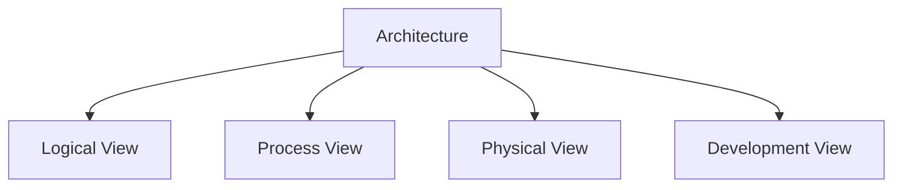

## 16. Architectural Processes
- **Architecture Design:** Creating the initial architecture
- **Architecture Evaluation:** Assessing architecture quality
- **Architecture Implementation:** Converting design to code
- **Architecture Maintenance:** Updating and evolving architecture

**Diagram: Architectural Process**
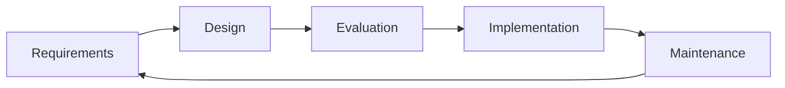

## 17. Stakeholders in a System's Architecture
Different groups with interest in the system's architecture:

1. **Architects:** Design and maintain the architecture
2. **Developers:** Implement the architecture
3. **Testers:** Verify architecture meets requirements
4. **Project Managers:** Ensure architecture supports project goals
5. **Users:** Expect system to meet their needs
6. **Maintainers:** Need to understand and modify the system
7. **Deployers:** Need to install and configure the system

**Diagram: Stakeholder Relationships**
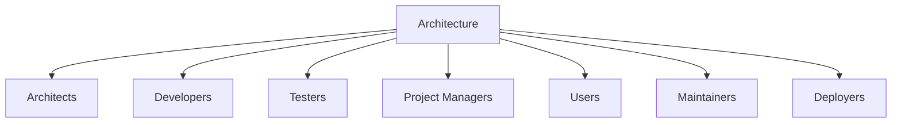

## 18. Summary
- Software architecture is the fundamental structure of a software system
- It involves components, connectors, and configurations
- Architecture exists in both prescriptive (as-designed) and descriptive (as-implemented) forms
- Architecture evolves over time and can degrade without proper maintenance
- Architectural patterns provide proven solutions to common problems
- Multiple views help different stakeholders understand the architecture
- Various processes ensure architecture quality and evolution
- Multiple stakeholders have different interests in the system's architecture

---

## Key Takeaways
1. **Architecture is fundamental** - defines system structure and behavior
2. **Components and connectors** are the basic building blocks
3. **Configurations** define how elements are arranged
4. **Patterns** provide proven architectural solutions
5. **Multiple views** serve different stakeholder needs
6. **Architecture evolves** and requires maintenance
7. **Stakeholders** have diverse interests in architecture
8. **Processes** ensure architecture quality and evolution 