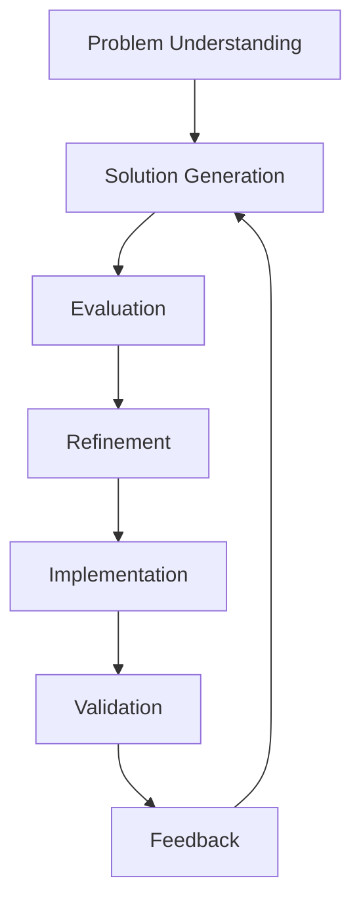
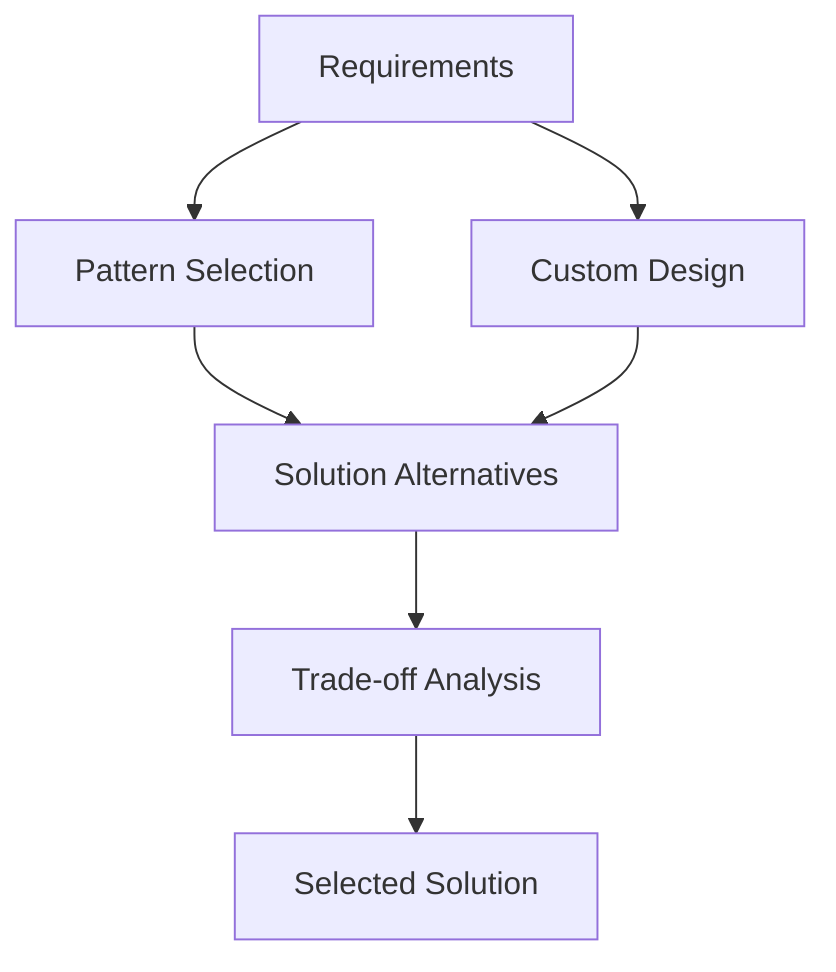
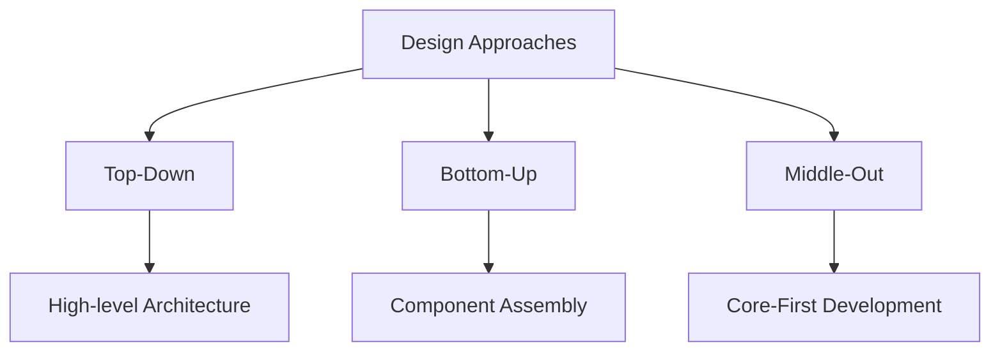

# How Do You Design?

## Introduction to Design
Designing software architecture involves a systematic approach to problem-solving that combines creative thinking with analytical reasoning. It's both an art and a science, requiring experience, intuition, and structured methodologies.

## Design Process Overview
Design is not a linear process but an iterative one that involves multiple cycles of creation, evaluation, and refinement.

**Diagram: Design Process Cycle**


## Key Design Activities

### 1. Problem Understanding
- **Requirements Analysis**: Understanding what needs to be built
- **Constraint Identification**: Technical, business, and regulatory constraints
- **Stakeholder Analysis**: Understanding different perspectives and needs
- **Context Analysis**: Understanding the environment and context

**Example: E-commerce System**
```
Problem: Build an online shopping platform
Requirements: User registration, product catalog, shopping cart, payment processing
Constraints: Budget, timeline, technology stack, security requirements
Stakeholders: Customers, merchants, administrators, payment processors
Context: Web-based, mobile-friendly, scalable, secure
```

### 2. Solution Generation
- **Creative Thinking**: Generating multiple design alternatives
- **Pattern Recognition**: Applying known architectural patterns
- **Innovation**: Creating new solutions when needed
- **Trade-off Analysis**: Balancing competing requirements

**Diagram: Solution Generation Process**


### 3. Evaluation and Refinement
- **Quality Attribute Analysis**: Evaluating against non-functional requirements
- **Risk Assessment**: Identifying potential problems
- **Cost-Benefit Analysis**: Evaluating trade-offs
- **Iterative Improvement**: Refining the design based on feedback

## Design Principles

### 1. Separation of Concerns
- Divide the system into distinct responsibilities
- Each component should have a single, well-defined purpose
- Reduces complexity and improves maintainability

**Example:**
```
┌─────────────────────────────────────────────────────────────┐
│                Separation of Concerns                       │
├─────────────────┬─────────────────┬─────────────────────────┤
│   Presentation  │   Business      │   Data                  │
│   (UI/UX)       │   Logic         │   (Storage)             │
│                 │                 │                         │
│ - User Interface│ - Business Rules│ - Database Operations   │
│ - Input Validation│ - Calculations │ - File I/O             │
│ - Display Logic │ - Workflows     │ - Data Transformation   │
└─────────────────┴─────────────────┴─────────────────────────┘
```

### 2. Abstraction
- Hide unnecessary details
- Focus on essential characteristics
- Manage complexity through layers of abstraction

### 3. Modularity
- Break systems into manageable pieces
- Enable independent development and testing
- Facilitate reuse and maintenance

## Design Techniques

### 1. Top-Down Design
- Start with high-level architecture
- Decompose into smaller components
- Good for well-understood problems

### 2. Bottom-Up Design
- Start with existing components
- Compose into larger systems
- Good when reusing existing components

### 3. Middle-Out Design
- Start with core functionality
- Expand outward in both directions
- Good for complex, evolving systems

**Diagram: Design Approaches**


## Practice Questions

### Question 1: Design Process
**Question:** Describe the iterative design process. Why is iteration important in software architecture design?

**Solution:**
The iterative design process involves:
1. **Problem Understanding**: Analyze requirements and constraints
2. **Solution Generation**: Create design alternatives
3. **Evaluation**: Assess solutions against requirements
4. **Refinement**: Improve the design based on feedback
5. **Implementation**: Build and validate the solution

Iteration is important because:
- Requirements may be unclear initially
- Design decisions reveal new constraints
- Feedback from stakeholders improves the design
- Complex problems require multiple attempts to solve optimally

### Question 2: Separation of Concerns
**Question:** Apply the principle of separation of concerns to design a library management system. Draw a diagram showing the main components and their responsibilities.

**Solution:**
```
┌─────────────────────────────────────────────────────────────┐
│                Library Management System                    │
├─────────────────┬─────────────────┬─────────────────────────┤
│   User Interface│   Business      │   Data Management       │
│   (Presentation)│   Logic         │   (Storage)             │
│                 │                 │                         │
│ ┌─────────────┐ │ ┌─────────────┐ │ ┌─────────────────────┐ │
│ │Web Interface│ │ │Book         │ │ │Book Database        │ │
│ │Mobile App   │ │ │Management   │ │ │User Database        │ │
│ │Admin Panel  │ │ │Loan         │ │ │Loan Database        │ │
│ └─────────────┘ │ │Processing   │ │ └─────────────────────┘ │
│                 │ └─────────────┘ │                         │
└─────────────────┴─────────────────┴─────────────────────────┘
```

### Question 3: Design Approach Selection
**Question:** When would you choose top-down vs bottom-up design? Provide an example for each approach.

**Solution:**
**Top-Down Design**: Choose when the problem is well-understood and you have clear requirements
- Example: Building a new e-commerce platform from scratch with clear specifications

**Bottom-Up Design**: Choose when you have existing components to reuse
- Example: Integrating multiple existing systems (payment gateway, inventory system, user management) into a unified platform

**Middle-Out Design**: Choose for complex, evolving systems where core functionality is clear but details are uncertain
- Example: Building a social media platform where the core features are known but additional features will be added based on user feedback 