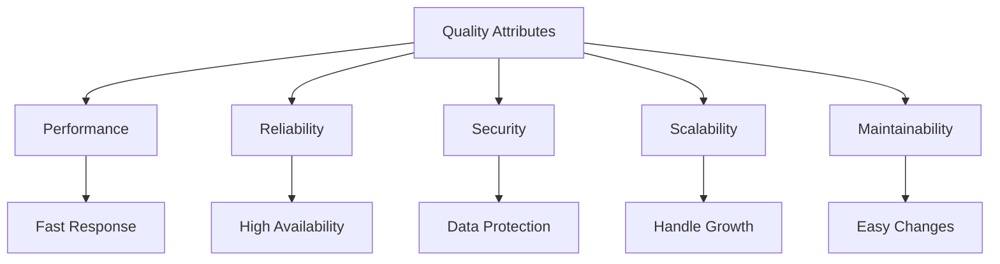
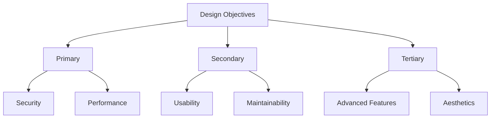

# Objectives of Architectural Design

The primary objectives of architectural design are:

- **Functional correctness:** The system meets all specified requirements.
- **Performance:** The system performs within acceptable limits (speed, responsiveness, resource usage).
- **Reliability:** The system operates without failure and recovers gracefully from errors.
- **Maintainability:** The system can be easily modified, extended, or fixed.
- **Scalability:** The system can handle increased load or growth in users/data.
- **Security:** The system protects against threats and unauthorized access.
- **Usability:** The system is easy and intuitive for users.

**Key Point:**
> A well-designed architecture balances these objectives according to the system's context and priorities.

# Objectives in Design

## Understanding Design Objectives
Design objectives are the goals and targets that guide the architectural design process. They define what the system should achieve and how it should behave. Clear objectives are essential for making informed design decisions and evaluating the success of the architecture.

## Types of Design Objectives

### 1. Functional Objectives
- **Purpose**: Define what the system should do
- **Examples**: 
  - Process user transactions
  - Generate reports
  - Manage user accounts
  - Handle real-time communication

**Example: Banking System Functional Objectives**
```
┌─────────────────────────────────────────────────────────────┐
│                Functional Objectives                        │
├─────────────────┬─────────────────┬─────────────────────────┤
│   Account       │   Transaction   │   Reporting             │
│   Management    │   Processing    │   System                │
│                 │                 │                         │
│ - User          │ - Money         │ - Account               │
│   Registration  │   Transfer      │ - Transaction           │
│ - Account       │ - Bill Payment  │   Statements            │
│   Creation      │ - ATM           │   History               │
│ - Profile       │   Withdrawal    │ - Financial             │
│   Management    │ - Online        │   Reports               │
│ └─────────────┘ │   Banking       │ └─────────────────────┘ │
└─────────────────┴─────────────────┴─────────────────────────┘
```

### 2. Non-Functional Objectives (Quality Attributes)
- **Performance**: Response time, throughput, resource utilization
- **Reliability**: Availability, fault tolerance, error handling
- **Security**: Authentication, authorization, data protection
- **Scalability**: Ability to handle increased load
- **Maintainability**: Ease of modification and enhancement
- **Usability**: User experience and interface design

**Diagram: Quality Attributes Trade-offs**


### 3. Business Objectives
- **Cost**: Development and operational costs
- **Time-to-Market**: Speed of delivery
- **Competitive Advantage**: Unique features or capabilities
- **Compliance**: Regulatory and legal requirements

## Objective Hierarchy

### Primary Objectives
- Most critical goals that must be achieved
- Often non-negotiable requirements
- Examples: Security compliance, performance requirements

### Secondary Objectives
- Important but can be compromised if necessary
- May have trade-offs with primary objectives
- Examples: Development speed, cost optimization

### Tertiary Objectives
- Nice-to-have features or qualities
- Can be deferred or eliminated if needed
- Examples: Advanced features, aesthetic considerations

**Diagram: Objective Hierarchy**


## Objective-Driven Design Process

### 1. Objective Identification
- **Stakeholder Analysis**: Understanding different perspectives
- **Requirement Analysis**: Converting requirements to objectives
- **Constraint Analysis**: Identifying limitations and boundaries
- **Priority Setting**: Determining relative importance

### 2. Objective Validation
- **Feasibility Analysis**: Can objectives be achieved?
- **Conflict Resolution**: Resolving competing objectives
- **Stakeholder Agreement**: Ensuring buy-in from all parties
- **Documentation**: Clear specification of objectives

### 3. Objective Monitoring
- **Progress Tracking**: Measuring achievement of objectives
- **Adjustment**: Modifying objectives as needed
- **Validation**: Ensuring objectives remain relevant

## Example: E-commerce Platform Objectives

### Functional Objectives
- User registration and authentication
- Product catalog and search
- Shopping cart management
- Payment processing
- Order management

### Non-Functional Objectives
- **Performance**: Page load time < 2 seconds
- **Availability**: 99.9% uptime
- **Security**: PCI DSS compliance
- **Scalability**: Handle 10,000 concurrent users

### Business Objectives
- **Cost**: Development budget < $500,000
- **Time**: Launch within 6 months
- **Market**: Support mobile and desktop users

## Practice Questions

### Question 1: Objective Classification
**Question:** Classify the following objectives as functional, non-functional, or business objectives for a hospital management system:
- Process patient admissions
- Response time < 1 second
- HIPAA compliance
- Development cost < $1M
- Generate medical reports

**Solution:**
- **Functional**: Process patient admissions, Generate medical reports
- **Non-Functional**: Response time < 1 second, HIPAA compliance
- **Business**: Development cost < $1M

### Question 2: Objective Trade-offs
**Question:** Describe a scenario where performance and security objectives conflict. How would you resolve this conflict?

**Solution:**
**Conflict**: Implementing strong encryption (security) may slow down data processing (performance)

**Resolution Strategies**:
1. **Compromise**: Use acceptable encryption that balances both needs
2. **Prioritize**: Choose the more critical objective based on context
3. **Optimize**: Find ways to improve performance while maintaining security
4. **Architectural Solution**: Use caching or parallel processing to mitigate performance impact

### Question 3: Objective-Driven Design
**Question:** Design a set of objectives for a real-time messaging application. Include functional, non-functional, and business objectives.

**Solution:**
**Functional Objectives**:
- User registration and authentication
- Real-time message sending and receiving
- Group chat functionality
- File sharing capabilities

**Non-Functional Objectives**:
- **Performance**: Message delivery < 100ms
- **Reliability**: 99.99% message delivery rate
- **Scalability**: Support 1M concurrent users
- **Security**: End-to-end encryption

**Business Objectives**:
- **Cost**: Monthly operational cost < $50,000
- **Time**: Beta launch within 3 months
- **Market**: Support iOS and Android platforms 