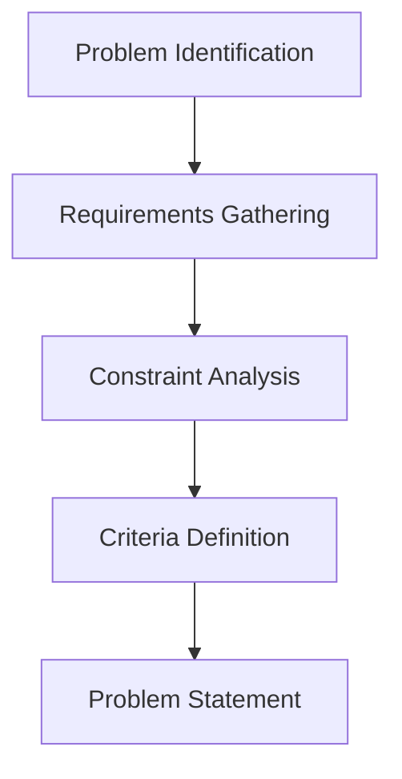
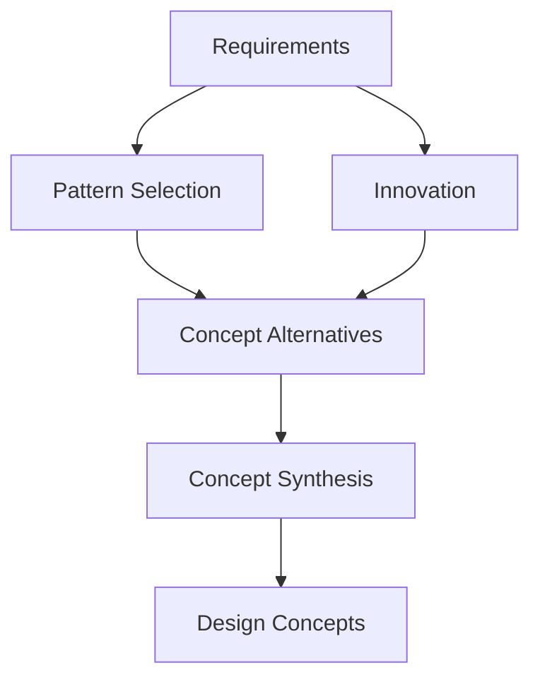
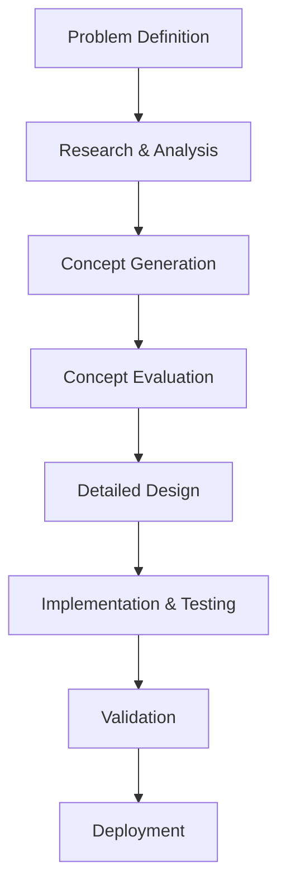
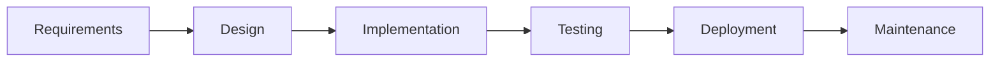
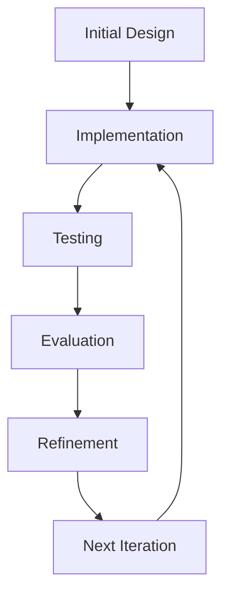
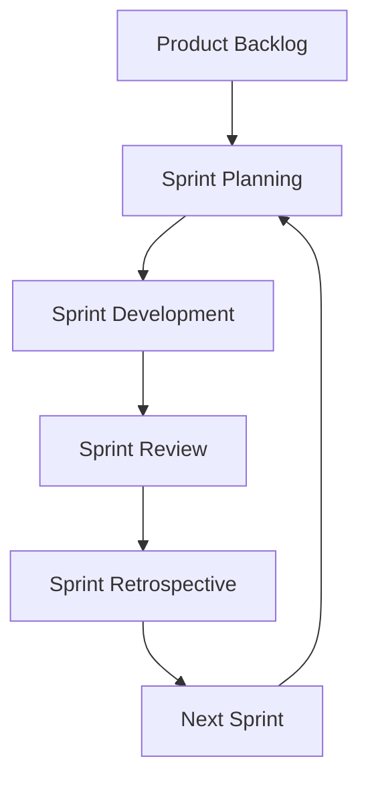

# Engineering Design Processes (Standard Approach)

## Introduction to Engineering Design Processes
Engineering design processes provide structured methodologies for solving complex problems. These processes have evolved from traditional engineering disciplines and have been adapted for software development. Understanding these processes helps architects make systematic, well-reasoned design decisions.

## Standard Engineering Design Process

### 1. Problem Definition
- **Identify the Problem**: Clearly understand what needs to be solved
- **Gather Requirements**: Collect functional and non-functional requirements
- **Define Constraints**: Identify technical, business, and regulatory constraints
- **Establish Criteria**: Define success criteria and evaluation metrics

**Diagram: Problem Definition Process**

### 2. Research and Analysis
- **Literature Review**: Study existing solutions and approaches
- **Technology Analysis**: Evaluate available technologies and tools
- **Stakeholder Analysis**: Understand different perspectives and needs
- **Risk Assessment**: Identify potential problems and challenges

### 3. Concept Generation
- **Brainstorming**: Generate multiple design alternatives
- **Pattern Recognition**: Apply known architectural patterns
- **Innovation**: Create novel solutions when needed
- **Synthesis**: Combine ideas into coherent concepts

**Diagram: Concept Generation**

### 4. Concept Evaluation
- **Feasibility Analysis**: Assess technical and economic feasibility
- **Trade-off Analysis**: Evaluate competing requirements
- **Risk Analysis**: Identify and assess potential risks
- **Stakeholder Review**: Get feedback from relevant parties

### 5. Detailed Design
- **Architecture Design**: Create the high-level structure
- **Component Design**: Design individual components
- **Interface Design**: Define component interfaces
- **Documentation**: Create design documentation

### 6. Implementation and Testing
- **Prototyping**: Build prototypes to validate design
- **Implementation**: Build the actual system
- **Testing**: Verify that requirements are met
- **Validation**: Ensure the solution solves the original problem

**Diagram: Complete Design Process**

## Software-Specific Design Processes

### 1. Waterfall Process
- **Linear Approach**: Sequential phases from requirements to deployment
- **Characteristics**: 
  - Detailed planning upfront
  - Clear phase boundaries
  - Comprehensive documentation
  - Limited flexibility for changes

**Diagram: Waterfall Process**

### 2. Iterative Process
- **Cyclical Approach**: Multiple iterations of design and implementation
- **Characteristics**:
  - Incremental development
  - Feedback-driven refinement
  - Risk mitigation through early validation
  - Flexibility for requirement changes

**Diagram: Iterative Process**

### 3. Agile Process
- **Adaptive Approach**: Responds to changing requirements
- **Characteristics**:
  - Short development cycles (sprints)
  - Continuous stakeholder involvement
  - Emphasis on working software
  - Regular reflection and adaptation

**Diagram: Agile Process**

## Design Process Best Practices

### 1. Stakeholder Involvement
- **Early Engagement**: Involve stakeholders from the beginning
- **Regular Communication**: Maintain ongoing dialogue
- **Feedback Integration**: Incorporate stakeholder feedback
- **Conflict Resolution**: Address competing stakeholder needs

### 2. Risk Management
- **Risk Identification**: Identify potential problems early
- **Risk Assessment**: Evaluate likelihood and impact
- **Risk Mitigation**: Develop strategies to reduce risks
- **Risk Monitoring**: Track risks throughout the process

### 3. Quality Assurance
- **Design Reviews**: Regular review of design decisions
- **Peer Review**: Colleague review of design work
- **Validation**: Ensure design meets requirements
- **Documentation**: Maintain clear design documentation

## Example: E-commerce Platform Design Process

### Problem Definition
- **Problem**: Build an online shopping platform
- **Requirements**: User registration, product catalog, shopping cart, payment processing
- **Constraints**: Budget, timeline, security requirements
- **Criteria**: Performance, usability, security, scalability

### Research and Analysis
- **Technology Stack**: Evaluate web frameworks, databases, payment gateways
- **Competitor Analysis**: Study existing e-commerce platforms
- **User Research**: Understand customer needs and behaviors
- **Risk Assessment**: Identify security, performance, and scalability risks

### Concept Generation
- **Architecture Patterns**: Consider three-tier, microservices, event-driven
- **Technology Selection**: Choose appropriate technologies
- **Component Design**: Design user interface, business logic, data layers

### Concept Evaluation
- **Performance Analysis**: Evaluate response times and throughput
- **Security Assessment**: Review security measures
- **Cost Analysis**: Estimate development and operational costs
- **Stakeholder Review**: Get feedback from business and technical stakeholders

## Practice Questions

### Question 1: Design Process Comparison
**Question:** Compare the waterfall and agile design processes. When would you choose each approach?

**Solution:**
**Waterfall Process**:
- **Characteristics**: Linear, sequential, detailed planning upfront
- **When to Use**: Well-understood problems, stable requirements, regulatory compliance needs
- **Advantages**: Clear milestones, comprehensive documentation, predictable timeline
- **Disadvantages**: Limited flexibility, late feedback, difficulty handling changes

**Agile Process**:
- **Characteristics**: Iterative, adaptive, continuous stakeholder involvement
- **When to Use**: Uncertain requirements, rapidly changing environments, innovation projects
- **Advantages**: Flexibility, early feedback, risk mitigation
- **Disadvantages**: Less predictable timeline, requires stakeholder commitment

### Question 2: Risk Management in Design
**Question:** Describe how you would manage risks during the architectural design process. Provide specific examples.

**Solution:**
**Risk Management Process**:
1. **Risk Identification**: Identify technical, business, and project risks
2. **Risk Assessment**: Evaluate likelihood and impact of each risk
3. **Risk Mitigation**: Develop strategies to reduce or eliminate risks
4. **Risk Monitoring**: Track risks throughout the project

**Examples**:
- **Technical Risk**: New technology may not perform as expected
  - Mitigation: Prototype and test early
- **Business Risk**: Requirements may change significantly
  - Mitigation: Use iterative design process
- **Project Risk**: Team may lack necessary skills
  - Mitigation: Training, hiring, or outsourcing

### Question 3: Design Process Application
**Question:** Apply the standard engineering design process to design a mobile banking application. Outline the key activities in each phase.

**Solution:**
**Problem Definition**:
- Requirements: Secure banking transactions, user authentication, account management
- Constraints: Mobile platform limitations, security regulations, performance requirements

**Research and Analysis**:
- Study existing mobile banking apps
- Evaluate mobile development frameworks
- Analyze security requirements and regulations

**Concept Generation**:
- Consider native vs hybrid development
- Design authentication and security architecture
- Plan user interface and experience

**Concept Evaluation**:
- Assess security measures
- Evaluate performance on different devices
- Review compliance with banking regulations

**Detailed Design**:
- Design component architecture
- Define API interfaces
- Plan data storage and security

**Implementation and Testing**:
- Build prototypes
- Implement core functionality
- Conduct security and usability testing 