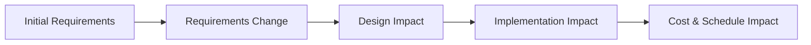
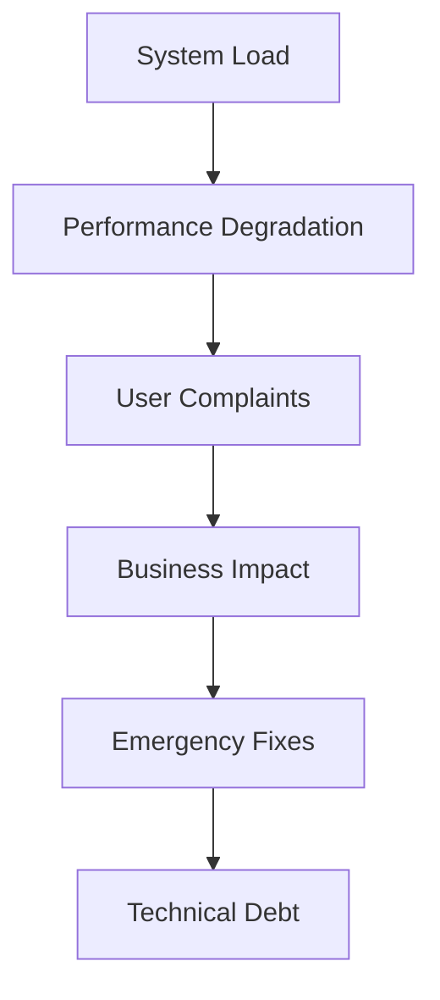
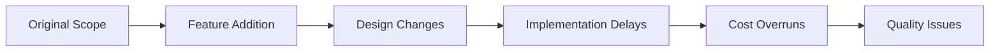
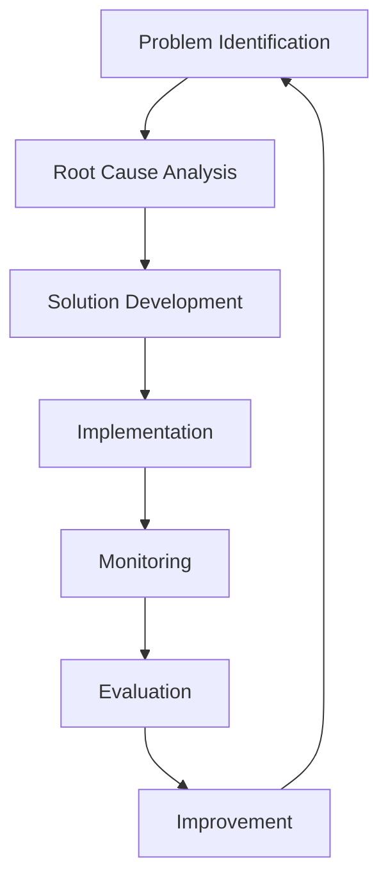

# Potential Problems in Design

## Introduction to Design Problems
Architectural design is a complex process that can encounter various problems. Understanding these potential issues helps architects anticipate challenges and develop strategies to avoid or mitigate them. Early identification and resolution of problems is crucial for successful system development.

## Common Design Problems

### 1. Requirements Problems

#### Unclear or Vague Requirements
- **Problem**: Requirements are ambiguous, incomplete, or contradictory
- **Causes**: 
  - Poor stakeholder communication
  - Insufficient analysis
  - Changing business needs
  - Multiple conflicting stakeholders

**Example:**
```
Vague Requirement: "The system should be fast"
Clear Requirement: "The system should respond to user queries within 2 seconds"
```

#### Changing Requirements
- **Problem**: Requirements change frequently during development
- **Causes**:
  - Evolving business needs
  - Market changes
  - Stakeholder learning and feedback
  - Technology changes

**Diagram: Requirements Evolution**


### 2. Technical Problems

#### Technology Selection Issues
- **Problem**: Choosing inappropriate technologies or tools
- **Causes**:
  - Insufficient technology evaluation
  - Following trends without analysis
  - Lack of team expertise
  - Vendor lock-in

**Example:**
```
Problem: Choosing a new, unproven framework for a critical system
Solution: Evaluate multiple options, consider team expertise, assess maturity
```

#### Scalability Problems
- **Problem**: System cannot handle increased load
- **Causes**:
  - Poor architectural decisions
  - Insufficient capacity planning
  - Inadequate performance testing
  - Growth underestimation

**Diagram: Scalability Issues**


### 3. Communication Problems

#### Stakeholder Misalignment
- **Problem**: Different stakeholders have conflicting expectations
- **Causes**:
  - Insufficient stakeholder involvement
  - Poor communication channels
  - Different priorities and goals
  - Lack of shared understanding

#### Team Communication Issues
- **Problem**: Poor communication within the development team
- **Causes**:
  - Large team size
  - Geographic distribution
  - Different technical backgrounds
  - Inadequate documentation

### 4. Process Problems

#### Scope Creep
- **Problem**: Project scope expands beyond original boundaries
- **Causes**:
  - Poor requirement management
  - Stakeholder pressure
  - Lack of change control
  - Insufficient planning

**Diagram: Scope Creep Impact**


#### Time Pressure
- **Problem**: Insufficient time for proper design and implementation
- **Causes**:
  - Unrealistic schedules
  - Poor estimation
  - External pressures
  - Resource constraints

## Problem Prevention Strategies

### 1. Requirements Management
- **Stakeholder Engagement**: Involve all stakeholders early and often
- **Requirements Documentation**: Clear, detailed, and traceable requirements
- **Change Control**: Formal process for managing requirement changes
- **Validation**: Regular review and validation of requirements

### 2. Technical Risk Mitigation
- **Technology Evaluation**: Thorough assessment of technologies
- **Prototyping**: Build prototypes to validate technical decisions
- **Performance Testing**: Early and continuous performance testing
- **Scalability Planning**: Design for expected and future growth

### 3. Communication Improvement
- **Regular Meetings**: Scheduled stakeholder and team meetings
- **Clear Documentation**: Comprehensive and accessible documentation
- **Feedback Loops**: Mechanisms for continuous feedback
- **Conflict Resolution**: Processes for resolving disagreements

### 4. Process Management
- **Project Planning**: Realistic schedules and resource allocation
- **Scope Management**: Clear boundaries and change control
- **Quality Assurance**: Regular reviews and testing
- **Risk Management**: Proactive identification and mitigation of risks

## Problem Resolution Approaches

### 1. Root Cause Analysis
- **Identify the Problem**: Clearly define what went wrong
- **Analyze Causes**: Understand why the problem occurred
- **Develop Solutions**: Create strategies to fix the problem
- **Implement Fixes**: Execute the solutions
- **Monitor Results**: Track the effectiveness of fixes

### 2. Iterative Improvement
- **Small Changes**: Make incremental improvements
- **Quick Feedback**: Get rapid feedback on changes
- **Continuous Learning**: Learn from each iteration
- **Adaptation**: Adjust approach based on results

**Diagram: Problem Resolution Process**


## Example: E-commerce Platform Problems

### Requirements Problems
- **Vague Requirements**: "The system should be user-friendly"
- **Solution**: Define specific usability metrics and user experience goals

### Technical Problems
- **Scalability Issues**: System crashes during peak shopping periods
- **Solution**: Implement load balancing, caching, and database optimization

### Communication Problems
- **Stakeholder Conflicts**: Marketing wants many features, development wants simplicity
- **Solution**: Facilitate discussions to find common ground and prioritize features

### Process Problems
- **Scope Creep**: Adding features without adjusting timeline or resources
- **Solution**: Implement change control process and impact analysis

## Practice Questions

### Question 1: Problem Identification
**Question:** Identify three potential problems that could occur during the design of a hospital information system. For each problem, describe its causes and potential solutions.

**Solution:**
1. **Security Requirements Problem**:
   - **Problem**: Complex HIPAA compliance requirements
   - **Causes**: Unclear regulations, multiple stakeholders, technical complexity
   - **Solution**: Engage security experts early, create detailed security architecture, regular compliance reviews

2. **Integration Problems**:
   - **Problem**: Difficulty integrating with existing hospital systems
   - **Causes**: Legacy systems, different data formats, vendor lock-in
   - **Solution**: Thorough system analysis, design integration layer, use standard protocols

3. **User Adoption Problems**:
   - **Problem**: Medical staff resistance to new system
   - **Causes**: Change resistance, poor user interface, insufficient training
   - **Solution**: Involve users in design, create intuitive interface, comprehensive training program

### Question 2: Risk Mitigation
**Question:** Describe how you would mitigate the risk of technology selection problems in a critical system design.

**Solution:**
**Risk Mitigation Strategies**:
1. **Technology Evaluation**: Create evaluation criteria and assess multiple options
2. **Expert Consultation**: Engage technology experts and consultants
3. **Prototyping**: Build prototypes to validate technical decisions
4. **Vendor Assessment**: Evaluate vendor stability, support, and track record
5. **Fallback Plans**: Identify alternative technologies as backup options
6. **Team Training**: Ensure team has necessary skills or provide training

### Question 3: Communication Problem Resolution
**Question:** A project has multiple stakeholders with conflicting requirements. Describe a process for resolving these conflicts.

**Solution:**
**Conflict Resolution Process**:
1. **Stakeholder Analysis**: Identify all stakeholders and their interests
2. **Requirement Prioritization**: Establish criteria for prioritizing requirements
3. **Facilitated Workshops**: Bring stakeholders together to discuss conflicts
4. **Trade-off Analysis**: Evaluate different options and their impacts
5. **Consensus Building**: Work toward agreement on key decisions
6. **Documentation**: Clearly document decisions and rationale
7. **Regular Review**: Schedule regular reviews to address new conflicts 