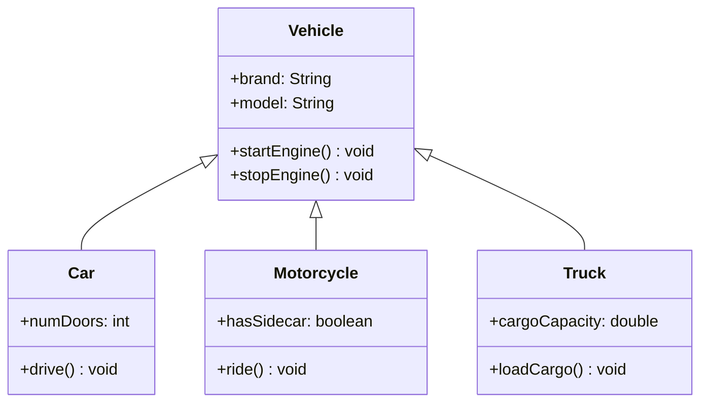
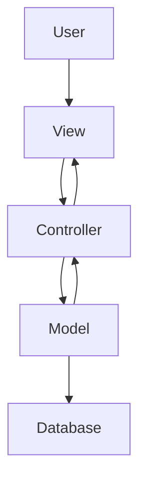

# Object-Oriented Style

## Introduction to Object-Oriented Architecture
Object-Oriented (OO) architecture organizes software around objects that encapsulate both data and behavior. This style is based on the principles of object-oriented programming and provides a natural way to model real-world entities and their interactions.

## Core Principles

### 1. Encapsulation
- **Definition**: Bundling data and methods that operate on that data within a single unit (object)
- **Benefits**: 
  - Information hiding
  - Data protection
  - Modularity
  - Reduced coupling

**Example: Bank Account Object**
```
┌─────────────────────────────────────────────────────────────┐
│                    Bank Account Object                      │
├─────────────────────────────────────────────────────────────┤
│                     Private Data                            │
│ ┌─────────────────────────────────────────────────────────┐ │
│ │ accountNumber: String                                   │ │
│ │ balance: Double                                         │ │
│ │ owner: String                                           │ │
│ └─────────────────────────────────────────────────────────┘ │
│                     Public Methods                          │ │
│ ┌─────────────────────────────────────────────────────────┐ │
│ │ +deposit(amount: Double): void                          │ │
│ │ +withdraw(amount: Double): boolean                      │ │
│ │ +getBalance(): Double                                   │ │
│ │ +transfer(to: Account, amount: Double): boolean        │ │
│ └─────────────────────────────────────────────────────────┘ │
└─────────────────────────────────────────────────────────────┘
```

### 2. Inheritance
- **Definition**: Mechanism that allows a class to inherit properties and methods from another class
- **Benefits**:
  - Code reuse
  - Polymorphism
  - Hierarchical organization
  - Extensibility

**Diagram: Inheritance Hierarchy**


### 3. Polymorphism
- **Definition**: Ability to present the same interface for different underlying forms (data types or classes)
- **Types**:
  - **Compile-time polymorphism**: Method overloading
  - **Runtime polymorphism**: Method overriding

**Example: Polymorphic Payment Processing**
```
┌─────────────────────────────────────────────────────────────┐
│                Payment Processing System                    │
├─────────────────────────────────────────────────────────────┤
│   Payment Interface                                         │
│ ┌─────────────────────────────────────────────────────────┐ │
│ │ +processPayment(amount: double): boolean               │ │
│ │ +getPaymentDetails(): PaymentDetails                   │ │
│ │ +getStatus(): NotificationStatus                        │ │
│ └─────────────────────────────────────────────────────────┘ │
│                                                             │
│   Concrete Implementations                                  │
│ ┌─────────────┐ ┌─────────────┐ ┌─────────────────────────┐ │
│ │CreditCard   │ │PayPal       │ │BankTransfer             │ │
│ │Payment      │ │Payment      │ │Payment                  │ │
│ │             │ │             │ │                         │ │
│ │+process     │ │+process     │ │+process                 │ │
│ │+validate    │ │+authenticate│ │+verifyAccount           │ │
│ └─────────────┘ └─────────────┘ └─────────────────────────┘ │
└─────────────────────────────────────────────────────────────┘
```

## Object-Oriented Architecture Patterns

### 1. Model-View-Controller (MVC)
- **Purpose**: Separates application logic from user interface
- **Components**:
  - **Model**: Data and business logic
  - **View**: User interface
  - **Controller**: Handles user input and coordinates between Model and View

**Diagram: MVC Pattern**


**Example: E-commerce MVC**
```
┌─────────────────────────────────────────────────────────────┐
│                    E-commerce MVC                          │
├─────────────────┬─────────────────┬─────────────────────────┤
│      View       │   Controller    │        Model            │
│                 │                 │                         │
│ ┌─────────────┐ │ ┌─────────────┐ │ ┌─────────────────────┐ │
│ │Product List │ │ │Product      │ │ │Product              │ │
│ │Shopping Cart│ │ │Controller   │ │ │Order                │ │
│ │Checkout Form│ │ │Order        │ │ │User                 │ │
│ └─────────────┘ │ │Controller   │ │ │Payment              │ │
│                 │ └─────────────┘ │ └─────────────────────┘ │
└─────────────────┴─────────────────┴─────────────────────────┘
```

### 2. Repository Pattern
- **Purpose**: Abstracts data persistence logic
- **Benefits**:
  - Separation of concerns
  - Testability
  - Flexibility in data access

**Example: User Repository**
```
┌─────────────────────────────────────────────────────────────┐
│                    Repository Pattern                       │
├─────────────────────────────────────────────────────────────┤
│   IUserRepository Interface                                 │
│ ┌─────────────────────────────────────────────────────────┐ │
│ │ +findById(id: String): User                            │ │
│ │ +save(user: User): void                                │ │
│ │ +delete(id: String): void                              │ │
│ │ +findAll(): List<User>                                 │ │
│ └─────────────────────────────────────────────────────────┘ │
│                                                             │
│   Concrete Implementations                                  │
│ ┌─────────────┐ ┌─────────────┐ ┌─────────────────────────┐ │
│ │Database     │ │File         │ │Mock                     │ │
│ │UserRepo     │ │UserRepo     │ │UserRepo                 │ │
│ │             │ │             │ │(Testing)                │ │
│ │+SQL queries │ │+File I/O    │ │+In-memory               │ │
│ └─────────────┘ └─────────────┘ └─────────────────────────┘ │
└─────────────────────────────────────────────────────────────┘
```

## Advantages of Object-Oriented Architecture

### 1. Natural Modeling
- Objects correspond to real-world entities
- Intuitive for developers and stakeholders
- Easy to understand and maintain

### 2. Reusability
- Inheritance promotes code reuse
- Components can be reused across projects
- Reduces development time and cost

### 3. Maintainability
- Encapsulation reduces coupling
- Changes are localized to specific objects
- Easier to modify and extend

### 4. Extensibility
- New functionality can be added through inheritance
- Existing code remains unchanged
- Supports open-closed principle

## Disadvantages of Object-Oriented Architecture

### 1. Complexity
- Can lead to complex inheritance hierarchies
- Over-abstraction can make code hard to understand
- Performance overhead from object creation and method calls

### 2. Design Challenges
- Difficult to get inheritance hierarchies right
- Can lead to tight coupling if not designed properly
- Requires careful consideration of object relationships

### 3. Performance Issues
- Object creation and destruction overhead
- Method call indirection
- Memory usage for object metadata

## Best Practices

### 1. Design Principles
- **Single Responsibility Principle**: Each class should have one reason to change
- **Open-Closed Principle**: Open for extension, closed for modification
- **Liskov Substitution Principle**: Subtypes should be substitutable for their base types
- **Interface Segregation Principle**: Clients should not depend on interfaces they don't use
- **Dependency Inversion Principle**: Depend on abstractions, not concretions

### 2. Class Design
- Keep classes focused and cohesive
- Minimize coupling between classes
- Use composition over inheritance when possible
- Design for change and extension

## Practice Questions

### Question 1: Object-Oriented Design
**Question:** Design an object-oriented architecture for a library management system. Create a class diagram showing the main classes and their relationships.

**Solution:**
```
┌─────────────────────────────────────────────────────────────┐
│                Library Management System                    │
├─────────────────┬─────────────────┬─────────────────────────┤
│     User        │     Book        │       Loan              │
│   Management    │   Management    │     Management           │
│                 │                 │                         │
│ ┌─────────────┐ │ ┌─────────────┐ │ ┌─────────────────────┐ │
│ │User         │ │ │Book         │ │ │Loan                 │ │
│ │Member       │ │ │Author       │ │ │Fine                 │ │
│ │Librarian    │ │ │Category     │ │ │Reservation         │ │
│ │Admin        │ │ │ISBN         │ │ │Return              │ │
│ └─────────────┘ │ └─────────────┘ │ └─────────────────────┘ │
└─────────────────┴─────────────────┴─────────────────────────┘
```

**Class Relationships:**
- User has many Loans
- Book has many Loans
- Loan belongs to User and Book
- Book has one Author
- Book belongs to one Category

### Question 2: Encapsulation and Information Hiding
**Question:** Explain how encapsulation provides information hiding in object-oriented design. Provide an example.

**Solution:**
**Encapsulation and Information Hiding:**
- Encapsulation bundles data and methods together
- Private data is hidden from external access
- Public methods provide controlled access to data
- Implementation details are hidden from clients

**Example:**
```java
public class BankAccount {
    private double balance;  // Private data - hidden from external access
    private String accountNumber;
    
    public void deposit(double amount) {  // Public method - controlled access
        if (amount > 0) {
            balance += amount;
        }
    }
    
    public double getBalance() {  // Public method - read-only access
        return balance;
    }
}
```

### Question 3: Polymorphism Application
**Question:** Design a polymorphic system for handling different types of notifications (email, SMS, push notification). Show how polymorphism enables extensibility.

**Solution:**
```
┌─────────────────────────────────────────────────────────────┐
│                Notification System                          │
├─────────────────────────────────────────────────────────────┤
│   Notification Interface                                    │
│ ┌─────────────────────────────────────────────────────────┐ │
│ │ +send(message: String, recipient: String): boolean     │ │
│ │ +getStatus(): NotificationStatus                        │ │
│ └─────────────────────────────────────────────────────────┘ │
│                                                             │
│   Concrete Implementations                                  │
│ ┌─────────────┐ ┌─────────────┐ ┌─────────────────────────┐ │
│ │Email        │ │SMS          │ │Push                      │ │
│ │Notification │ │Notification │ │Notification             │ │
│ │             │ │             │ │                         │ │
│ │+SMTP config │ │+SMS gateway │ │+Mobile device           │ │
│ │+HTML format │ │+Text format │ │+App integration         │ │
│ └─────────────┘ └─────────────┘ └─────────────────────────┘ │
└─────────────────────────────────────────────────────────────┘
```

**Extensibility Benefits:**
- New notification types can be added without changing existing code
- All notifications can be handled uniformly through the interface
- Testing can be done with mock implementations
- Runtime selection of notification type based on user preferences 