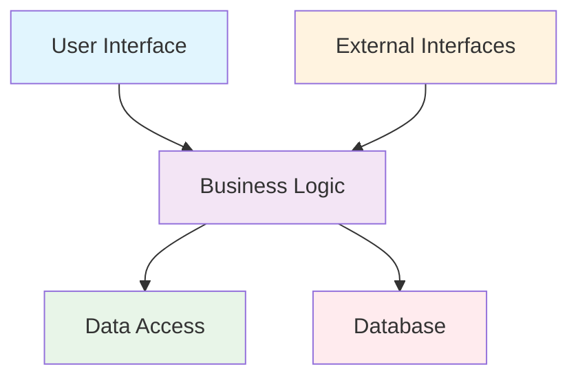

# Clean Code Principles

## Introduction to Clean Code
Clean code is a set of principles and practices that make software readable, maintainable, and understandable. In architectural design, clean code principles help create systems that are easy to understand, modify, and extend.

## Core Clean Code Principles

### 1. Meaningful Names
- **Purpose**: Names should clearly express intent and purpose
- **Guidelines**:
  - Use descriptive names for variables, functions, and classes
  - Avoid abbreviations and acronyms
  - Choose names that reveal intent
  - Use consistent naming conventions

**Examples:**
```
Poor Names:
- int d; // elapsed time in days
- List<Customer> c;
- void process();

Clean Names:
- int elapsedTimeInDays;
- List<Customer> customers;
- void processCustomerOrder();
```

### 2. Functions
- **Single Responsibility**: Each function should do one thing
- **Small Size**: Functions should be small and focused
- **Descriptive Names**: Function names should clearly describe what they do
- **Minimal Parameters**: Fewer parameters are better

**Example: Function Refactoring**
```
Before (Poor):
public void processOrder(Order order, Customer customer, Payment payment, 
                        Inventory inventory, EmailService email, 
                        NotificationService notification) {
    // 50 lines of mixed logic
    if (order.getStatus() == "PENDING") {
        // validate order
        // check inventory
        // process payment
        // update inventory
        // send confirmation
        // notify customer
    }
}

After (Clean):
public void processOrder(Order order) {
    validateOrder(order);
    checkInventory(order);
    processPayment(order);
    updateInventory(order);
    sendConfirmation(order);
    notifyCustomer(order);
}

private void validateOrder(Order order) {
    // Single responsibility: validation only
}

private void checkInventory(Order order) {
    // Single responsibility: inventory check only
}
```

### 3. Comments
- **Purpose**: Explain "why" not "what"
- **Guidelines**:
  - Write self-documenting code instead of comments
  - Use comments for complex business logic
  - Avoid redundant or obvious comments
  - Keep comments up-to-date

**Examples:**
```
Poor Comment:
// Loop through customers
for (Customer c : customers) {
    // Process each customer
    process(c);
}

Clean Code (No Comment Needed):
for (Customer customer : customers) {
    processCustomerOrder(customer);
}

Good Comment:
// Apply 10% discount for premium customers during holiday season
// This is a business rule that may change
if (customer.isPremium() && isHolidaySeason()) {
    applyDiscount(order, 0.10);
}
```

### 4. Formatting
- **Consistency**: Use consistent formatting throughout the codebase
- **Readability**: Format code for human readability
- **Standards**: Follow language-specific formatting standards

## Clean Architecture Principles

### 1. Dependency Rule
- Dependencies should point inward
- High-level modules should not depend on low-level modules
- Both should depend on abstractions

**Diagram: Clean Architecture Dependencies**


### 2. Separation of Concerns
- **Purpose**: Each component has a single, well-defined responsibility
- **Benefits**: Easier to understand, test, and modify

**Example: E-commerce System Separation**
```
┌─────────────────────────────────────────────────────────────┐
│                Clean Architecture Layers                    │
├─────────────────┬─────────────────┬─────────────────────────┤
│   Presentation  │   Business      │   Infrastructure        │
│   Layer         │   Logic         │   Layer                 │
│                 │                 │                         │
│ ┌─────────────┐ │ ┌─────────────┐ │ ┌─────────────────────┐ │
│ │Controllers  │ │ │Use Cases    │ │ │Database             │ │
│ │Views        │ │ │Entities     │ │ │External APIs        │ │
│ │DTOs         │ │ │Value Objects│ │ │File System          │ │
│ └─────────────┘ │ └─────────────┘ │ └─────────────────────┘ │
└─────────────────┴─────────────────┴─────────────────────────┘
```

### 3. SOLID Principles
- **S**ingle Responsibility Principle
- **O**pen/Closed Principle
- **L**iskov Substitution Principle
- **I**nterface Segregation Principle
- **D**ependency Inversion Principle

## Code Organization

### 1. File Structure
- **Logical Grouping**: Organize files by feature or responsibility
- **Consistent Naming**: Use consistent file and folder naming
- **Clear Hierarchy**: Maintain clear directory structure

**Example: Project Structure**
```
src/
├── domain/
│   ├── entities/
│   ├── valueobjects/
│   └── services/
├── application/
│   ├── usecases/
│   ├── interfaces/
│   └── dto/
├── infrastructure/
│   ├── database/
│   ├── external/
│   └── config/
└── presentation/
    ├── controllers/
    ├── views/
    └── middleware/
```

### 2. Class Organization
- **Cohesion**: Related methods should be grouped together
- **Size**: Classes should be focused and not too large
- **Responsibilities**: Each class should have a single reason to change

## Testing and Clean Code

### 1. Testable Code
- **Dependency Injection**: Use dependency injection for testability
- **Small Functions**: Small functions are easier to test
- **Clear Interfaces**: Well-defined interfaces make mocking easier

**Example: Testable Design**
```
// Poor: Hard to test
public class OrderProcessor {
    private Database database = new Database();
    private EmailService email = new EmailService();
    
    public void processOrder(Order order) {
        // Direct dependencies make testing difficult
    }
}

// Clean: Easy to test
public class OrderProcessor {
    private final OrderRepository orderRepository;
    private final NotificationService notificationService;
    
    public OrderProcessor(OrderRepository orderRepository, 
                         NotificationService notificationService) {
        this.orderRepository = orderRepository;
        this.notificationService = notificationService;
    }
    
    public void processOrder(Order order) {
        // Dependencies can be easily mocked for testing
    }
}
```

### 2. Test-Driven Development (TDD)
- **Red-Green-Refactor**: Write tests first, then implementation
- **Coverage**: Aim for high test coverage
- **Quality**: Tests help maintain code quality

## Practice Questions

### Question 1: Clean Code Principles
**Question:** Refactor the following code to follow clean code principles. Explain your changes.

```java
public class OrderService {
    public void p(Order o, Customer c) {
        if (o.getStatus().equals("PENDING")) {
            // Check if customer has enough credit
            if (c.getCreditLimit() >= o.getTotal()) {
                // Process the order
                o.setStatus("PROCESSED");
                // Send email
                EmailService es = new EmailService();
                es.sendEmail(c.getEmail(), "Order processed");
            } else {
                // Reject order
                o.setStatus("REJECTED");
            }
        }
    }
}
```

**Solution:**
```java
public class OrderService {
    private final EmailService emailService;
    
    public OrderService(EmailService emailService) {
        this.emailService = emailService;
    }
    
    public void processOrder(Order order, Customer customer) {
        if (isOrderPending(order)) {
            if (hasSufficientCredit(customer, order)) {
                approveOrder(order, customer);
            } else {
                rejectOrder(order);
            }
        }
    }
    
    private boolean isOrderPending(Order order) {
        return "PENDING".equals(order.getStatus());
    }
    
    private boolean hasSufficientCredit(Customer customer, Order order) {
        return customer.getCreditLimit() >= order.getTotal();
    }
    
    private void approveOrder(Order order, Customer customer) {
        order.setStatus("PROCESSED");
        sendOrderConfirmation(customer);
    }
    
    private void rejectOrder(Order order) {
        order.setStatus("REJECTED");
    }
    
    private void sendOrderConfirmation(Customer customer) {
        emailService.sendEmail(customer.getEmail(), "Order processed");
    }
}
```

**Changes Made:**
1. **Meaningful Names**: `p` → `processOrder`, `o` → `order`, `c` → `customer`
2. **Single Responsibility**: Split into smaller, focused methods
3. **Dependency Injection**: Inject EmailService instead of creating it
4. **Descriptive Method Names**: Each method clearly describes its purpose
5. **Reduced Complexity**: Each method does one thing

### Question 2: Clean Architecture
**Question:** Design a clean architecture for a user management system. Show the layers and their responsibilities.

**Solution:**
```
┌─────────────────────────────────────────────────────────────┐
│                User Management System                       │
├─────────────────┬─────────────────┬─────────────────────────┤
│   Presentation  │   Business      │   Infrastructure        │
│   Layer         │   Logic         │   Layer                 │
│                 │                 │                         │
│ ┌─────────────┐ │ ┌─────────────┐ │ ┌─────────────────────┐ │
│ │User         │ │ │User         │ │ │Database             │ │
│ │Controller   │ │ │Entity       │ │ │UserRepository      │ │
│ │UserDTO      │ │ │UserService  │ │ │EmailService        │ │
│ │Validation   │ │ │AuthService  │ │ │FileStorage         │ │
│ └─────────────┘ │ └─────────────┘ │ └─────────────────────┘ │
└─────────────────┴─────────────────┴─────────────────────────┘
```

**Responsibilities:**
- **Presentation**: Handle HTTP requests, validation, DTOs
- **Business Logic**: User operations, authentication, business rules
- **Infrastructure**: Data persistence, external services, configuration

### Question 3: SOLID Principles
**Question:** Explain how the Single Responsibility Principle applies to architectural design. Provide an example.

**Solution:**
**Single Responsibility Principle**: Each class/module should have only one reason to change.

**Example:**
```
// Violation: Multiple responsibilities
public class UserManager {
    public void createUser(User user) { /* user creation logic */ }
    public void sendEmail(String email, String message) { /* email logic */ }
    public void saveToDatabase(User user) { /* database logic */ }
    public void validateUser(User user) { /* validation logic */ }
}

// Clean: Single responsibility
public class UserService {
    private final UserRepository userRepository;
    private final EmailService emailService;
    private final UserValidator userValidator;
    
    public void createUser(User user) {
        userValidator.validate(user);
        userRepository.save(user);
        emailService.sendWelcomeEmail(user.getEmail());
    }
}

public class UserRepository {
    public void save(User user) { /* database logic only */ }
}

public class EmailService {
    public void sendWelcomeEmail(String email) { /* email logic only */ }
}

public class UserValidator {
    public void validate(User user) { /* validation logic only */ }
}
```

**Benefits:**
- Easier to understand and maintain
- Changes are localized to specific classes
- Better testability
- Reduced coupling between components 