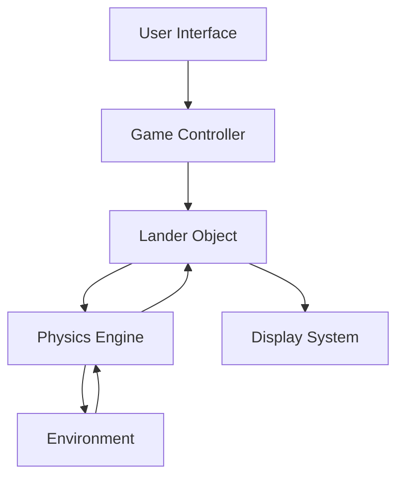
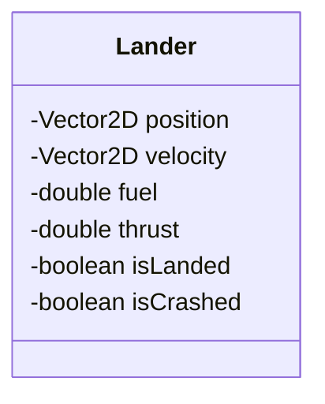
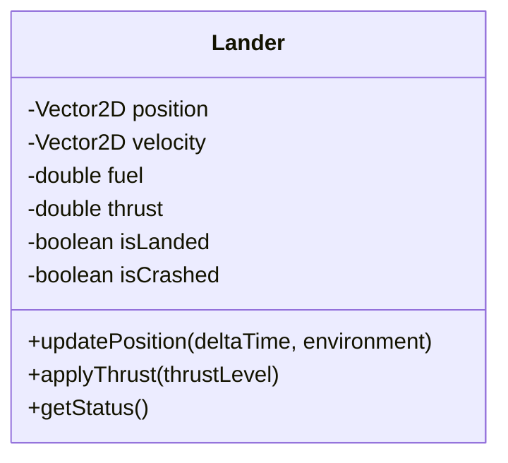
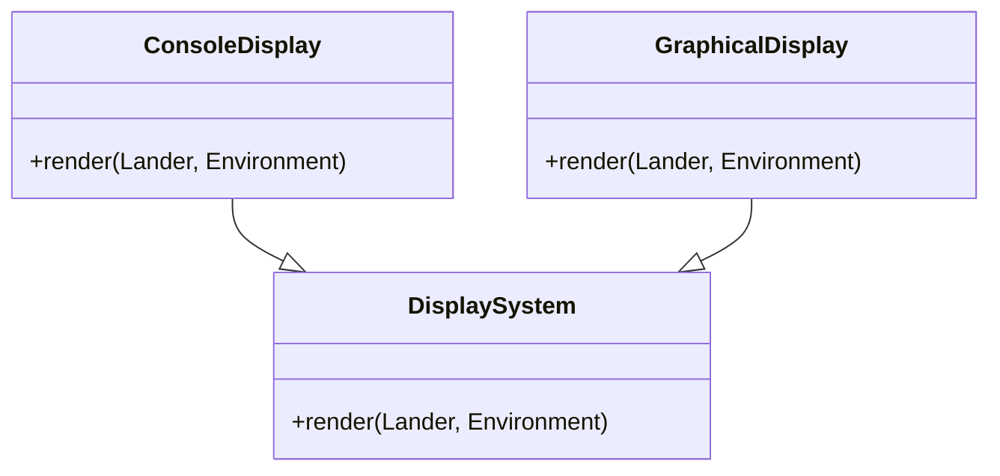
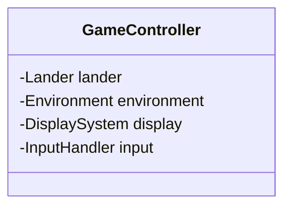
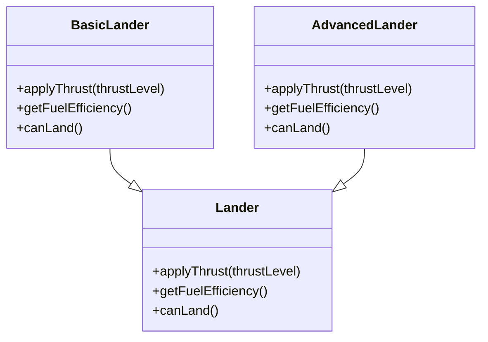

# Object-Oriented Lunar Lander Example

## Introduction to Lunar Lander System
The Lunar Lander system is a classic example used to demonstrate object-oriented design principles. It simulates a spacecraft landing on the moon, requiring careful management of fuel, velocity, and position.

## System Overview

### Core Components
- **Lander**: The main spacecraft object
- **Environment**: Moon's surface and gravity
- **Control System**: User input and automated controls
- **Display System**: Visual representation of the lander

**Diagram: Lunar Lander System Architecture**


## Object-Oriented Design

### 1. Lander Class
The main spacecraft class that encapsulates all lander-related data and behavior.

**Class Structure:**


### 2. Vector2D Class
Represents 2D vectors for position and velocity calculations.

**Class Structure:**
```
┌─────────────────────────────────────────────────────────────┐
│                    Vector2D Class                           │
├─────────────────────────────────────────────────────────────┤
│                     Attributes                              │
│ ┌─────────────────────────────────────────────────────────┐ │
│ │ x: double                                              │ │
│ │ y: double                                              │ │
│ └─────────────────────────────────────────────────────────┘ │
│                     Methods                                 │ │
│ ┌─────────────────────────────────────────────────────────┐ │
│ │ +add(other: Vector2D): Vector2D                        │ │
│ │ +multiply(scalar: double): Vector2D                    │ │
│ │ +getMagnitude(): double                                │ │
│ │ +normalize(): Vector2D                                 │ │
│ └─────────────────────────────────────────────────────────┘ │
└─────────────────────────────────────────────────────────────┘
```

### 3. Environment Class
Represents the moon's environment including gravity and surface.

**Class Structure:**
```
┌─────────────────────────────────────────────────────────────┐
│                  Environment Class                          │
├─────────────────────────────────────────────────────────────┤
│                     Attributes                              │
│ ┌─────────────────────────────────────────────────────────┐ │
│ │ gravity: Vector2D                                       │ │
│ │ surfaceLevel: double                                    │ │
│ │ landingZones: List<LandingZone>                         │ │
│ └─────────────────────────────────────────────────────────┘ │
│                     Methods                                 │ │
│ ┌─────────────────────────────────────────────────────────┐ │
│ │ +getGravity(): Vector2D                                │ │
│ │ +checkCollision(position: Vector2D): boolean           │ │
│ │ +isInLandingZone(position: Vector2D): boolean          │ │
│ │ +getLandingZone(position: Vector2D): LandingZone       │ │
│ └─────────────────────────────────────────────────────────┘ │
└─────────────────────────────────────────────────────────────┘
```

## Implementation Example

### Lander Class Implementation

**Conceptual Explanation:**
- The Lander class manages its position, velocity, fuel, thrust, and landing/crash state.
- It updates its state based on gravity and thrust, and checks for landing or crash conditions after each update.
- Encapsulation ensures that only the class's methods can change its internal state, supporting safe and predictable behavior.



## Object-Oriented Principles Applied

### 1. Encapsulation
- **Data Hiding**: Position, velocity, and fuel are private
- **Controlled Access**: Methods provide controlled access to lander state
- **State Management**: Internal state is managed within the class

### 2. Inheritance
- **GameObject Base Class**: Lander could inherit from a base GameObject class
- **Specialized Landers**: Different types of landers with different capabilities

**Example Inheritance Hierarchy:**
```
┌─────────────────────────────────────────────────────────────┐
│                GameObject Hierarchy                         │
├─────────────────────────────────────────────────────────────┤
│                 GameObject                                  │
│ ┌─────────────────────────────────────────────────────────┐ │
│ │ +position: Vector2D                                     │ │
│ │ +velocity: Vector2D                                     │ │
│ │ +update(deltaTime: double): void                        │ │
│ │ +render(): void                                         │ │
│ └─────────────────────────────────────────────────────────┘ │
│                                                             │
│                 Lander                                      │
│ ┌─────────────────────────────────────────────────────────┐ │
│ │ +fuel: double                                           │ │
│ │ +thrust: double                                         │ │
│ │ +applyThrust(level: double): void                       │ │
│ │ +consumeFuel(amount: double): boolean                   │ │
│ └─────────────────────────────────────────────────────────┘ │
└─────────────────────────────────────────────────────────────┘
```

### 3. Polymorphism
- **Interface Implementation**: Different display systems can render the lander
- **Strategy Pattern**: Different control strategies (manual, AI, automated)

**Example: Display System Polymorphism**

**Conceptual Explanation:**
- The DisplaySystem interface allows for different rendering strategies (console or graphical).
- ConsoleDisplay and GraphicalDisplay both implement the DisplaySystem interface, enabling polymorphic rendering.



## Game Controller Class
Coordinates the interaction between different components.



## Practice Questions

### Question 1: Object-Oriented Design
**Question:** Design an object-oriented architecture for the Lunar Lander game. Create a class diagram showing the main classes and their relationships.

**Solution:**
```
┌─────────────────────────────────────────────────────────────┐
│                Lunar Lander Class Diagram                   │
├─────────────────┬─────────────────┬─────────────────────────┤
│   Game          │   Physics       │   Display               │
│   Control       │   System        │   System                │
│                 │                 │                         │
│ ┌─────────────┐ │ ┌─────────────┐ │ ┌─────────────────────┐ │
│ │GameController│ │ │Lander       │ │ │DisplaySystem        │ │
│ │InputHandler │ │ │Environment   │ │ │ConsoleDisplay       │ │
│ │GameState    │ │ │Vector2D      │ │ │GraphicalDisplay     │ │
│ └─────────────┘ │ └─────────────┘ │ └─────────────────────┘ │
└─────────────────┴─────────────────┴─────────────────────────┘
```

**Relationships:**
- GameController has one Lander and one Environment
- Lander uses Vector2D for position and velocity
- DisplaySystem is implemented by ConsoleDisplay and GraphicalDisplay
- InputHandler provides input to GameController

### Question 2: Encapsulation Benefits
**Question:** Explain how encapsulation is implemented in the Lunar Lander system and what benefits it provides.

**Solution:**
**Encapsulation Implementation:**
- Private attributes: position, velocity, fuel, thrust
- Public methods: updatePosition(), applyThrust(), getStatus()
- Controlled access: Fuel consumption is managed internally

**Benefits:**
1. **Data Protection**: External code cannot directly modify lander state
2. **Consistency**: All state changes go through controlled methods
3. **Validation**: Input validation can be performed in methods
4. **Maintainability**: Internal implementation can change without affecting external code
5. **Debugging**: State changes are traceable through method calls

### Question 3: Polymorphism Application
**Question:** How could polymorphism be used to implement different types of landers (e.g., basic lander, advanced lander with better fuel efficiency)?

**Solution:**


**Benefits:**
- Different lander types can be used interchangeably
- Game logic remains the same regardless of lander type
- Easy to add new lander types without changing existing code
- Testing can be done with different lander implementations
``` 