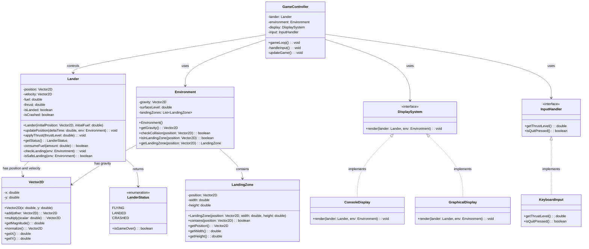
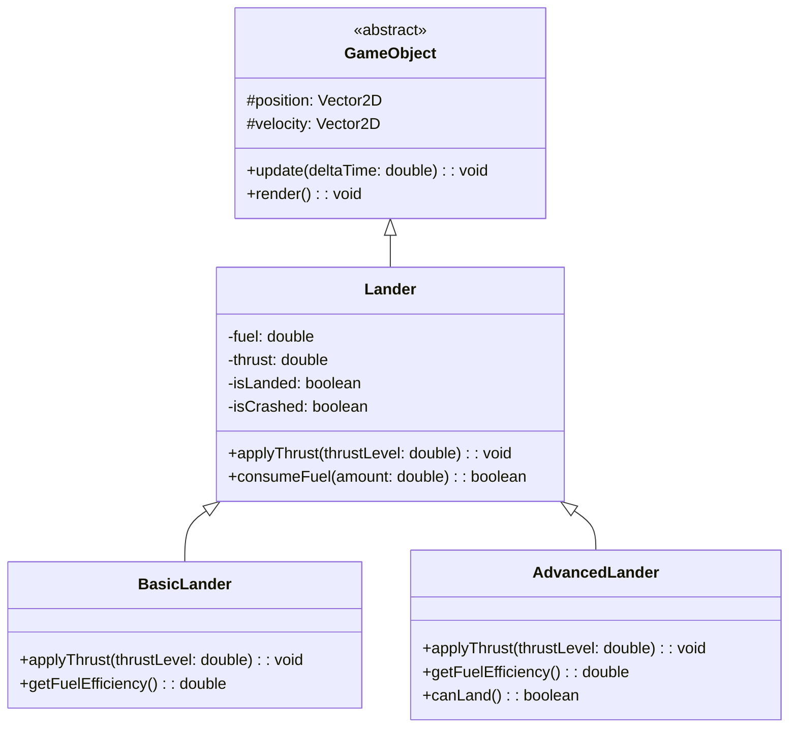
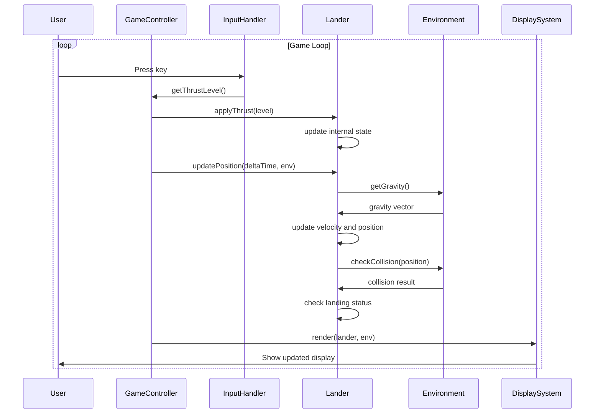
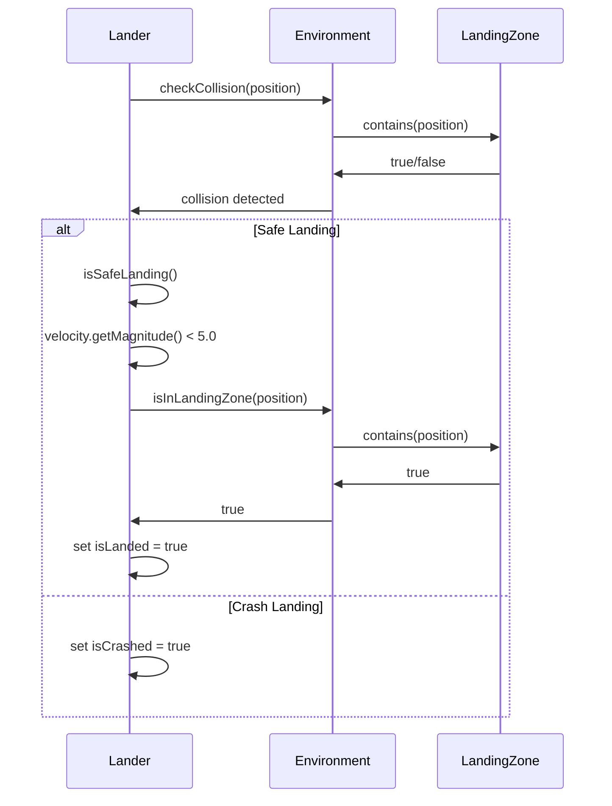
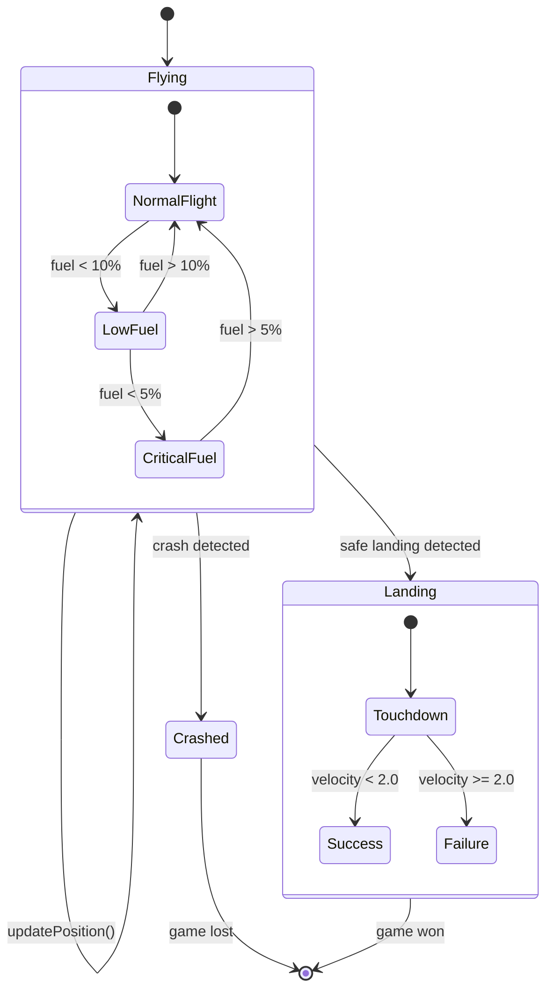
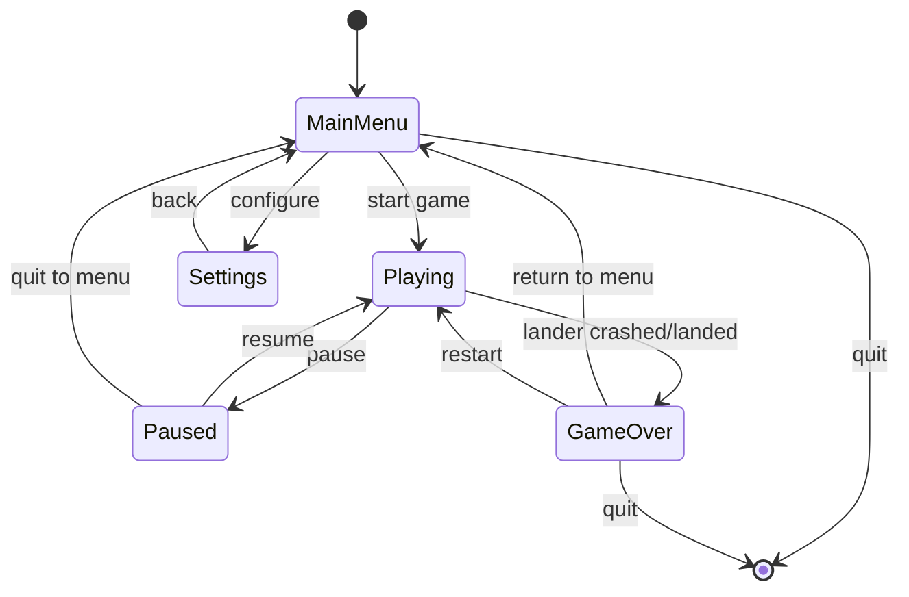
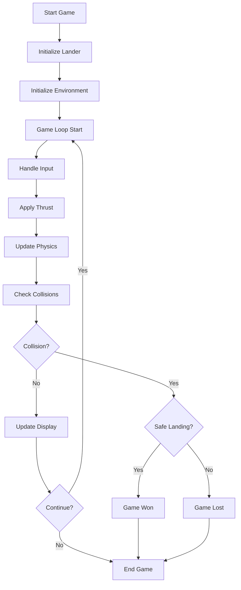
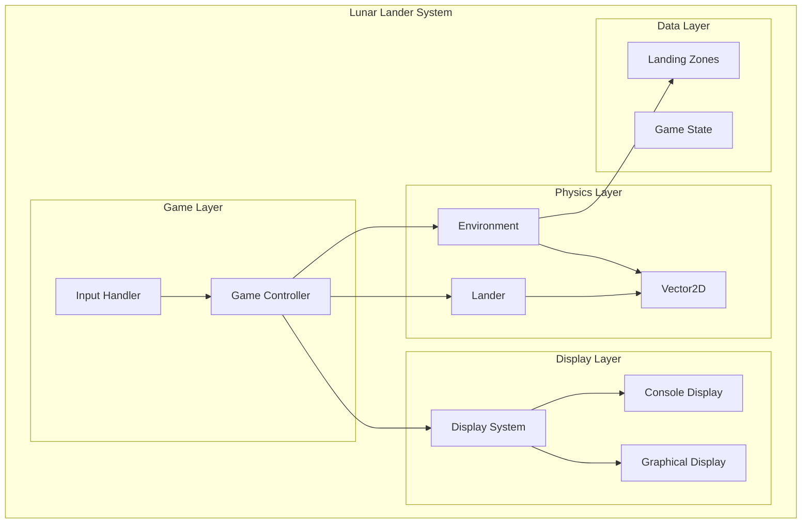
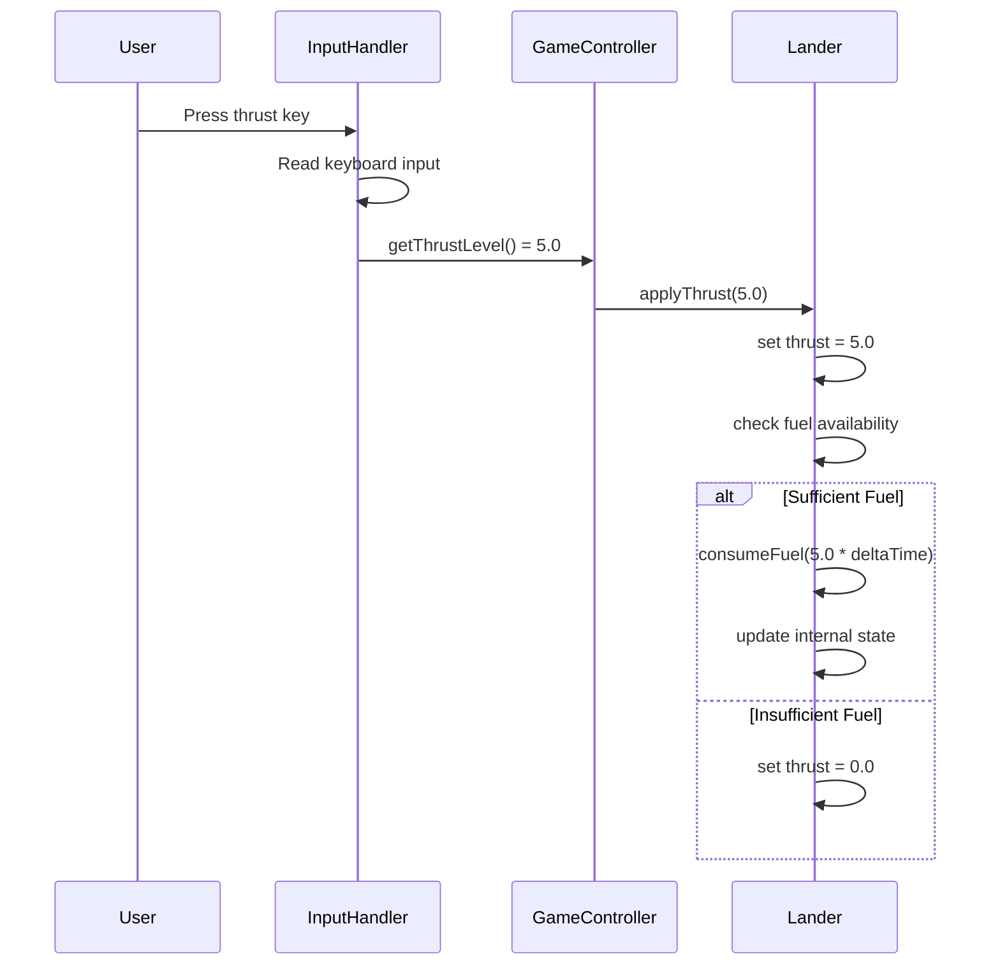
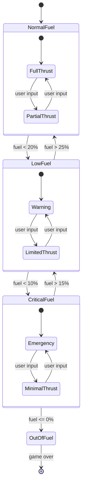

# OO/LL in UML

## Introduction to UML for Lunar Lander
Unified Modeling Language (UML) provides standardized diagrams to visualize object-oriented systems. For the Lunar Lander system, we'll use various UML diagrams to show the structure, behavior, and interactions of the system components.

## Class Diagram

### Main Classes and Relationships
The class diagram shows the static structure of the Lunar Lander system, including classes, their attributes, methods, and relationships.

**Complete Class Diagram:**

### Inheritance Hierarchy
Shows the inheritance relationships between classes.

**Inheritance Diagram:**

## Sequence Diagram

### Game Loop Sequence
Shows the interaction between objects during the main game loop.

**Game Loop Sequence:**

### Landing Sequence
Shows the sequence of events when the lander attempts to land.

**Landing Sequence:**

## State Diagram

### Lander State Machine
Shows the different states the lander can be in and the transitions between them.

**Lander State Diagram:**

### Game State Machine
Shows the overall game states and transitions.

**Game State Diagram:**

## Activity Diagram

### Main Game Flow
Shows the flow of activities in the main game loop.

**Game Flow Activity:**

## Component Diagram

### System Architecture
Shows the high-level components and their interfaces.

**Component Architecture:**

## Practice Questions

### Question 1: Class Diagram Analysis
**Question:** Analyze the Lunar Lander class diagram and identify:
1. Three classes and their primary responsibilities
2. Two relationships between classes
3. One design pattern used in the system

**Solution:**
1. **Classes and Responsibilities:**
   - **Lander**: Manages spacecraft state (position, velocity, fuel, landing status)
   - **Environment**: Handles physics simulation (gravity, collision detection, landing zones)
   - **GameController**: Coordinates game flow and component interactions

2. **Relationships:**
   - **Association**: GameController has a Lander (controls relationship)
   - **Composition**: Lander has Vector2D objects for position and velocity

3. **Design Pattern:**
   - **Strategy Pattern**: DisplaySystem interface with ConsoleDisplay and GraphicalDisplay implementations

### Question 2: Sequence Diagram Creation
**Question:** Create a sequence diagram showing the interaction when a user applies thrust to the lander.

**Solution:**

### Question 3: State Machine Design
**Question:** Design a state machine for a fuel management system in the Lunar Lander. Include states for normal, low fuel, and critical fuel levels.

**Solution:**
