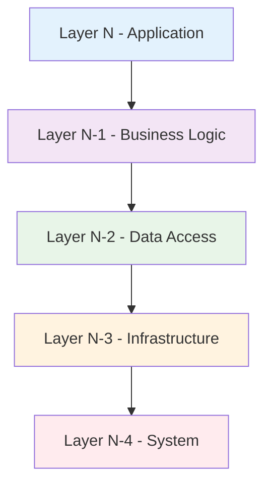
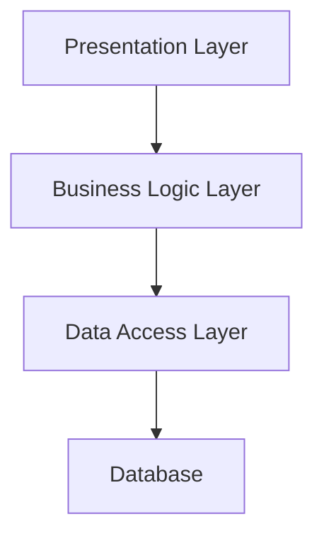
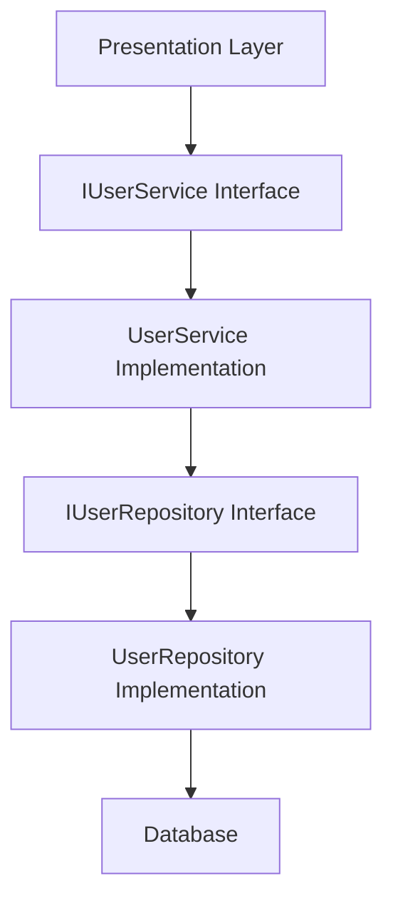
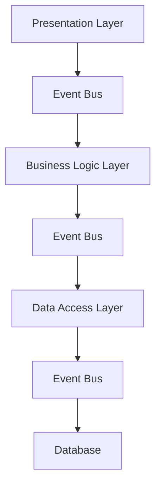
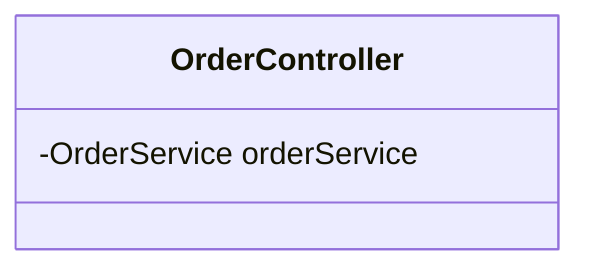
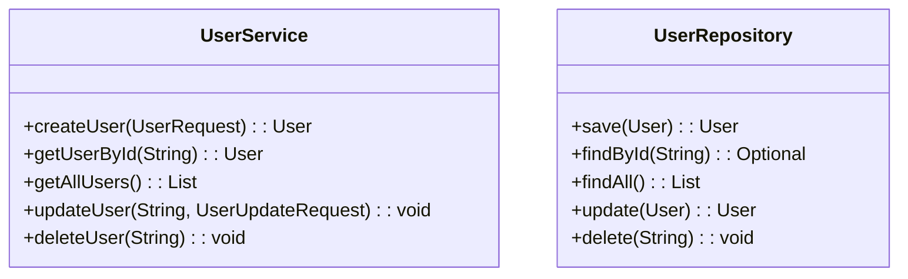

# Layered Style (Detailed with Diagrams)

## Introduction to Layered Architecture
Layered architecture organizes software into horizontal layers, where each layer provides services to the layer above it and uses services from the layer below it. This style promotes separation of concerns, modularity, and maintainability.

## Core Principles

### 1. Layer Separation
- **Hierarchical Organization**: Layers are arranged in a hierarchy
- **Service Provision**: Each layer provides services to the layer above
- **Service Consumption**: Each layer uses services from the layer below
- **Interface Definition**: Clear interfaces between layers

### 2. Dependency Direction
- **Downward Dependencies**: Layers can only depend on layers below them
- **No Upward Dependencies**: Higher layers cannot be directly accessed by lower layers
- **No Skip Dependencies**: Layers cannot skip intermediate layers

**Diagram: Layered Architecture Structure**


## Common Layered Patterns

### 1. Three-Tier Architecture
The most common layered pattern with three main tiers.

**Three-Tier Structure:**
```
┌─────────────────────────────────────────────────────────────┐
│                Three-Tier Architecture                      │
├─────────────────┬─────────────────┬─────────────────────────┤
│   Presentation  │   Business      │   Data                  │
│     Tier        │     Logic       │   Tier                  │
│                 │     Tier        │                         │
│ ┌─────────────┐ │ ┌─────────────┐ │ ┌─────────────────────┐ │
│ │Web Browser  │ │ │Controllers  │ │ │Database Server      │ │
│ │Mobile App   │ │ │Business     │ │ │External APIs        │ │
│ │Desktop App  │ │ │Rules        │ │ │Message Queues       │ │
│ │API Gateway  │ │ │            │ │ │                   │ │
│ └─────────────┘ │ └─────────────┘ │ └─────────────────────┘ │
└─────────────────┴─────────────────┴─────────────────────────┘
```

### 2. Four-Layer Architecture
A more detailed layered pattern with four distinct layers.

**Four-Layer Structure:**
```
┌─────────────────────────────────────────────────────────────┐
│                Four-Layer Architecture                      │
├─────────────────┬─────────────────┬─────────────────────────┤
│   Presentation  │   Application   │   Domain                │
│     Layer       │     Layer       │   Layer                 │
│                 │                 │                         │
│ ┌─────────────┐ │ ┌─────────────┐ │ ┌─────────────────────┐ │
│ │Controllers  │ │ │Use Cases    │ │ │Entities             │ │
│ │Views        │ │ │Application  │ │ │Value Objects        │ │
│ │DTOs         │ │ │Services     │ │ │Domain Services      │ │
│ │Middleware   │ │ │Orchestration│ │ │Business Rules       │ │
│ └─────────────┘ │ └─────────────┘ │ └─────────────────────┘ │
└─────────────────┴─────────────────┴─────────────────────────┘
│                                                             │
│   Infrastructure Layer                                      │
│ ┌─────────────────────────────────────────────────────────┐ │
│ │Database Access                                          │ │
│ │External Services                                        │ │
│ │File System                                              │ │
│ │Configuration                                            │ │
│ └─────────────────────────────────────────────────────────┘ │
└─────────────────────────────────────────────────────────────┘
```

## Layer Responsibilities

### 1. Presentation Layer
- **Purpose**: Handles user interaction and display
- **Responsibilities**:
  - User interface components
  - Input validation
  - Data formatting
  - User experience

**Example Components:**
```
┌─────────────────────────────────────────────────────────────┐
│                Presentation Layer                           │
├─────────────────┬─────────────────┬─────────────────────────┤
│   Web           │   Mobile        │   API                   │
│   Interface     │   Interface     │   Gateway               │
│                 │                 │                         │
│ ┌─────────────┐ │ ┌─────────────┐ │ ┌─────────────────────┐ │
│ │React        │ │ │iOS App      │ │ │REST API             │ │
│ │Components   │ │ │Android App  │ │ │GraphQL API          │ │
│ │HTML/CSS     │ │ │React Native │ │ │WebSocket API        │ │
│ │JavaScript   │ │ │Flutter      │ │ │Authentication       │ │
│ └─────────────┘ │ └─────────────┘ │ └─────────────────────┘ │
└─────────────────┴─────────────────┴─────────────────────────┘
```

### 2. Business Logic Layer
- **Purpose**: Implements core business rules and logic
- **Responsibilities**:
  - Business rules enforcement
  - Data processing
  - Workflow management
  - Business validation

**Example Components:**
```
┌─────────────────────────────────────────────────────────────┐
│                Business Logic Layer                         │
├─────────────────┬─────────────────┬─────────────────────────┤
│   Services      │   Controllers   │   Business              │
│                 │                 │   Rules                 │
│                 │                 │                         │
│ ┌─────────────┐ │ ┌─────────────┐ │ ┌─────────────────────┐ │
│ │UserService  │ │ │UserController│ │ │Validation Rules     │ │
│ │OrderService │ │ │OrderController│ │ │Business Policies    │ │
│ │PaymentService│ │ │PaymentController│ │ │Workflow Engine     │ │
│ │EmailService │ │ │EmailController│ │ │Decision Engine     │ │
│ └─────────────┘ │ └─────────────┘ │ └─────────────────────┘ │
└─────────────────┴─────────────────┴─────────────────────────┘
```

### 3. Data Access Layer
- **Purpose**: Manages data persistence and retrieval
- **Responsibilities**:
  - Database operations
  - Data mapping
  - Query optimization
  - Transaction management

**Example Components:**
```
┌─────────────────────────────────────────────────────────────┐
│                Data Access Layer                            │
├─────────────────┬─────────────────┬─────────────────────────┤
│   Repositories  │   Data          │   Database              │
│                 │   Mappers       │   Connections           │
│                 │                 │                         │
│ ┌─────────────┐ │ ┌─────────────┐ │ ┌─────────────────────┐ │
│ │UserRepo     │ │ │EntityMapper │ │ │Database Pool        │ │
│ │OrderRepo    │ │ │DTOMapper    │ │ │Connection Manager   │ │
│ │ProductRepo  │ │ │QueryBuilder │ │ │Transaction Manager  │ │
│ │PaymentRepo  │ │ │ResultMapper │ │ │Migration Manager    │ │
│ └─────────────┘ │ └─────────────┘ │ └─────────────────────┘ │
└─────────────────┴─────────────────┴─────────────────────────┘
```

## Communication Between Layers

### 1. Direct Communication
- **Pattern**: Layer directly calls methods in the layer below
- **Pros**: Simple, straightforward
- **Cons**: Tight coupling, difficult to test

**Diagram: Direct Communication**


### 2. Interface-Based Communication
- **Pattern**: Layers communicate through interfaces
- **Pros**: Loose coupling, testability, flexibility
- **Cons**: More complex, additional abstraction

**Diagram: Interface-Based Communication**


### 3. Event-Based Communication
- **Pattern**: Layers communicate through events
- **Pros**: Decoupled, scalable, asynchronous
- **Cons**: Complex debugging, eventual consistency

**Diagram: Event-Based Communication**


## Advantages of Layered Architecture

### 1. Separation of Concerns
- Each layer has a specific responsibility
- Changes in one layer don't affect others
- Easier to understand and maintain

### 2. Modularity
- Layers can be developed independently
- Teams can work on different layers
- Reusable components within layers

### 3. Testability
- Each layer can be tested in isolation
- Mock objects can replace dependencies
- Easier to write unit tests

### 4. Scalability
- Layers can be scaled independently
- Load balancing at presentation layer
- Database scaling at data layer

## Disadvantages of Layered Architecture

### 1. Performance Overhead
- Multiple layer calls can add latency
- Data transformation between layers
- Network calls between distributed layers

### 2. Complexity
- More layers mean more complexity
- Interface management between layers
- Debugging across multiple layers

### 3. Tight Coupling Between Adjacent Layers
- Changes in one layer affect adjacent layers
- Difficult to change layer boundaries
- Can lead to "big ball of mud"

## Implementation Example: E-commerce System

### Layer Structure
```
┌─────────────────────────────────────────────────────────────┐
│                E-commerce Layered System                   │
├─────────────────┬─────────────────┬─────────────────────────┤
│   Presentation  │   Business      │   Data                  │
│     Layer       │     Logic       │   Access                │
│                 │     Layer       │   Layer                 │
│                 │                 │                         │
│ ┌─────────────┐ │ ┌─────────────┐ │ ┌─────────────────────┐ │
│ │Web UI       │ │ │OrderService │ │ │OrderRepository      │ │
│ │Mobile App   │ │ │UserService  │ │ │UserRepository       │ │
│ │API Gateway  │ │ │PaymentService│ │ │ProductRepository    │ │
│ │Admin Panel  │ │ │InventoryService│ │ │PaymentRepository   │ │
│ └─────────────┘ │ └─────────────┘ │ └─────────────────────┘ │
└─────────────────┴─────────────────┴─────────────────────────┘
```

### Code Example: Order Processing


## Practice Questions

### Question 1: Layer Responsibilities
**Question:** For a banking system, identify the responsibilities of each layer in a three-tier architecture. Provide specific examples of components in each layer.

**Solution:**
**Presentation Layer:**
- **Responsibilities**: User interface, input validation, display formatting
- **Components**: Web banking interface, mobile banking app, ATM interface, API gateway

**Business Logic Layer:**
- **Responsibilities**: Business rules, transaction processing, account management
- **Components**: AccountService, TransactionService, LoanService, SecurityService

**Data Access Layer:**
- **Responsibilities**: Database operations, data persistence, query management
- **Components**: AccountRepository, TransactionRepository, UserRepository, AuditRepository

### Question 2: Layer Communication
**Question:** Design an interface-based communication system between the Business Logic and Data Access layers for a user management system. Show the interfaces and implementations.

**Solution:**


### Question 3: Layered Architecture Design
**Question:** Design a layered architecture for a real-time messaging system. Include at least four layers and show how they communicate.

**Solution:**
```
┌─────────────────────────────────────────────────────────────┐
│                Real-Time Messaging System                   │
├─────────────────┬─────────────────┬─────────────────────────┤
│   Presentation  │   Application   │   Domain                │
│     Layer       │     Layer       │   Layer                 │
│                 │                 │                         │
│ ┌─────────────┐ │ ┌─────────────┐ │ ┌─────────────────────┐ │
│ │Web Client   │ │ │MessageService│ │ │Message Entity       │ │
│ │Mobile App   │ │ │UserService  │ │ │User Entity          │ │
│ │WebSocket    │ │ │ChatService  │ │ │Chat Entity          │ │
│ │API Gateway  │ │ │NotificationService│ │ │Message Rules       │ │
│ └─────────────┘ │ └─────────────┘ │ └─────────────────────┘ │
└─────────────────┴─────────────────┴─────────────────────────┘
│                                                             │
│   Infrastructure Layer                                      │
│ ┌─────────────────────────────────────────────────────────┐ │
│ │MessageRepository                                         │ │
│ │UserRepository                                            │ │
│ │WebSocket Manager                                         │ │
│ │Redis Cache                                               │ │
│ └─────────────────────────────────────────────────────────┘ │
└─────────────────────────────────────────────────────────────┘
```

**Communication Flow:**
1. **Presentation → Application**: WebSocket sends message to MessageService
2. **Application → Domain**: MessageService creates Message entity and applies business rules
3. **Application → Infrastructure**: MessageService saves message via MessageRepository
4. **Infrastructure → Infrastructure**: MessageRepository stores in database and cache
5. **Application → Presentation**: NotificationService sends message to connected clients 