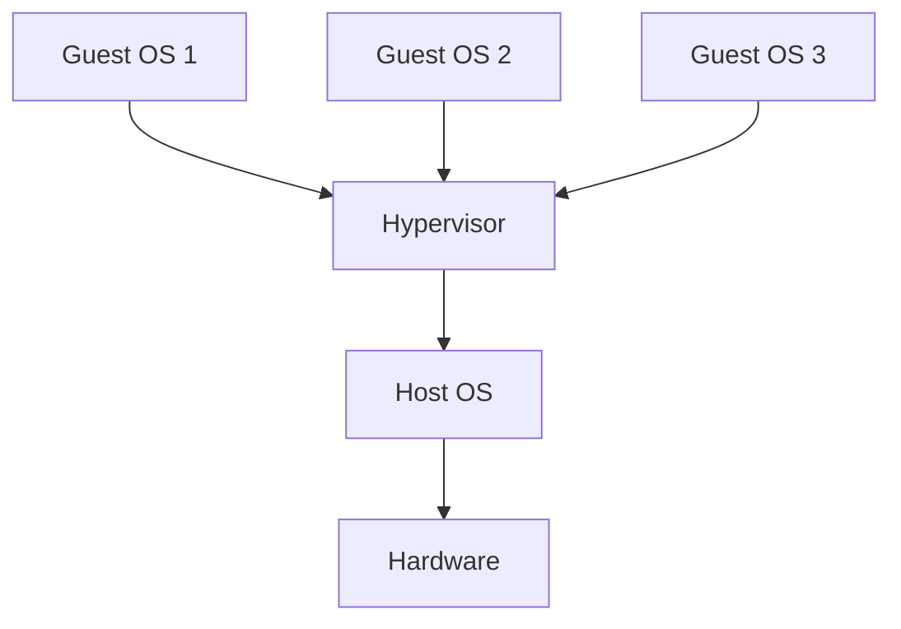
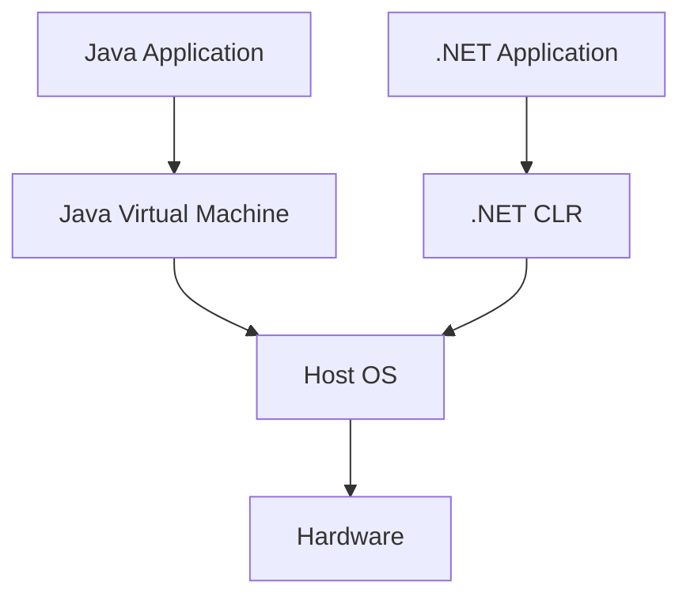
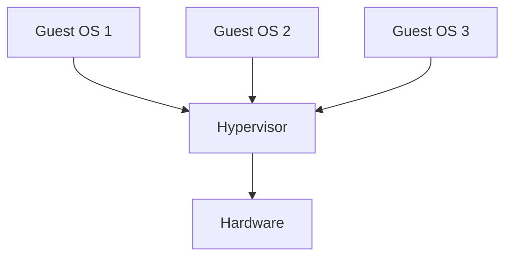
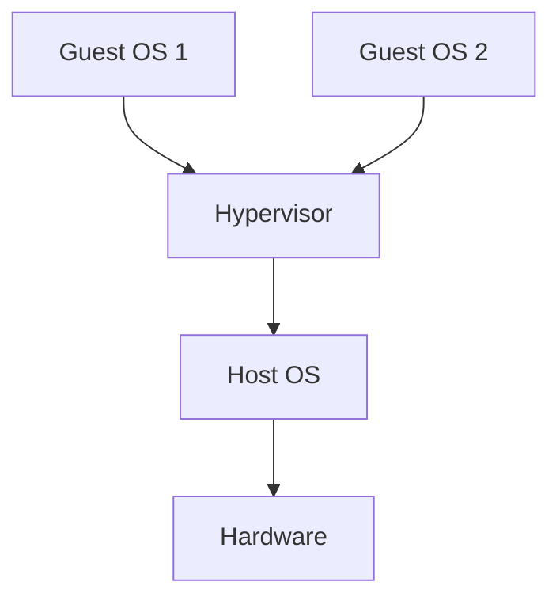

# Layered Systems and Virtual Machines

## Introduction to Layered Systems
Layered systems are a fundamental concept in computer science where complex systems are organized into hierarchical layers. Each layer provides services to the layer above and uses services from the layer below. This concept is particularly important in operating systems, networking, and virtualization.

## Operating System Layers

### Traditional OS Architecture
Operating systems are typically organized in layers, from hardware abstraction to user applications.

**OS Layer Structure:**
```
┌─────────────────────────────────────────────────────────────┐
│                Operating System Layers                      │
├─────────────────┬─────────────────┬─────────────────────────┤
│   User          │   System        │   Kernel                │
│   Applications  │   Libraries     │   Layer                 │
│                 │                 │                         │
│ ┌─────────────┐ │ ┌─────────────┐ │ ┌─────────────────────┐ │
│ │Web Browser  │ │ │C Runtime    │ │ │Process Management   │ │
│ │Word Processor│ │ │GUI Libraries│ │ │Memory Management    │ │
│ │Games        │ │ │Network APIs │ │ │File System          │ │
│ │Development  │ │ │Device APIs  │ │ │Device Drivers       │ │
│ │Tools        │ │ │System Calls │ │ │Hardware Abstraction │ │
│ └─────────────┘ │ └─────────────┘ │ └─────────────────────┘ │
└─────────────────┴─────────────────┴─────────────────────────┘
│                                                             │
│   Hardware Layer                                             │
│ ┌─────────────────────────────────────────────────────────┐ │
│ │CPU, Memory, Storage, Network, Display, Input Devices   │ │
│ └─────────────────────────────────────────────────────────┘ │
└─────────────────────────────────────────────────────────────┘
```

### Detailed OS Layer Responsibilities

#### 1. User Applications Layer
- **Purpose**: End-user software and utilities
- **Responsibilities**:
  - User interface
  - Application logic
  - Data processing
  - User interaction

#### 2. System Libraries Layer
- **Purpose**: Provide standardized interfaces to system services
- **Responsibilities**:
  - System call wrappers
  - Standard libraries
  - GUI frameworks
  - Network protocols

#### 3. Kernel Layer
- **Purpose**: Core operating system functionality
- **Responsibilities**:
  - Process management
  - Memory management
  - File system
  - Device drivers
  - Security

#### 4. Hardware Layer
- **Purpose**: Physical computing resources
- **Responsibilities**:
  - CPU execution
  - Memory storage
  - I/O operations
  - Network communication

## Virtual Machine Architecture

### Virtual Machine Layers
Virtual machines create additional layers of abstraction, allowing multiple operating systems to run on the same hardware.

**VM Layer Structure:**
```
┌─────────────────────────────────────────────────────────────┐
│                Virtual Machine Architecture                 │
├─────────────────┬─────────────────┬─────────────────────────┤
│   Guest OS 1    │   Guest OS 2    │   Guest OS 3            │
│   Applications  │   Applications  │   Applications           │
│                 │                 │                         │
│ ┌─────────────┐ │ ┌─────────────┐ │ ┌─────────────────────┐ │
│ │Guest Apps   │ │ │Guest Apps   │ │ │Guest Apps           │ │
│ │Guest OS     │ │ │Guest OS     │ │ │Guest OS             │ │
│ │Guest Drivers│ │ │Guest Drivers│ │ │Guest Drivers        │ │
│ └─────────────┘ │ └─────────────┘ │ └─────────────────────┘ │
└─────────────────┴─────────────────┴─────────────────────────┘
│                                                             │
│   Virtual Machine Monitor (Hypervisor)                      │
│ ┌─────────────────────────────────────────────────────────┐ │
│ │VM Management                                            │ │
│ │Resource Allocation                                      │ │
│ │Hardware Virtualization                                  │ │
│ │Security Isolation                                       │ │
│ └─────────────────────────────────────────────────────────┘ │
└─────────────────────────────────────────────────────────────┘
│                                                             │
│   Host Operating System                                     │
│ ┌─────────────────────────────────────────────────────────┐ │
│ │Host Applications                                        │ │
│ │Host OS Kernel                                           │ │
│ │Host Device Drivers                                      │ │
│ └─────────────────────────────────────────────────────────┘ │
└─────────────────────────────────────────────────────────────┘
│                                                             │
│   Physical Hardware                                         │
│ ┌─────────────────────────────────────────────────────────┐ │
│ │CPU, Memory, Storage, Network, I/O Devices              │ │
│ └─────────────────────────────────────────────────────────┘ │
└─────────────────────────────────────────────────────────────┘
```

### Types of Virtual Machines

#### 1. System Virtual Machines
- **Purpose**: Run complete operating systems
- **Examples**: VMware, VirtualBox, Hyper-V
- **Characteristics**:
  - Full OS isolation
  - Hardware virtualization
  - Multiple guest OS support

**Diagram: System VM Architecture**


#### 2. Process Virtual Machines
- **Purpose**: Run applications in isolated environments
- **Examples**: Java Virtual Machine (JVM), .NET CLR
- **Characteristics**:
  - Application-level isolation
  - Platform independence
  - Managed execution

**Diagram: Process VM Architecture**


## Layered System Examples

### 1. TCP/IP Protocol Stack
The Internet protocol suite is organized in layers, each providing specific networking services.

**TCP/IP Layers:**
```
┌─────────────────────────────────────────────────────────────┐
│                TCP/IP Protocol Stack                        │
├─────────────────┬─────────────────┬─────────────────────────┤
│   Application   │   Transport     │   Network               │
│     Layer       │     Layer       │   Layer                 │
│                 │                 │                         │
│ ┌─────────────┐ │ ┌─────────────┐ │ ┌─────────────────────┐ │
│ │HTTP         │ │ │TCP          │ │ │IP                   │ │
│ │FTP          │ │ │UDP          │ │ │ICMP                 │ │
│ │SMTP         │ │ │SCTP         │ │ │Routing              │ │
│ │DNS          │ │ │Reliability  │ │ │Addressing           │ │
│ └─────────────┘ │ └─────────────┘ │ └─────────────────────┘ │
└─────────────────┴─────────────────┴─────────────────────────┘
│                                                             │
│   Data Link Layer                                            │
│ ┌─────────────────────────────────────────────────────────┐ │
│ │Ethernet                                                  │ │
│ │WiFi                                                      │ │
│ │PPP                                                       │ │
│ │Frame Relay                                               │ │
│ └─────────────────────────────────────────────────────────┘ │
└─────────────────────────────────────────────────────────────┘
│                                                             │
│   Physical Layer                                             │
│ ┌─────────────────────────────────────────────────────────┐ │
│ │Cables, Wireless, Fiber Optics, Electrical Signals      │ │
│ └─────────────────────────────────────────────────────────┘ │
└─────────────────────────────────────────────────────────────┘
```

### 2. Database Management Systems
Database systems are organized in layers for data management and access.

**Database Layers:**
```
┌─────────────────────────────────────────────────────────────┐
│                Database System Layers                       │
├─────────────────┬─────────────────┬─────────────────────────┤
│   Application   │   Query         │   Storage               │
│     Layer       │   Processor     │   Engine                │
│                 │                 │                         │
│ ┌─────────────┐ │ ┌─────────────┐ │ ┌─────────────────────┐ │
│ │User Apps    │ │ │Query Parser │ │ │Buffer Manager       │ │
│ │Web Apps     │ │ │Optimizer    │ │ │Transaction Manager  │ │
│ │Reporting    │ │ │Executor     │ │ │Lock Manager         │ │
│ │Analytics    │ │ │Planner      │ │ │Recovery Manager     │ │
│ └─────────────┘ │ └─────────────┘ │ └─────────────────────┘ │
└─────────────────┴─────────────────┴─────────────────────────┘
│                                                             │
│   File System Layer                                          │
│ ┌─────────────────────────────────────────────────────────┐ │
│ │File Management                                           │ │
│ │Index Management                                          │ │
│ │Storage Allocation                                        │ │
│ │I/O Management                                            │ │
│ └─────────────────────────────────────────────────────────┘ │
└─────────────────────────────────────────────────────────────┘
│                                                             │
│   Operating System Layer                                     │
│ ┌─────────────────────────────────────────────────────────┐ │
│ │Process Management                                        │ │
│ │Memory Management                                         │ │
│ │File System                                               │ │
│ │Device Drivers                                            │ │
│ └─────────────────────────────────────────────────────────┘ │
└─────────────────────────────────────────────────────────────┘
```

## Virtual Machine Implementation

### Hypervisor Types

#### 1. Type 1 Hypervisor (Bare Metal)
- **Characteristics**: Runs directly on hardware
- **Examples**: VMware ESXi, Microsoft Hyper-V, Xen
- **Advantages**: Better performance, direct hardware access
- **Disadvantages**: More complex, hardware-specific

**Diagram: Type 1 Hypervisor**


#### 2. Type 2 Hypervisor (Hosted)
- **Characteristics**: Runs on top of host OS
- **Examples**: VMware Workstation, VirtualBox, Parallels
- **Advantages**: Easy installation, hardware compatibility
- **Disadvantages**: Performance overhead, host OS dependency

**Diagram: Type 2 Hypervisor**


### Virtual Machine Benefits

#### 1. Resource Utilization
- **Server Consolidation**: Multiple VMs on single hardware
- **Resource Sharing**: Efficient use of computing resources
- **Scalability**: Easy to add/remove VMs

#### 2. Isolation and Security
- **Process Isolation**: VMs are isolated from each other
- **Security Boundaries**: Malware containment
- **Testing Environment**: Safe testing of software

#### 3. Flexibility and Portability
- **Hardware Independence**: VMs can run on different hardware
- **Easy Migration**: VMs can be moved between hosts
- **Backup and Recovery**: VM-level backup and restore

## Practice Questions

### Question 1: OS Layer Analysis
**Question:** Analyze the operating system layer structure and explain:
1. The role of each layer
2. How layers communicate with each other
3. Why layered architecture is beneficial for OS design

**Solution:**
1. **Layer Roles:**
   - **User Applications**: End-user software and utilities
   - **System Libraries**: Provide standardized interfaces to system services
   - **Kernel**: Core OS functionality (process, memory, file system management)
   - **Hardware**: Physical computing resources

2. **Layer Communication:**
   - Applications call system libraries
   - System libraries make system calls to kernel
   - Kernel directly accesses hardware
   - No direct communication between non-adjacent layers

3. **Benefits:**
   - **Modularity**: Each layer can be developed independently
   - **Maintainability**: Changes in one layer don't affect others
   - **Portability**: OS can be ported to different hardware
   - **Security**: Clear boundaries between layers

### Question 2: Virtual Machine Architecture
**Question:** Compare Type 1 and Type 2 hypervisors. Draw diagrams for each and explain when you would use each type.

**Solution:**
**Type 1 Hypervisor (Bare Metal):**
```
┌─────────────────────────────────────────────────────────────┐
│                Type 1 Hypervisor                            │
├─────────────────┬─────────────────┬─────────────────────────┤
│   Guest OS 1    │   Guest OS 2    │   Guest OS 3            │
│                 │                 │                         │
│ ┌─────────────┐ │ ┌─────────────┐ │ ┌─────────────────────┐ │
│ │Applications │ │ │Applications │ │ │Applications         │ │
│ │Guest OS     │ │ │Guest OS     │ │ │Guest OS             │ │
│ └─────────────┘ │ └─────────────┘ │ └─────────────────────┘ │
└─────────────────┴─────────────────┴─────────────────────────┘
│                                                             │
│   Hypervisor (Direct on Hardware)                           │
│ ┌─────────────────────────────────────────────────────────┐ │
│ │VM Management                                            │ │
│ │Resource Allocation                                      │ │
│ │Hardware Virtualization                                  │ │
│ └─────────────────────────────────────────────────────────┘ │
└─────────────────────────────────────────────────────────────┘
│                                                             │
│   Hardware                                                  │
│ ┌─────────────────────────────────────────────────────────┐ │
│ │CPU, Memory, Storage, Network                            │ │
│ └─────────────────────────────────────────────────────────┘ │
└─────────────────────────────────────────────────────────────┘
```

**Type 2 Hypervisor (Hosted):**
```
┌─────────────────────────────────────────────────────────────┐
│                Type 2 Hypervisor                            │
├─────────────────┬─────────────────┬─────────────────────────┤
│   Guest OS 1    │   Guest OS 2    │   Host Applications    │
│                 │                 │                         │
│ ┌─────────────┐ │ ┌─────────────┐ │ ┌─────────────────────┐ │
│ │Applications │ │ │Applications │ │ │Host Applications    │ │
│ │Guest OS     │ │ │Guest OS     │ │ │Host OS              │ │
│ └─────────────┘ │ └─────────────┘ │ └─────────────────────┘ │
└─────────────────┴─────────────────┴─────────────────────────┘
│                                                             │
│   Hypervisor (On Host OS)                                   │
│ ┌─────────────────────────────────────────────────────────┐ │
│ │VM Management                                            │ │
│ │Resource Allocation                                      │ │
│ │Hardware Virtualization                                  │ │
│ └─────────────────────────────────────────────────────────┘ │
└─────────────────────────────────────────────────────────────┘
│                                                             │
│   Host Operating System                                     │
│ ┌─────────────────────────────────────────────────────────┐ │
│ │Host OS Kernel                                           │ │
│ │Device Drivers                                           │ │
│ └─────────────────────────────────────────────────────────┘ │
└─────────────────────────────────────────────────────────────┘
│                                                             │
│   Hardware                                                  │
│ ┌─────────────────────────────────────────────────────────┐ │
│ │CPU, Memory, Storage, Network                            │ │
│ └─────────────────────────────────────────────────────────┘ │
└─────────────────────────────────────────────────────────────┘
```

**Usage Scenarios:**
- **Type 1**: Data centers, server virtualization, high-performance requirements
- **Type 2**: Development, testing, personal use, hardware compatibility needs

### Question 3: Protocol Stack Design
**Question:** Design a layered protocol stack for a messaging system. Include at least four layers and explain the responsibilities of each layer.

**Solution:**
```
┌─────────────────────────────────────────────────────────────┐
│                Messaging Protocol Stack                     │
├─────────────────┬─────────────────┬─────────────────────────┤
│   Application   │   Transport     │   Network               │
│     Layer       │     Layer       │   Layer                 │
│                 │                 │                         │
│ ┌─────────────┐ │ ┌─────────────┐ │ ┌─────────────────────┐ │
│ │Chat App     │ │ │Message      │ │ │Message Routing      │ │
│ │Email Client │ │ │Reliability  │ │ │Address Resolution   │ │
│ │Notification │ │ │Flow Control │ │ │Load Balancing       │ │
│ │API Gateway  │ │ │Encryption   │ │ │Network Security     │ │
│ └─────────────┘ │ └─────────────┘ │ └─────────────────────┘ │
└─────────────────┴─────────────────┴─────────────────────────┘
│                                                             │
│   Data Link Layer                                            │
│ ┌─────────────────────────────────────────────────────────┐ │
│ │Frame Management                                          │ │
│ │Error Detection                                           │ │
│ │Media Access Control                                      │ │
│ │Link Security                                             │ │
│ └─────────────────────────────────────────────────────────┘ │
└─────────────────────────────────────────────────────────────┘
│                                                             │
│   Physical Layer                                             │
│ ┌─────────────────────────────────────────────────────────┐ │
│ │Signal Transmission                                       │ │
│ │Cable Management                                          │ │
│ │Wireless Transmission                                     │ │
│ │Hardware Interfaces                                       │ │
│ └─────────────────────────────────────────────────────────┘ │
└─────────────────────────────────────────────────────────────┘
```

**Layer Responsibilities:**
1. **Application Layer**: User interfaces, message formatting, application protocols
2. **Transport Layer**: Message reliability, flow control, encryption/decryption
3. **Network Layer**: Message routing, addressing, load balancing, network security
4. **Data Link Layer**: Frame management, error detection, media access control
5. **Physical Layer**: Signal transmission, hardware interfaces, cable management 