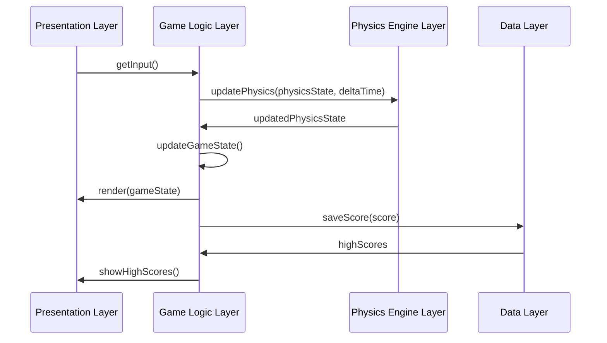

# Lunar Lander in Layered Style

## Introduction to Layered Lunar Lander
The Lunar Lander system can be effectively implemented using layered architecture, where different aspects of the game are organized into distinct layers. This approach provides clear separation of concerns, making the system more maintainable and extensible.

## Layered Architecture for Lunar Lander

### Layer Structure
The Lunar Lander system is organized into four main layers, each with specific responsibilities.

**Layered Lunar Lander Architecture:**
```
┌─────────────────────────────────────────────────────────────┐
│                Lunar Lander Layered System                 │
├─────────────────┬─────────────────┬─────────────────────────┤
│   Presentation  │   Game Logic    │   Physics               │
│     Layer       │     Layer       │   Engine                │
│                 │                 │                         │
│ ┌─────────────┐ │ ┌─────────────┐ │ ┌─────────────────────┐ │
│ │User         │ │ │Game         │ │ │Physics              │ │
│ │Interface    │ │ │Controller   │ │ │Simulation           │ │
│ │Display      │ │ │Game State   │ │ │Collision            │ │
│ │Input        │ │ │Score        │ │ │Detection            │ │
│ │Rendering    │ │ │Level        │ │ │Gravity              │ │
│ │Audio        │ │ │Management   │ │ │Engine               │ │
│ └─────────────┘ │ └─────────────┘ │ └─────────────────────┘ │
└─────────────────┴─────────────────┴─────────────────────────┘
│                                                             │
│   Data Layer                                                 │
│ ┌─────────────────────────────────────────────────────────┐ │
│ │Game Data                                                │ │
│ │Level Data                                               │ │
│ │Score Data                                               │ │
│ │Configuration                                            │ │
│ │Save/Load                                                │ │
│ └─────────────────────────────────────────────────────────┘ │
└─────────────────────────────────────────────────────────────┘
```

## Layer Responsibilities

### 1. Presentation Layer
- **Purpose**: Handle user interaction and visual/audio output
- **Responsibilities**:
  - User interface rendering
  - Input processing
  - Audio output
  - Visual effects

**Presentation Layer Components:**
```
┌─────────────────────────────────────────────────────────────┐
│                Presentation Layer                           │
├─────────────────┬─────────────────┬─────────────────────────┤
│   User          │   Display       │   Audio                 │
│   Interface     │   System        │   System                │
│                 │                 │                         │
│ ┌─────────────┐ │ ┌─────────────┐ │ ┌─────────────────────┐ │
│ │InputHandler │ │ │Renderer     │ │ │AudioManager         │ │
│ │UI           │ │ │Sprite       │ │ │SoundEffects         │ │
│ │Controls     │ │ │Manager      │ │ │Background           │ │
│ │Menu         │ │ │Animation    │ │ │Music                │ │
│ │HUD          │ │ │Effects      │ │ │Volume               │ │
│ └─────────────┘ │ └─────────────┘ │ └─────────────────────┘ │
└─────────────────┴─────────────────┴─────────────────────────┘
```

### 2. Game Logic Layer
- **Purpose**: Manage game rules, state, and flow
- **Responsibilities**:
  - Game state management
  - Score calculation
  - Level progression
  - Win/lose conditions

**Game Logic Layer Components:**
```
┌─────────────────────────────────────────────────────────────┐
│                Game Logic Layer                             │
├─────────────────┬─────────────────┬─────────────────────────┤
│   Game          │   Level         │   Score                 │
│   Controller    │   Management    │   System                │
│                 │                 │                         │
│ ┌─────────────┐ │ ┌─────────────┐ │ ┌─────────────────────┐ │
│ │GameLoop     │ │ │LevelLoader  │ │ │ScoreCalculator      │ │
│ │GameState    │ │ │Level        │ │ │HighScore            │ │
│ │GameRules    │ │ │Generator    │ │ │Achievements         │ │
│ │GameFlow     │ │ │Difficulty   │ │ │Statistics           │ │
│ │Pause/Resume │ │ │Progression  │ │ │Leaderboard          │ │
│ └─────────────┘ │ └─────────────┘ │ └─────────────────────┘ │
└─────────────────┴─────────────────┴─────────────────────────┘
```

### 3. Physics Engine Layer
- **Purpose**: Handle all physics calculations and simulations
- **Responsibilities**:
  - Gravity simulation
  - Collision detection
  - Movement calculations
  - Physics constraints

**Physics Engine Layer Components:**
```
┌─────────────────────────────────────────────────────────────┐
│                Physics Engine Layer                         │
├─────────────────┬─────────────────┬─────────────────────────┤
│   Physics       │   Collision     │   Movement              │
│   Simulation    │   Detection     │   System                │
│                 │                 │                         │
│ ┌─────────────┐ │ ┌─────────────┐ │ ┌─────────────────────┐ │
│ │Gravity      │ │ │Collision    │ │ │Position             │ │
│ │Engine       │ │ │Detector     │ │ │Calculator           │ │
│ │Force        │ │ │Boundary     │ │ │Velocity             │ │
│ │Calculator   │ │ │Checker      │ │ │Updater              │ │
│ │Physics      │ │ │Collision    │ │ │Acceleration         │ │
│ │Constants    │ │ │Response     │ │ │Handler              │ │
│ └─────────────┘ │ └─────────────┘ │ └─────────────────────┘ │
└─────────────────┴─────────────────┴─────────────────────────┘
```

### 4. Data Layer
- **Purpose**: Manage game data and persistence
- **Responsibilities**:
  - Game configuration
  - Level data storage
  - Score persistence
  - Save/load functionality

**Data Layer Components:**
```
┌─────────────────────────────────────────────────────────────┐
│                Data Layer                                   │
├─────────────────┬─────────────────┬─────────────────────────┤
│   Game          │   Level         │   Persistence           │
│   Data          │   Data          │   System                │
│                 │                 │                         │
│ ┌─────────────┐ │ ┌─────────────┐ │ ┌─────────────────────┐ │
│ │GameConfig   │ │ │LevelData    │ │ │SaveManager          │ │
│ │Settings     │ │ │Terrain      │ │ │LoadManager          │ │
│ │Parameters   │ │ │LandingZones │ │ │DataSerializer       │ │
│ │Constants    │ │ │Obstacles    │ │ │FileManager          │ │
│ │Preferences  │ │ │Backgrounds  │ │ │DataValidator        │ │
│ └─────────────┘ │ └─────────────┘ │ └─────────────────────┘ │
└─────────────────┴─────────────────┴─────────────────────────┘
```

## Implementation Example

### Layer Interfaces
Each layer defines clear interfaces for communication with other layers.

```java
// Presentation Layer Interface
public interface PresentationLayer {
    void render(GameState gameState);
    UserInput getInput();
    void playSound(SoundType sound);
    void showMessage(String message);
}

// Game Logic Layer Interface
public interface GameLogicLayer {
    GameState updateGameState(GameState currentState, UserInput input);
    boolean isGameOver(GameState state);
    int calculateScore(GameState state);
    Level getCurrentLevel();
}

// Physics Engine Layer Interface
public interface PhysicsEngineLayer {
    PhysicsState updatePhysics(PhysicsState currentState, double deltaTime);
    boolean checkCollision(GameObject obj1, GameObject obj2);
    Vector2D calculateGravity(Vector2D position);
    void applyForce(GameObject object, Vector2D force);
}

// Data Layer Interface
public interface DataLayer {
    GameConfig loadGameConfig();
    LevelData loadLevel(int levelNumber);
    void saveScore(int score);
    List<Integer> getHighScores();
    void saveGameState(GameState state);
    GameState loadGameState();
}
```

### Layer Implementation

#### Presentation Layer Implementation
```java
public class PresentationLayerImpl implements PresentationLayer {
    private final Renderer renderer;
    private final InputHandler inputHandler;
    private final AudioManager audioManager;
    
    @Override
    public void render(GameState gameState) {
        // Render lander
        renderer.drawLander(gameState.getLander());
        
        // Render terrain
        renderer.drawTerrain(gameState.getTerrain());
        
        // Render UI
        renderer.drawHUD(gameState.getScore(), gameState.getFuel());
        
        // Render effects
        if (gameState.isThrusting()) {
            renderer.drawThrustEffect(gameState.getLander());
        }
    }
    
    @Override
    public UserInput getInput() {
        return inputHandler.getCurrentInput();
    }
    
    @Override
    public void playSound(SoundType sound) {
        audioManager.playSound(sound);
    }
}
```

#### Game Logic Layer Implementation
```java
public class GameLogicLayerImpl implements GameLogicLayer {
    private final PhysicsEngineLayer physicsEngine;
    private final DataLayer dataLayer;
    private Level currentLevel;
    
    @Override
    public GameState updateGameState(GameState currentState, UserInput input) {
        // Update lander based on input
        Lander lander = updateLander(currentState.getLander(), input);
        
        // Update physics
        PhysicsState physicsState = physicsEngine.updatePhysics(
            currentState.getPhysicsState(), 0.016); // 60 FPS
        
        // Check for landing or crash
        boolean isLanded = checkLanding(lander, currentState.getTerrain());
        boolean isCrashed = checkCrash(lander, currentState.getTerrain());
        
        // Update score
        int score = calculateScore(currentState, isLanded, isCrashed);
        
        return new GameState(lander, physicsState, score, isLanded, isCrashed);
    }
    
    @Override
    public boolean isGameOver(GameState state) {
        return state.isLanded() || state.isCrashed();
    }
    
    @Override
    public int calculateScore(GameState state) {
        // Score calculation logic
        int baseScore = 1000;
        int fuelBonus = state.getLander().getFuel() * 10;
        int landingBonus = state.isLanded() ? 500 : 0;
        return baseScore + fuelBonus + landingBonus;
    }
}
```

#### Physics Engine Layer Implementation
```java
public class PhysicsEngineLayerImpl implements PhysicsEngineLayer {
    private static final Vector2D GRAVITY = new Vector2D(0, -1.62); // Moon gravity
    
    @Override
    public PhysicsState updatePhysics(PhysicsState currentState, double deltaTime) {
        Lander lander = currentState.getLander();
        
        // Apply gravity
        Vector2D gravityForce = calculateGravity(lander.getPosition());
        applyForce(lander, gravityForce);
        
        // Apply thrust if active
        if (lander.isThrusting()) {
            Vector2D thrustForce = new Vector2D(0, lander.getThrustLevel());
            applyForce(lander, thrustForce);
        }
        
        // Update position and velocity
        Vector2D newVelocity = lander.getVelocity().add(
            lander.getAcceleration().multiply(deltaTime));
        Vector2D newPosition = lander.getPosition().add(
            newVelocity.multiply(deltaTime));
        
        lander.setVelocity(newVelocity);
        lander.setPosition(newPosition);
        
        return new PhysicsState(lander);
    }
    
    @Override
    public boolean checkCollision(GameObject obj1, GameObject obj2) {
        // Simple bounding box collision detection
        return obj1.getBounds().intersects(obj2.getBounds());
    }
    
    @Override
    public Vector2D calculateGravity(Vector2D position) {
        return GRAVITY; // Constant gravity on moon
    }
    
    @Override
    public void applyForce(GameObject object, Vector2D force) {
        Vector2D currentAcceleration = object.getAcceleration();
        Vector2D newAcceleration = currentAcceleration.add(force);
        object.setAcceleration(newAcceleration);
    }
}
```

## Layer Communication

### Communication Flow
The layers communicate through well-defined interfaces, maintaining loose coupling.

**Communication Diagram:**


### Data Flow Between Layers
```
┌─────────────────────────────────────────────────────────────┐
│                Layer Communication Flow                     │
├─────────────────┬─────────────────┬─────────────────────────┤
│   Presentation  │   Game Logic    │   Physics               │
│     Layer       │     Layer       │   Engine                │
│                 │                 │                         │
│ ┌─────────────┐ │ ┌─────────────┐ │ ┌─────────────────────┐ │
│ │User Input   │ │ │Game State   │ │ │Physics State        │ │
│ │Display Data │ │ │Game Rules   │ │ │Physics Calculations │ │
│ │Audio Events │ │ │Score Logic  │ │ │Collision Data       │ │
│ └─────────────┘ │ └─────────────┘ │ └─────────────────────┘ │
└─────────────────┴─────────────────┴─────────────────────────┘
│                                                             │
│   Data Layer                                                 │
│ ┌─────────────────────────────────────────────────────────┐ │
│ │Configuration Data                                       │ │
│ │Level Data                                               │ │
│ │Score Data                                               │ │
│ │Save Data                                                │ │
│ └─────────────────────────────────────────────────────────┘ │
└─────────────────────────────────────────────────────────────┘
```

## Benefits of Layered Architecture for Lunar Lander

### 1. Separation of Concerns
- **Presentation**: Focuses only on user interface and display
- **Game Logic**: Handles game rules and state management
- **Physics**: Manages all physics calculations
- **Data**: Handles data persistence and configuration

### 2. Maintainability
- Changes in one layer don't affect others
- Easy to modify physics without changing UI
- Simple to add new display modes
- Clear debugging boundaries

### 3. Extensibility
- Easy to add new physics models
- Simple to implement different UI themes
- Can add new game modes without changing physics
- Easy to port to different platforms

### 4. Testability
- Each layer can be tested independently
- Mock objects can replace layer dependencies
- Unit tests for specific layer functionality
- Integration tests for layer communication

## Practice Questions

### Question 1: Layer Responsibilities
**Question:** For the Lunar Lander system, identify which layer would be responsible for each of the following tasks:
1. Drawing the lander sprite on screen
2. Calculating the lander's velocity based on thrust
3. Checking if the lander has crashed into terrain
4. Saving the player's high score
5. Playing the thrust sound effect

**Solution:**
1. **Drawing the lander sprite**: Presentation Layer (Renderer component)
2. **Calculating velocity based on thrust**: Physics Engine Layer (Movement System)
3. **Checking crash into terrain**: Physics Engine Layer (Collision Detection)
4. **Saving high score**: Data Layer (Persistence System)
5. **Playing thrust sound**: Presentation Layer (Audio System)

### Question 2: Layer Communication Design
**Question:** Design the interfaces and data structures needed for communication between the Game Logic Layer and Physics Engine Layer in the Lunar Lander system.

**Solution:**
```java
// Data structures for layer communication
public class PhysicsState {
    private final Lander lander;
    private final List<GameObject> obstacles;
    private final Terrain terrain;
    
    // Constructor and getters
}

public class GameState {
    private final Lander lander;
    private final PhysicsState physicsState;
    private final int score;
    private final boolean isLanded;
    private final boolean isCrashed;
    
    // Constructor and getters
}

// Interface for Physics Engine Layer
public interface PhysicsEngineLayer {
    PhysicsState updatePhysics(PhysicsState currentState, double deltaTime);
    boolean checkCollision(GameObject obj1, GameObject obj2);
    Vector2D calculateGravity(Vector2D position);
    void applyForce(GameObject object, Vector2D force);
}

// Interface for Game Logic Layer
public interface GameLogicLayer {
    GameState updateGameState(GameState currentState, UserInput input);
    boolean isGameOver(GameState state);
    int calculateScore(GameState state);
}
```

### Question 3: Layer Modification
**Question:** How would you modify the Lunar Lander system to add a new feature: different gravity levels for different planets? Which layers would need to be modified and why?

**Solution:**
**Layers that need modification:**

1. **Data Layer**: 
   - Add planet configuration data
   - Store gravity values for different planets
   - Modify level data to include planet information

2. **Physics Engine Layer**:
   - Modify `calculateGravity()` method to accept planet parameter
   - Update physics calculations for different gravity values
   - Adjust collision detection for different planet surfaces

3. **Game Logic Layer**:
   - Add planet selection logic
   - Modify level loading to include planet data
   - Update score calculation for different planets

4. **Presentation Layer**:
   - Add planet selection UI
   - Display current planet information
   - Show planet-specific visual effects

**Why these layers:**
- **Data Layer**: Needs to store new planet configuration data
- **Physics Engine**: Core physics calculations depend on gravity
- **Game Logic**: Manages planet selection and game flow
- **Presentation**: Provides user interface for planet selection

**Layers that don't need modification:**
- Core rendering and input handling in Presentation Layer
- Basic game state management in Game Logic Layer
- Generic collision detection in Physics Engine Layer 