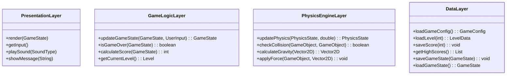

# Lunar Lander in Layered Style

## Introduction to Layered Lunar Lander
The Lunar Lander system can be effectively implemented using layered architecture, where different aspects of the game are organized into distinct layers. This approach provides clear separation of concerns, making the system more maintainable and extensible.

## Layered Architecture for Lunar Lander

### Layer Structure
The Lunar Lander system is organized into four main layers, each with specific responsibilities.

**Layered Lunar Lander Architecture:**
```
┌─────────────────────────────────────────────────────────────┐
│                Lunar Lander Layered System                 │
├─────────────────┬─────────────────┬─────────────────────────┤
│   Presentation  │   Game Logic    │   Physics               │
│     Layer       │     Layer       │   Engine                │
│                 │                 │                         │
│ ┌─────────────┐ │ ┌─────────────┐ │ ┌─────────────────────┐ │
│ │User         │ │ │Game         │ │ │Physics              │ │
│ │Interface    │ │ │Controller   │ │ │Simulation           │ │
│ │Display      │ │ │Game State   │ │ │Collision            │ │
│ │Input        │ │ │Score        │ │ │Detection            │ │
│ │Rendering    │ │ │Level        │ │ │Gravity              │ │
│ │Audio        │ │ │Management   │ │ │Engine               │ │
│ └─────────────┘ │ └─────────────┘ │ └─────────────────────┘ │
└─────────────────┴─────────────────┴─────────────────────────┘
│                                                             │
│   Data Layer                                                 │
│ ┌─────────────────────────────────────────────────────────┐ │
│ │Game Data                                                │ │
│ │Level Data                                               │ │
│ │Score Data                                               │ │
│ │Configuration                                            │ │
│ │Save/Load                                                │ │
│ └─────────────────────────────────────────────────────────┘ │
└─────────────────────────────────────────────────────────────┘
```

## Layer Responsibilities

### 1. Presentation Layer
- **Purpose**: Handle user interaction and visual/audio output
- **Responsibilities**:
  - User interface rendering
  - Input processing
  - Audio output
  - Visual effects

**Presentation Layer Components:**


### 2. Game Logic Layer
- **Purpose**: Manage game rules, state, and flow
- **Responsibilities**:
  - Game state management
  - Score calculation
  - Level progression
  - Win/lose conditions

**Game Logic Layer Components:**
```
┌─────────────────────────────────────────────────────────────┐
│                Game Logic Layer                             │
├─────────────────┬─────────────────┬─────────────────────────┤
│   Game          │   Level         │   Score                 │
│   Controller    │   Management    │   System                │
│                 │                 │                         │
│ ┌─────────────┐ │ ┌─────────────┐ │ ┌─────────────────────┐ │
│ │GameLoop     │ │ │LevelLoader  │ │ │ScoreCalculator      │ │
│ │GameState    │ │ │Level        │ │ │HighScore            │ │
│ │GameRules    │ │ │Generator    │ │ │Achievements         │ │
│ │GameFlow     │ │ │Difficulty   │ │ │Statistics           │ │
│ │Pause/Resume │ │ │Progression  │ │ │Leaderboard          │ │
│ └─────────────┘ │ └─────────────┘ │ └─────────────────────┘ │
└─────────────────┴─────────────────┴─────────────────────────┘
```

### 3. Physics Engine Layer
- **Purpose**: Handle all physics calculations and simulations
- **Responsibilities**:
  - Gravity simulation
  - Collision detection
  - Movement calculations
  - Physics constraints

**Physics Engine Layer Components:**


### 4. Data Layer
- **Purpose**: Manage game data and persistence
- **Responsibilities**:
  - Game configuration
  - Level data storage
  - Score persistence
  - Save/load functionality

**Data Layer Components:**


## Implementation Example

### Layer Interfaces
Each layer defines clear interfaces for communication with other layers.

**Conceptual Explanation:**
- Each layer in the architecture exposes an interface that defines the operations it provides to other layers.
- The Presentation Layer handles rendering, input, and audio.
- The Game Logic Layer manages game state, rules, and scoring.
- The Physics Engine Layer is responsible for physics calculations and collision detection.
- The Data Layer manages configuration, level data, scores, and game state persistence.



### Layer Implementation

#### Presentation Layer Implementation


#### Game Logic Layer Implementation


#### Physics Engine Layer Implementation


## Layer Communication

### Communication Flow
The layers communicate through well-defined interfaces, maintaining loose coupling.

**Communication Diagram:**


### Data Flow Between Layers
```
┌─────────────────────────────────────────────────────────────┐
│                Layer Communication Flow                     │
├─────────────────┬─────────────────┬─────────────────────────┤
│   Presentation  │   Game Logic    │   Physics               │
│     Layer       │     Layer       │   Engine                │
│                 │                 │                         │
│ ┌─────────────┐ │ ┌─────────────┐ │ ┌─────────────────────┐ │
│ │User Input   │ │ │Game State   │ │ │Physics State        │ │
│ │Display Data │ │ │Game Rules   │ │ │Physics Calculations │ │
│ │Audio Events │ │ │Score Logic  │ │ │Collision Data       │ │
│ └─────────────┘ │ └─────────────┘ │ └─────────────────────┘ │
└─────────────────┴─────────────────┴─────────────────────────┘
│                                                             │
│   Data Layer                                                 │
│ ┌─────────────────────────────────────────────────────────┐ │
│ │Configuration Data                                       │ │
│ │Level Data                                               │ │
│ │Score Data                                               │ │
│ │Save Data                                                │ │
│ └─────────────────────────────────────────────────────────┘ │
└─────────────────────────────────────────────────────────────┘
```

## Benefits of Layered Architecture for Lunar Lander

### 1. Separation of Concerns
- **Presentation**: Focuses only on user interface and display
- **Game Logic**: Handles game rules and state management
- **Physics**: Manages all physics calculations
- **Data**: Handles data persistence and configuration

### 2. Maintainability
- Changes in one layer don't affect others
- Easy to modify physics without changing UI
- Simple to add new display modes
- Clear debugging boundaries

### 3. Extensibility
- Easy to add new physics models
- Simple to implement different UI themes
- Can add new game modes without changing physics
- Easy to port to different platforms

### 4. Testability
- Each layer can be tested independently
- Mock objects can replace layer dependencies
- Unit tests for specific layer functionality
- Integration tests for layer communication

## Practice Questions

### Question 1: Layer Responsibilities
**Question:** For the Lunar Lander system, identify which layer would be responsible for each of the following tasks:
1. Drawing the lander sprite on screen
2. Calculating the lander's velocity based on thrust
3. Checking if the lander has crashed into terrain
4. Saving the player's high score
5. Playing the thrust sound effect

**Solution:**
1. **Drawing the lander sprite**: Presentation Layer (Renderer component)
2. **Calculating velocity based on thrust**: Physics Engine Layer (Movement System)
3. **Checking crash into terrain**: Physics Engine Layer (Collision Detection)
4. **Saving high score**: Data Layer (Persistence System)
5. **Playing thrust sound**: Presentation Layer (Audio System)

### Question 2: Layer Communication Design
**Question:** Design the interfaces and data structures needed for communication between the Game Logic Layer and Physics Engine Layer in the Lunar Lander system.

**Solution:**


### Question 3: Layer Modification
**Question:** How would you modify the Lunar Lander system to add a new feature: different gravity levels for different planets? Which layers would need to be modified and why?

**Solution:**
**Layers that need modification:**

1. **Data Layer**: 
   - Add planet configuration data
   - Store gravity values for different planets
   - Modify level data to include planet information

2. **Physics Engine Layer**:
   - Modify `calculateGravity()` method to accept planet parameter
   - Update physics calculations for different gravity values
   - Adjust collision detection for different planet surfaces

3. **Game Logic Layer**:
   - Add planet selection logic
   - Modify level loading to include planet data
   - Update score calculation for different planets

4. **Presentation Layer**:
   - Add planet selection UI
   - Display current planet information
   - Show planet-specific visual effects

**Why these layers:**
- **Data Layer**: Needs to store new planet configuration data
- **Physics Engine**: Core physics calculations depend on gravity
- **Game Logic**: Manages planet selection and game flow
- **Presentation**: Provides user interface for planet selection

**Layers that don't need modification:**
- Core rendering and input handling in Presentation Layer
- Basic game state management in Game Logic Layer
- Generic collision detection in Physics Engine Layer 