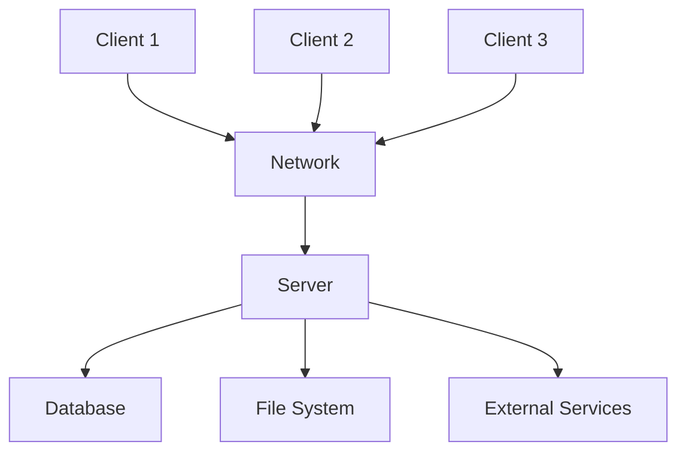
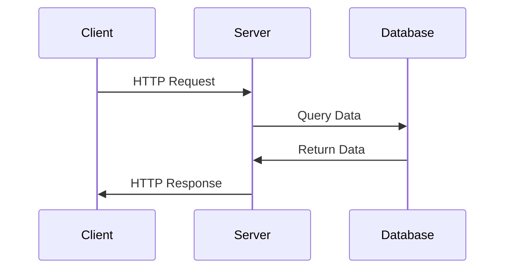
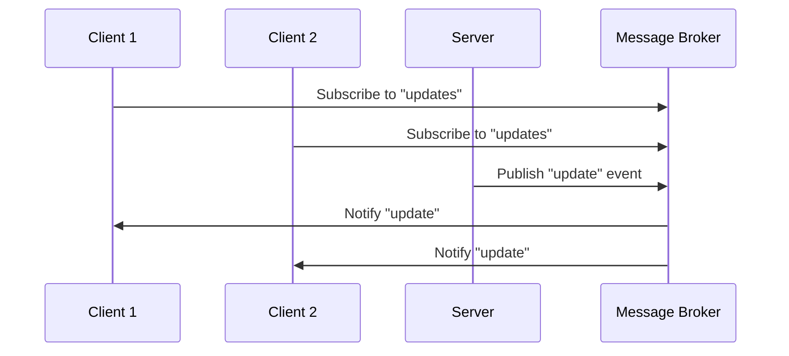
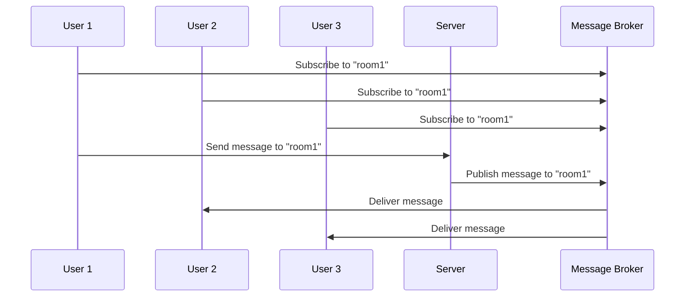

# Client-Server Style

## Introduction to Client-Server Architecture
Client-server architecture is a distributed computing model where client applications request services from server applications. The server provides resources, services, or data to multiple clients over a network.

## Core Principles

### 1. Separation of Concerns
- **Client**: Handles user interface and user interaction
- **Server**: Manages data, business logic, and shared resources
- **Network**: Facilitates communication between client and server

### 2. Request-Response Pattern
- Clients send requests to servers
- Servers process requests and send responses
- Asynchronous or synchronous communication

**Diagram: Client-Server Architecture**


## Client-Server Components

### 1. Client Components
- **User Interface**: Forms, displays, controls
- **Client Logic**: Input validation, data formatting
- **Network Client**: Communication protocols
- **Local Storage**: Cache, preferences

**Client Architecture:**
```
┌─────────────────────────────────────────────────────────────┐
│                Client Architecture                          │
├─────────────────┬─────────────────┬─────────────────────────┤
│   User          │   Client        │   Network               │
│   Interface     │   Logic         │   Layer                 │
│                 │                 │                         │
│ ┌─────────────┐ │ ┌─────────────┐ │ ┌─────────────────────┐ │
│ │Web Browser  │ │ │Input        │ │ │HTTP Client          │ │
│ │Mobile App   │ │ │Validation   │ │ │WebSocket Client     │ │
│ │Desktop App  │ │ │Data         │ │ │REST Client          │ │
│ │Forms        │ │ │Formatting   │ │ │Authentication       │ │
│ └─────────────┘ │ └─────────────┘ │ └─────────────────────┘ │
└─────────────────┴─────────────────┴─────────────────────────┘
```

### 2. Server Components
- **Request Handler**: Processes incoming requests
- **Business Logic**: Core application logic
- **Data Access**: Database and file operations
- **Security**: Authentication and authorization

**Server Architecture:**
```
┌─────────────────────────────────────────────────────────────┐
│                Server Architecture                          │
├─────────────────┬─────────────────┬─────────────────────────┤
│   Request       │   Business      │   Data                  │
│   Handler       │   Logic         │   Access                │
│                 │                 │                         │
│ ┌─────────────┐ │ ┌─────────────┐ │ ┌─────────────────────┐ │
│ │HTTP Server  │ │ │Application  │ │ │Database             │ │
│ │API Gateway  │ │ │Services     │ │ │File System          │ │
│ │Load Balancer│ │ │Business     │ │ │Cache                │ │
│ │Authentication│ │ │Rules        │ │ │External APIs        │ │
│ └─────────────┘ │ └─────────────┘ │ └─────────────────────┘ │
└─────────────────┴─────────────────┴─────────────────────────┘
```

## Client-Server Communication Patterns

### 1. Request-Response
- **Synchronous**: Client waits for server response
- **Asynchronous**: Client continues processing while waiting
- **Polling**: Client repeatedly checks for updates

**Request-Response Flow:**


### 2. Publish-Subscribe
- **Server**: Publishes events to topics
- **Client**: Subscribes to topics of interest
- **Real-time**: Immediate notification of changes

**Publish-Subscribe Flow:**


## Client-Server Variants

### 1. Two-Tier Architecture
- **Client**: User interface and business logic
- **Server**: Database server
- **Simple**: Direct database connections

**Two-Tier Structure:**
```
┌─────────────────────────────────────────────────────────────┐
│                Two-Tier Architecture                        │
├─────────────────────────────────────────────────────────────┤
│   Client Tier                                               │
│ ┌─────────────────────────────────────────────────────────┐ │
│ │User Interface                                           │ │
│ │Business Logic                                           │ │
│ │Data Access Layer                                        │ │
│ └─────────────────────────────────────────────────────────┘ │
└─────────────────────────────────────────────────────────────┘
│                                                             │
│   Server Tier                                               │
│ ┌─────────────────────────────────────────────────────────┐ │
│ │Database Server                                          │ │
│ │Data Storage                                             │ │
│ │Query Processing                                         │ │
│ └─────────────────────────────────────────────────────────┘ │
└─────────────────────────────────────────────────────────────┘
```

### 2. Three-Tier Architecture
- **Client**: User interface only
- **Application Server**: Business logic
- **Database Server**: Data storage

**Three-Tier Structure:**
```
┌─────────────────────────────────────────────────────────────┐
│                Three-Tier Architecture                      │
├─────────────────┬─────────────────┬─────────────────────────┤
│   Client        │   Application   │   Database              │
│   Tier          │   Server        │   Server                │
│                 │                 │                         │
│ ┌─────────────┐ │ ┌─────────────┐ │ ┌─────────────────────┐ │
│ │User         │ │ │Business     │ │ │Data Storage         │ │
│ │Interface    │ │ │Logic        │ │ │Query Processing     │ │
│ │Input        │ │ │Application  │ │ │Transaction          │ │
│ │Validation   │ │ │Services     │ │ │Management           │ │
│ └─────────────┘ │ └─────────────┘ │ └─────────────────────┘ │
└─────────────────┴─────────────────┴─────────────────────────┘
```

### 3. N-Tier Architecture
- **Multiple Layers**: More than three tiers
- **Specialized Servers**: Dedicated servers for specific functions
- **Scalability**: Better resource utilization

**N-Tier Structure:**
```
┌─────────────────────────────────────────────────────────────┐
│                N-Tier Architecture                          │
├─────────────────┬─────────────────┬─────────────────────────┤
│   Client        │   Web           │   Application           │
│   Tier          │   Server        │   Server                │
│                 │                 │                         │
│ ┌─────────────┐ │ ┌─────────────┐ │ ┌─────────────────────┐ │
│ │User         │ │ │Web Server   │ │ │Business Logic       │ │
│ │Interface    │ │ │Load Balancer│ │ │Application          │ │
│ │Mobile App   │ │ │Authentication│ │ │Workflow Engine      │ │
│ │Desktop App  │ │ │Authentication│ │ │Analytics Service    │ │
│ └─────────────┘ │ └─────────────┘ │ └─────────────────────┘ │
└─────────────────┴─────────────────┴─────────────────────────┘
│                                                             │
│   Data Tier                                                 │
│ ┌─────────────────────────────────────────────────────────┐ │
│ │Database Server                                          │ │
│ │Cache Server                                             │ │
│ │File Server                                              │ │
│ │Message Queue                                            │ │
│ └─────────────────────────────────────────────────────────┘ │
└─────────────────────────────────────────────────────────────┘
```

## Advantages of Client-Server Architecture

### 1. Scalability
- **Horizontal Scaling**: Add more servers
- **Load Balancing**: Distribute load across servers
- **Resource Sharing**: Centralized resource management

### 2. Maintainability
- **Centralized Updates**: Update server, all clients benefit
- **Version Control**: Manage server versions independently
- **Backup**: Centralized data backup and recovery

### 3. Security
- **Centralized Security**: Server-side security controls
- **Access Control**: User authentication and authorization
- **Data Protection**: Secure data storage and transmission

### 4. Reliability
- **Redundancy**: Multiple servers for high availability
- **Fault Tolerance**: Server failures don't affect all clients
- **Recovery**: Centralized recovery procedures

## Disadvantages of Client-Server Architecture

### 1. Network Dependency
- **Network Failures**: Client can't work without network
- **Latency**: Network delays affect performance
- **Bandwidth**: Network bandwidth limitations

### 2. Server Bottlenecks
- **Single Point of Failure**: Server failure affects all clients
- **Performance**: Server can become overloaded
- **Scalability Limits**: Server capacity constraints

### 3. Complexity
- **Network Programming**: Complex network communication
- **Synchronization**: Data synchronization challenges
- **Deployment**: Complex deployment and configuration

## Implementation Example: E-commerce System

### Client Implementation
```java
// Client-side code
public class EcommerceClient {
    private final HttpClient httpClient;
    private final String serverUrl;
    
    public Product getProduct(String productId) {
        String url = serverUrl + "/api/products/" + productId;
        HttpRequest request = HttpRequest.newBuilder()
            .uri(URI.create(url))
            .GET()
            .build();
            
        HttpResponse<String> response = httpClient.send(request, 
            HttpResponse.BodyHandlers.ofString());
            
        return parseProduct(response.body());
    }
    
    public Order createOrder(OrderRequest orderRequest) {
        String url = serverUrl + "/api/orders";
        String jsonBody = serializeOrderRequest(orderRequest);
        
        HttpRequest request = HttpRequest.newBuilder()
            .uri(URI.create(url))
            .header("Content-Type", "application/json")
            .POST(HttpRequest.BodyPublishers.ofString(jsonBody))
            .build();
            
        HttpResponse<String> response = httpClient.send(request, 
            HttpResponse.BodyHandlers.ofString());
            
        return parseOrder(response.body());
    }
}
```

### Server Implementation
```java
// Server-side code
@RestController
@RequestMapping("/api")
public class EcommerceServer {
    private final ProductService productService;
    private final OrderService orderService;
    
    @GetMapping("/products/{id}")
    public ResponseEntity<Product> getProduct(@PathVariable String id) {
        Product product = productService.getProduct(id);
        if (product != null) {
            return ResponseEntity.ok(product);
        } else {
            return ResponseEntity.notFound().build();
        }
    }
    
    @PostMapping("/orders")
    public ResponseEntity<Order> createOrder(@RequestBody OrderRequest request) {
        try {
            Order order = orderService.createOrder(request);
            return ResponseEntity.ok(order);
        } catch (ValidationException e) {
            return ResponseEntity.badRequest().build();
        }
    }
    
    @GetMapping("/orders/{id}")
    public ResponseEntity<Order> getOrder(@PathVariable String id) {
        Order order = orderService.getOrder(id);
        if (order != null) {
            return ResponseEntity.ok(order);
        } else {
            return ResponseEntity.notFound().build();
        }
    }
}
```

## Practice Questions

### Question 1: Client-Server Architecture Analysis
**Question:** Analyze the client-server architecture for a banking system. Identify the components in each tier and explain their responsibilities.

**Solution:**
**Client Tier:**
- **Web Interface**: Online banking portal, mobile banking app
- **ATM Interface**: ATM terminal software
- **Branch Interface**: Bank teller software

**Application Server Tier:**
- **Transaction Service**: Process deposits, withdrawals, transfers
- **Account Service**: Manage account information
- **Security Service**: Authentication, authorization, fraud detection
- **Notification Service**: Send alerts and confirmations

**Database Server Tier:**
- **Account Database**: Store account information
- **Transaction Database**: Store transaction history
- **User Database**: Store user credentials and preferences
- **Audit Database**: Store audit trails

### Question 2: Communication Pattern Selection
**Question:** For a real-time chat application, would you choose request-response or publish-subscribe pattern? Explain your choice and design the communication flow.

**Solution:**
**Choice**: Publish-subscribe pattern

**Reasoning**:
- Real-time updates require immediate notification
- Multiple clients need to receive the same messages
- Decoupled communication between sender and receivers
- Better scalability for multiple users

**Communication Flow**:


### Question 3: Scalability Design
**Question:** Design a scalable client-server architecture for a video streaming service. Include load balancing, caching, and fault tolerance mechanisms.

**Solution:**
```
┌─────────────────────────────────────────────────────────────┐
│                Video Streaming Architecture                 │
├─────────────────┬─────────────────┬─────────────────────────┤
│   Client        │   Load          │   Application           │
│   Tier          │   Balancer      │   Servers               │
│                 │                 │                         │
│ ┌─────────────┐ │ ┌─────────────┐ │ ┌─────────────────────┐ │
│ │Web Player   │ │ │Load         │ │ │Video Processing     │ │
│ │Mobile App   │ │ │Balancer     │ │ │User Management      │ │
│ │Smart TV App │ │ │CDN Router   │ │ │Content Management   │ │
│ │Desktop App  │ │ │Health Check │ │ │Analytics Service    │ │
│ └─────────────┘ │ └─────────────┘ │ └─────────────────────┘ │
└─────────────────┴─────────────────┴─────────────────────────┘
│                                                             │
│   Cache Tier                                                │
│ ┌─────────────────────────────────────────────────────────┐ │
│ │Redis Cache                                              │ │
│ │CDN Edge Servers                                         │ │
│ │Video Cache                                              │ │
│ │Session Cache                                            │ │
│ └─────────────────────────────────────────────────────────┘ │
└─────────────────────────────────────────────────────────────┘
│                                                             │
│   Storage Tier                                              │
│ ┌─────────────────────────────────────────────────────────┐ │
│ │Video Storage                                            │ │
│ │User Database                                            │ │
│ │Analytics Database                                       │ │
│ │Backup Storage                                           │ │
│ └─────────────────────────────────────────────────────────┘ │
└─────────────────────────────────────────────────────────────┘
```

**Scalability Mechanisms**:
1. **Load Balancing**: Distribute requests across multiple application servers
2. **CDN**: Cache and serve video content from edge locations
3. **Database Sharding**: Distribute data across multiple database servers
4. **Caching**: Cache frequently accessed data in Redis
5. **Auto-scaling**: Automatically scale servers based on load
6. **Fault Tolerance**: Multiple servers with failover mechanisms 