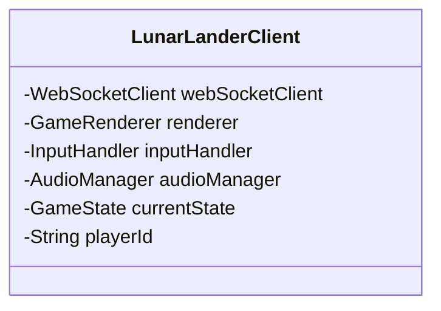
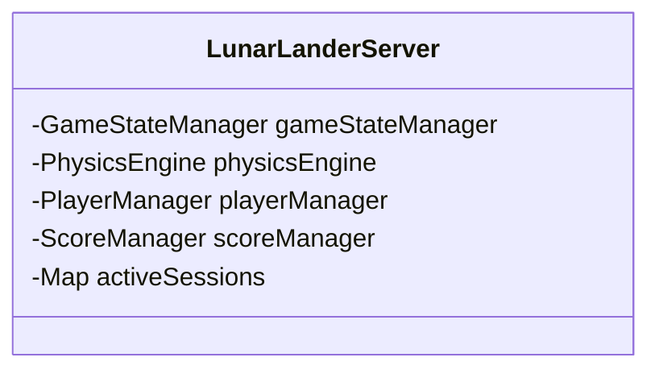
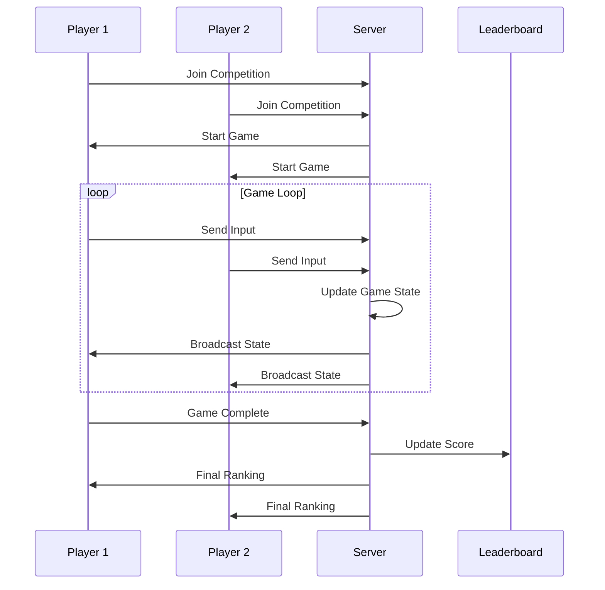
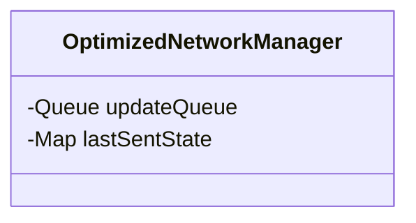
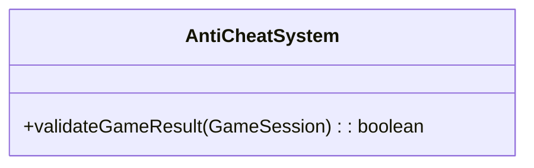

# Client-Server Lunar Lander

## Introduction to Client-Server Lunar Lander
The Lunar Lander system can be implemented using client-server architecture to support multiplayer gaming, centralized scoring, and shared game state. This approach enables features like leaderboards, multiplayer competitions, and persistent game data.

## Client-Server Architecture for Lunar Lander

### System Overview
The client-server implementation separates the game into client-side rendering and input handling, and server-side physics simulation and game state management.

**Client-Server Lunar Lander Architecture:**
```
┌─────────────────────────────────────────────────────────────┐
│                Client-Server Lunar Lander                   │
├─────────────────┬─────────────────┬─────────────────────────┤
│   Client 1      │   Client 2      │   Client 3              │
│   (Player 1)    │   (Player 2)    │   (Player 3)            │
│                 │                 │                         │
│ ┌─────────────┐ │ ┌─────────────┐ │ ┌─────────────────────┐ │
│ │Game         │ │ │Game         │ │ │Game                 │ │
│ │Interface    │ │ │Interface    │ │ │Interface            │ │
│ │Input        │ │ │Input        │ │ │Input                │ │
│ │Rendering    │ │ │Rendering    │ │ │Rendering            │ │
│ │Audio        │ │ │Audio        │ │ │Audio                │ │
│ └─────────────┘ │ └─────────────┘ │ └─────────────────────┘ │
└─────────────────┴─────────────────┴─────────────────────────┘
│                                                             │
│   Network Layer                                              │
│ ┌─────────────────────────────────────────────────────────┐ │
│ │WebSocket Connections                                    │ │
│ │HTTP API Calls                                           │ │
│ │Real-time Communication                                  │ │
│ └─────────────────────────────────────────────────────────┘ │
└─────────────────────────────────────────────────────────────┘
│                                                             │
│   Game Server                                               │
│ ┌─────────────────────────────────────────────────────────┐ │
│ │Game State Manager                                       │ │
│ │Physics Engine                                           │ │
│ │Multiplayer Coordinator                                  │ │
│ │Score Manager                                            │ │
│ │Level Manager                                            │ │
│ └─────────────────────────────────────────────────────────┘ │
└─────────────────────────────────────────────────────────────┘
│                                                             │
│   Data Layer                                                │
│ ┌─────────────────────────────────────────────────────────┐ │
│ │Player Database                                          │ │
│ │Score Database                                           │ │
│ │Level Database                                           │ │
│ │Game History                                             │ │
│ └─────────────────────────────────────────────────────────┘ │
└─────────────────────────────────────────────────────────────┘
```

## Client-Side Implementation

### Client Responsibilities
- **User Interface**: Display game state and handle user input
- **Input Processing**: Capture and send user actions to server
- **Rendering**: Display game graphics based on server updates
- **Audio**: Play sound effects and music
- **Local Prediction**: Predict game state for smooth gameplay

**Client Architecture:**
```
┌─────────────────────────────────────────────────────────────┐
│                Client Architecture                          │
├─────────────────┬─────────────────┬─────────────────────────┤
│   User          │   Network       │   Game                  │
│   Interface     │   Layer         │   Logic                 │
│                 │                 │                         │
│ ┌─────────────┐ │ ┌─────────────┐ │ ┌─────────────────────┐ │
│ │Game Display │ │ │WebSocket    │ │ │Input Handler        │ │
│ │Menu System  │ │ │Client       │ │ │State Predictor      │ │
│ │HUD          │ │ │HTTP Client  │ │ │Audio Manager        │ │
│ │Controls     │ │ │Message      │ │ │Local Cache          │ │
│ │Settings     │ │ │Handler      │ │ │Error Handler        │ │
│ └─────────────┘ │ └─────────────┘ │ └─────────────────────┘ │
└─────────────────┴─────────────────┴─────────────────────────┘
```

### Client Code Example


## Server-Side Implementation

### Server Responsibilities
- **Game State Management**: Maintain authoritative game state
- **Physics Simulation**: Run physics calculations
- **Multiplayer Coordination**: Manage multiple players
- **Score Management**: Track and validate scores
- **Level Management**: Provide level data and progression

**Server Architecture:**
```
┌─────────────────────────────────────────────────────────────┐
│                Server Architecture                          │
├─────────────────┬─────────────────┬─────────────────────────┤
│   Connection    │   Game          │   Data                  │
│   Manager       │   Engine        │   Manager               │
│                 │                 │                         │
│ ┌─────────────┐ │ ┌─────────────┐ │ ┌─────────────────────┐ │
│ │WebSocket    │ │ │Game State   │ │ │Player Database      │ │
│ │Manager      │ │ │Manager      │ │ │Score Database       │ │
│ │Client       │ │ │Physics      │ │ │Level Database       │ │
│ │Authentication│ │ │Engine       │ │ │Game History         │ │
│ │Session      │ │ │Multiplayer  │ │ │Analytics            │ │
│ │Management   │ │ │Coordinator  │ │ │Backup System        │ │
│ └─────────────┘ │ └─────────────┘ │ └─────────────────────┘ │
└─────────────────┴─────────────────┴─────────────────────────┘
```

### Server Code Example


## Multiplayer Features

### 1. Competitive Multiplayer
- **Real-time Competition**: Multiple players compete simultaneously
- **Leaderboard**: Real-time ranking updates
- **Spectator Mode**: Watch other players' games

**Competitive Multiplayer Flow:**


### 2. Cooperative Multiplayer
- **Team Challenges**: Players work together to achieve goals
- **Shared Resources**: Common fuel or equipment
- **Coordinated Actions**: Synchronized maneuvers

### 3. Tournament System
- **Brackets**: Elimination-style competitions
- **Seasons**: Regular competitive periods
- **Rewards**: Prizes and recognition

## Network Considerations

### 1. Latency Management
- **Client Prediction**: Predict server state locally
- **Server Reconciliation**: Correct predictions when server updates arrive
- **Interpolation**: Smooth movement between server updates

### 2. Bandwidth Optimization
- **Delta Compression**: Send only changed data
- **Priority Queuing**: Important updates sent first
- **Compression**: Compress network messages

### 3. Reliability
- **Connection Recovery**: Handle network disconnections
- **State Synchronization**: Resync when reconnecting
- **Error Handling**: Graceful degradation

## Data Management

### 1. Player Data
- **Profiles**: Player information and preferences
- **Statistics**: Game history and performance
- **Achievements**: Unlocked accomplishments

### 2. Score Management
- **Validation**: Prevent cheating and invalid scores
- **Leaderboards**: Global and regional rankings
- **History**: Track score progression over time

### 3. Level Data
- **Dynamic Levels**: Server-generated challenges
- **Difficulty Scaling**: Adjust based on player skill
- **Custom Levels**: User-created content

## Practice Questions

### Question 1: Client-Server Design
**Question:** Design a client-server architecture for a multiplayer Lunar Lander tournament system. Include components for matchmaking, game coordination, and result tracking.

**Solution:**
```
┌─────────────────────────────────────────────────────────────┐
│                Tournament System Architecture               │
├─────────────────┬─────────────────┬─────────────────────────┤
│   Client        │   Matchmaking   │   Game                  │
│   Tier          │   Server        │   Server                │
│                 │                 │                         │
│ ┌─────────────┐ │ ┌─────────────┐ │ ┌─────────────────────┐ │
│ │Tournament   │ │ │Player       │ │ │Game State           │ │
│ │Interface    │ │ │Queue        │ │ │Manager              │ │
│ │Leaderboard  │ │ │Match        │ │ │Physics Engine       │ │
│ │Results      │ │ │Maker        │ │ │Tournament           │ │
│ │Brackets     │ │ │Skill        │ │ │Coordinator          │ │
│ └─────────────┘ │ │Matcher      │ │ └─────────────────────┘ │
│                 │ └─────────────┘ │                         │
└─────────────────┴─────────────────┴─────────────────────────┘
│                                                             │
│   Data Tier                                                 │
│ ┌─────────────────────────────────────────────────────────┐ │
│ │Tournament Database                                      │ │
│ │Player Database                                          │ │
│ │Match History                                            │ │
│ │Bracket State                                            │ │
│ └─────────────────────────────────────────────────────────┘ │
└─────────────────────────────────────────────────────────────┘
```

**Components:**
1. **Matchmaking Server**: Manages player queues and creates matches
2. **Game Server**: Handles individual game sessions
3. **Tournament Coordinator**: Manages bracket progression
4. **Result Tracker**: Records and validates match results

### Question 2: Network Optimization
**Question:** How would you optimize network communication for a real-time multiplayer Lunar Lander game? Consider latency, bandwidth, and reliability.

**Solution:**
**Network Optimization Strategies:**

1. **Latency Reduction:**
   - Client-side prediction for smooth gameplay
   - Server reconciliation to correct predictions
   - Interpolation for smooth movement display
   - Optimized server locations (CDN)

2. **Bandwidth Optimization:**
   - Delta compression (send only changes)
   - Priority queuing (critical updates first)
   - Message compression (gzip, protocol buffers)
   - Rate limiting for input messages

3. **Reliability:**
   - Connection recovery mechanisms
   - State synchronization on reconnection
   - Error handling and graceful degradation
   - Heartbeat monitoring

**Implementation Example:**


### Question 3: Anti-Cheat Measures
**Question:** Design anti-cheat measures for a competitive Lunar Lander game. Consider common cheating methods and how to prevent them.

**Solution:**
**Anti-Cheat Measures:**

1. **Client-Side Validation:**
   - Input validation (reasonable thrust values)
   - Movement validation (impossible trajectories)
   - Time validation (reasonable game duration)

2. **Server-Side Verification:**
   - Physics simulation on server
   - Score validation against game state
   - Anomaly detection (impossible scores)

3. **Behavioral Analysis:**
   - Pattern recognition for automated play
   - Statistical analysis of player performance
   - Machine learning for cheat detection

**Implementation:**
