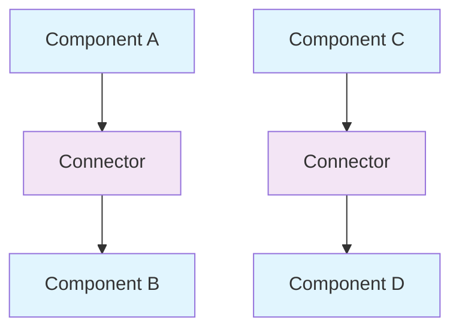

# What is a Software Connector?

## Introduction to Software Connectors
Software connectors are fundamental architectural elements that enable communication and interaction between software components. They are the "glue" that holds software systems together, facilitating data flow, control flow, and coordination between different parts of a system.

## Definition and Purpose

### What is a Software Connector?
A software connector is an architectural element that:
- **Enables Communication**: Facilitates interaction between components
- **Manages Dependencies**: Handles relationships between system parts
- **Provides Abstraction**: Hides communication complexity from components
- **Supports Reuse**: Allows components to be used in different contexts

**Key Characteristics:**
- **First-Class Elements**: Connectors are treated as distinct architectural elements
- **Communication Mechanisms**: Provide specific ways for components to interact
- **Protocol Enforcement**: Ensure proper communication patterns
- **Error Handling**: Manage communication failures and recovery

## Connector vs Component Distinction

### Components
- **Purpose**: Perform computation and maintain state
- **Focus**: Business logic and functionality
- **Examples**: User interface, business logic modules, data access layers

### Connectors
- **Purpose**: Enable communication and coordination
- **Focus**: Interaction patterns and protocols
- **Examples**: Method calls, message queues, database connections

**Diagram: Components vs Connectors**


## Types of Software Connectors

### 1. Procedure Call Connectors
- **Purpose**: Synchronous communication between components
- **Characteristics**: Direct method invocation, return values
- **Examples**: Function calls, method calls, API calls

### 2. Event Connectors
- **Purpose**: Asynchronous communication through events
- **Characteristics**: Loose coupling, publish-subscribe pattern
- **Examples**: Event systems, message buses, signal handlers

### 3. Data Access Connectors
- **Purpose**: Access to shared data and resources
- **Characteristics**: Data persistence, query capabilities
- **Examples**: Database connections, file system access, shared memory

### 4. Stream Connectors
- **Purpose**: Continuous data flow between components
- **Characteristics**: Sequential data processing, buffering
- **Examples**: Pipes, data streams, audio/video processing

### 5. Linkage Connectors
- **Purpose**: Compile-time and load-time connections
- **Characteristics**: Static binding, dependency resolution
- **Examples**: Static linking, dynamic linking, dependency injection

## Connector Roles and Responsibilities

### 1. Communication Facilitation
- **Message Routing**: Direct messages to appropriate destinations
- **Protocol Translation**: Convert between different communication protocols
- **Data Transformation**: Format data for different components

### 2. Coordination and Synchronization
- **Timing Coordination**: Ensure proper sequencing of operations
- **Resource Management**: Manage shared resources and access
- **Concurrency Control**: Handle multiple simultaneous interactions

### 3. Error Handling and Recovery
- **Failure Detection**: Identify communication problems
- **Error Recovery**: Implement recovery mechanisms
- **Fault Tolerance**: Provide redundancy and backup paths

### 4. Performance Optimization
- **Load Balancing**: Distribute communication load
- **Caching**: Store frequently accessed data
- **Connection Pooling**: Reuse expensive connections

## Connector Classification Framework

### 1. Communication Mechanism
- **Synchronous**: Blocking communication with immediate response
- **Asynchronous**: Non-blocking communication with delayed response
- **Streaming**: Continuous data flow

### 2. Coupling Level
- **Tight Coupling**: Direct dependencies between components
- **Loose Coupling**: Minimal dependencies, flexible connections
- **Decoupled**: No direct dependencies, event-driven

### 3. Communication Direction
- **Unidirectional**: One-way communication
- **Bidirectional**: Two-way communication
- **Multidirectional**: Multiple participants

### 4. Persistence
- **Transient**: Temporary connections
- **Persistent**: Long-lived connections
- **Session-based**: Connection for specific time periods

## Connector Design Principles

### 1. Separation of Concerns
- **Communication Logic**: Separate from business logic
- **Protocol Handling**: Isolate protocol-specific code
- **Error Management**: Centralize error handling

### 2. Abstraction
- **Interface Hiding**: Hide implementation details
- **Protocol Independence**: Support multiple protocols
- **Location Transparency**: Hide component locations

### 3. Reusability
- **Generic Connectors**: Work with different components
- **Configuration**: Adaptable to different contexts
- **Composition**: Combine multiple connectors

### 4. Reliability
- **Fault Tolerance**: Handle communication failures
- **Recovery Mechanisms**: Automatic error recovery
- **Monitoring**: Track connector health and performance

## Example: E-commerce System Connectors

### System Overview
An e-commerce system uses various connectors to enable communication between components.

**E-commerce Connector Architecture:**
```
┌─────────────────────────────────────────────────────────────┐
│                E-commerce System Connectors                │
├─────────────────┬─────────────────┬─────────────────────────┤
│   Web           │   Application   │   Data                  │
│   Interface     │   Server        │   Layer                 │
│                 │                 │                         │
│ ┌─────────────┐ │ ┌─────────────┐ │ ┌─────────────────────┐ │
│ │HTTP         │ │ │REST API     │ │ │Database             │ │
│ │Connector    │ │ │Connector    │ │ │Connector            │ │
│ │WebSocket    │ │ │Message      │ │ │Cache                │ │
│ │Connector    │ │ │Queue        │ │ │Connector            │ │
│ │Load         │ │ │Connector    │ │ │File System          │ │
│ │Balancer     │ │ │Event Bus    │ │ │Connector            │ │
│ └─────────────┘ │ └─────────────┘ │ └─────────────────────┘ │
└─────────────────┴─────────────────┴─────────────────────────┘
```

### Connector Examples

#### 1. HTTP Connector
**Purpose**: Handle HTTP requests and responses between web clients and server
**Characteristics**: 
- Stateless communication
- Request-response pattern
- Standard HTTP methods (GET, POST, PUT, DELETE)
- Status codes for response handling

**HTTP Connector Flow:**
```
┌─────────────┐    ┌─────────────┐    ┌─────────────┐
│   Client    │───▶│   HTTP      │───▶│   Server    │
│   Request   │    │   Connector │    │   Response  │
└─────────────┘    └─────────────┘    └─────────────┘
       │                   │                   │
       ▼                   ▼                   ▼
┌─────────────┐    ┌─────────────┐    ┌─────────────┐
│URL + Method │    │Protocol     │    │Status Code  │
│Headers      │    │Translation  │    │Response     │
│Body Data    │    │Error        │    │Body         │
└─────────────┘    │Handling     │    └─────────────┘
                   └─────────────┘
```

#### 2. Message Queue Connector
**Purpose**: Enable asynchronous communication between services
**Characteristics**:
- Decoupled communication
- Event-driven architecture
- Reliable message delivery
- Load distribution

**Message Queue Flow:**
```
┌─────────────┐    ┌─────────────┐    ┌─────────────┐
│   Producer  │───▶│   Message   │───▶│   Consumer  │
│   Sends     │    │   Queue     │    │   Receives  │
│   Message   │    │   Stores    │    │   Message   │
└─────────────┘    └─────────────┘    └─────────────┘
       │                   │                   │
       ▼                   ▼                   ▼
┌─────────────┐    ┌─────────────┐    ┌─────────────┐
│Message      │    │Queue        │    │Message      │
│Serialization│    │Persistence  │    │Deserialization│
│Routing      │    │Load         │    │Processing   │
│Acknowledgment│   │Balancing    │    │Acknowledgment│
└─────────────┘    └─────────────┘    └─────────────┘
```

#### 3. Database Connector
**Purpose**: Provide data access and persistence capabilities
**Characteristics**:
- Data abstraction layer
- Transaction management
- Connection pooling
- Query optimization

**Database Connection Flow:**
```
┌─────────────┐    ┌─────────────┐    ┌─────────────┐
│Application  │───▶│   Database  │───▶│   Database  │
│Request      │    │   Connector │    │   System    │
└─────────────┘    └─────────────┘    └─────────────┘
       │                   │                   │
       ▼                   ▼                   ▼
┌─────────────┐    ┌─────────────┐    ┌─────────────┐
│Query        │    │Connection   │    │Query        │
│Formulation  │    │Establishment│    │Execution    │
│Parameter    │    │Transaction  │    │Result       │
│Binding      │    │Management   │    │Generation   │
└─────────────┘    └─────────────┘    └─────────────┘
       │                   │                   │
       ▼                   ▼                   ▼
┌─────────────┐    ┌─────────────┐    ┌─────────────┐
│Result       │◄───│   Data      │◄───│   Data      │
│Processing   │    │   Transfer  │    │   Retrieval │
│Data         │    │   Error     │    │   Storage   │
│Mapping      │    │   Handling  │    │   Update    │
└─────────────┘    └─────────────┘    └─────────────┘
```

## Benefits of Explicit Connectors

### 1. Improved System Understanding
- **Clear Communication Patterns**: Explicit connectors show how components interact
- **Architecture Documentation**: Connectors serve as living documentation
- **System Analysis**: Easier to analyze system behavior and performance

### 2. Enhanced Maintainability
- **Isolated Changes**: Changes to communication don't affect components
- **Reusable Components**: Components can be reused with different connectors
- **Easier Testing**: Connectors can be tested independently

### 3. Better Performance
- **Optimized Communication**: Connectors can be optimized for specific patterns
- **Load Balancing**: Connectors can distribute communication load
- **Caching**: Connectors can implement caching strategies

### 4. Increased Flexibility
- **Protocol Changes**: Easy to change communication protocols
- **Component Replacement**: Components can be replaced without affecting others
- **System Evolution**: Connectors can evolve independently of components

## Practice Questions

### Question 1: Connector Identification
**Question:** In a web-based banking system, identify three different types of connectors and explain their roles in the system.

**Solution:**
1. **HTTP Connector**: 
   - **Role**: Enables communication between web browsers and the banking server
   - **Type**: Procedure call connector (REST API calls)
   - **Function**: Handles HTTP requests/responses for account operations

2. **Database Connector**:
   - **Role**: Provides data access between application server and database
   - **Type**: Data access connector
   - **Function**: Manages SQL queries, transactions, and data persistence

3. **Message Queue Connector**:
   - **Role**: Enables asynchronous communication between banking services
   - **Type**: Event connector
   - **Function**: Handles notifications, audit events, and background processing

### Question 2: Connector Design
**Question:** Design a connector for a real-time chat application that supports both text messages and file transfers. Explain the design decisions.

**Solution:**
**Chat Application Connector Architecture:**
```
┌─────────────────────────────────────────────────────────────┐
│                Chat Application Connector Design           │
├─────────────────┬─────────────────┬─────────────────────────┤
│   Text          │   File          │   Notification          │
│   Messaging     │   Transfer      │   System                │
│   Connector     │   Connector     │                         │
│                 │                 │                         │
│                 │                 │                         │
│ ┌─────────────┐ │ ┌─────────────┐ │ ┌─────────────────────┐ │
│ │WebSocket    │ │ │HTTP Upload  │ │ │Message Queue        │ │
│ │Connector    │ │ │Connector    │ │ │Connector            │ │
│ │Real-time    │ │ │File Storage │ │ │Push Notifications   │ │
│ │Bidirectional│ │ │Connector    │ │ │Email Notifications  │ │
│ │Message      │ │ │CDN          │ │ │SMS Notifications    │ │
│ │Routing      │ │ │Connector    │ │ │                     │ │
│ └─────────────┘ │ └─────────────┘ │ └─────────────────────┘ │
└─────────────────┴─────────────────┴─────────────────────────┘
```

**Design Decisions:**
1. **WebSocket for Text**: Real-time, low-latency communication
2. **Dedicated File Transfer**: Handle large files efficiently
3. **Message Queue for Notifications**: Asynchronous delivery to offline users
4. **Database Storage**: Persistence for message history

### Question 3: Connector Selection
**Question:** Compare procedure call connectors and event connectors. When would you choose each type?

**Solution:**
**Procedure Call Connectors:**
- **Characteristics**: Synchronous, direct communication, immediate response
- **Use Cases**: 
  - Simple request-response patterns
  - When immediate response is required
  - Tightly coupled components
  - Simple error handling

**Event Connectors:**
- **Characteristics**: Asynchronous, loose coupling, delayed response
- **Use Cases**:
  - Complex workflows with multiple participants
  - When components should be decoupled
  - Event-driven architectures
  - When immediate response is not required

**Selection Criteria:**
- **Coupling**: Choose events for loose coupling, procedure calls for tight coupling
- **Performance**: Choose procedure calls for low latency, events for high throughput
- **Scalability**: Choose events for better scalability
- **Complexity**: Choose procedure calls for simple interactions, events for complex workflows 