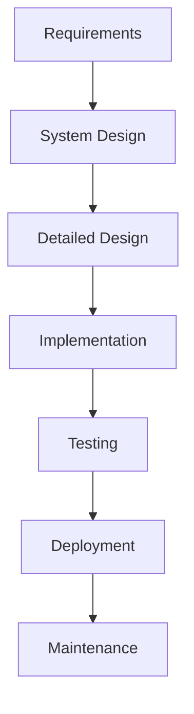
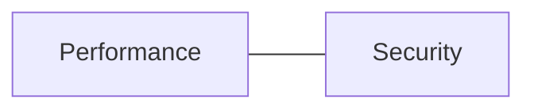

# Unit 1: Practice Questions and Solutions

## 1. Design Principles

### Q1: Identify the violated SOLID principle in this scenario:
A restaurant app has a single class that handles order placement, payment processing, and sending notifications.

**Solution:**
- **Violated Principle:** Single Responsibility Principle (SRP)
- **Explanation:** Each class should have only one responsibility. Order placement, payment, and notifications should be handled by separate classes.

---

### Q2: How can you extend a food delivery app to support a new payment method without modifying existing payment code?

**Solution:**
- **Principle:** Open/Closed Principle (OCP)
- **Explanation:** Use an abstract PaymentMethod interface. Add new payment classes (e.g., WalletPayment) that implement this interface, without changing existing code.

---

## 2. Design Processes

### Q3: Which process model is best for a university management system where requirements may change frequently? Why?

**Solution:**
- **Model:** Iterative Model
- **Reason:** Allows for repeated cycles of design, implementation, and feedback, making it suitable for evolving requirements.

---

### Q4: Draw a flowchart for the software design process of a restaurant management system.

**Solution:**

---

## 3. Design Knowledge

### Q5: Why is domain knowledge important in designing a university management system?

**Solution:**
- **Importance:** Domain knowledge ensures the system meets real user needs, follows academic rules, and supports processes like registration, grading, and scheduling.

---

### Q6: Give an example of tacit and explicit knowledge in a food delivery app.

**Solution:**
- **Tacit:** An experienced designer intuitively knows how to optimize delivery routes.
- **Explicit:** Documented process for handling order cancellations.

---

## 4. Quality Attributes

### Q7: What trade-off might you face between performance and security in a restaurant app?

**Solution:**
- **Trade-off:** Adding encryption (security) may slow down order processing (performance).
- **Diagram:**

---

### Q8: List two non-functional quality attributes important for a food delivery app and explain why.

**Solution:**
- **Performance:** Fast order placement and tracking are critical for user satisfaction.
- **Reliability:** Orders must not be lost, even if a server fails. 