# Unit 1A: Software Design Principles

## 1. SOLID Principles Overview

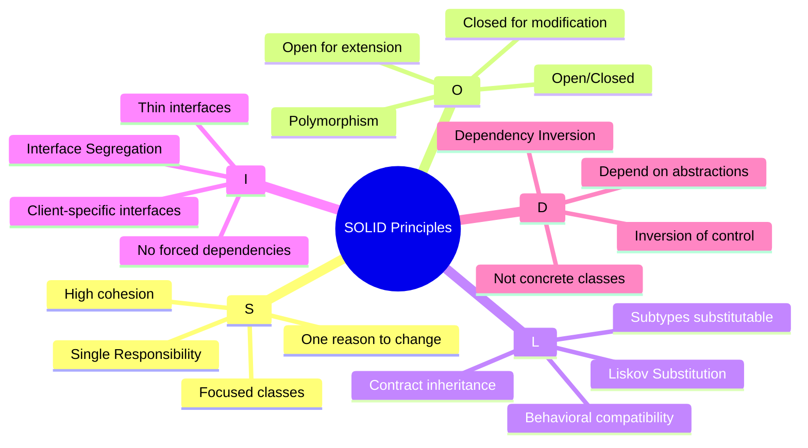

## 2. Single Responsibility Principle (SRP)

**Definition**: A class should have only one reason to change.

**Key Concepts**:
- Each class should have a single, well-defined purpose
- Changes to one responsibility should not affect others
- Improves maintainability and reduces coupling
- Makes code easier to understand and test

**Example Scenarios**:

### Scenario 1: Restaurant Management System
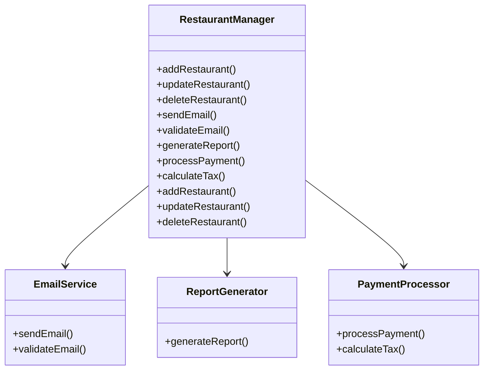

### Scenario 2: University Management System
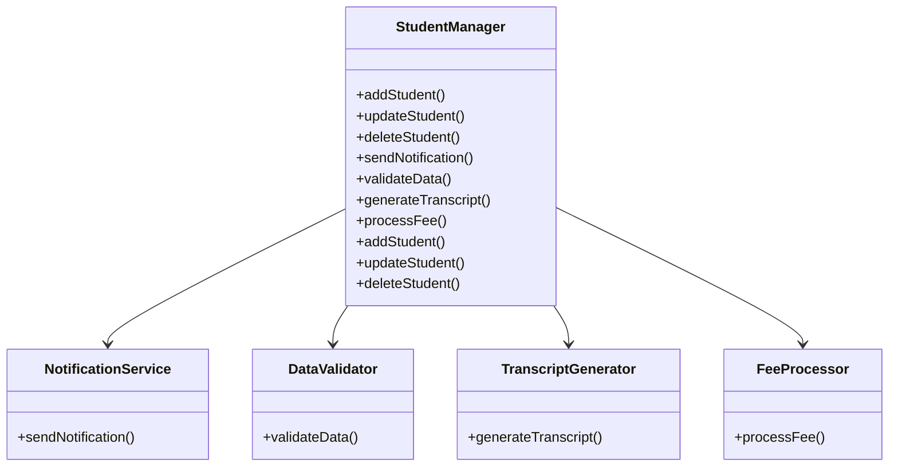

## 3. Open/Closed Principle (OCP)

**Definition**: Software entities should be open for extension but closed for modification.

**Key Concepts**:
- Add new functionality without changing existing code
- Use inheritance and polymorphism
- Promotes code reuse and stability
- Reduces risk of introducing bugs

**Example Scenarios**:

### Scenario 1: Payment System
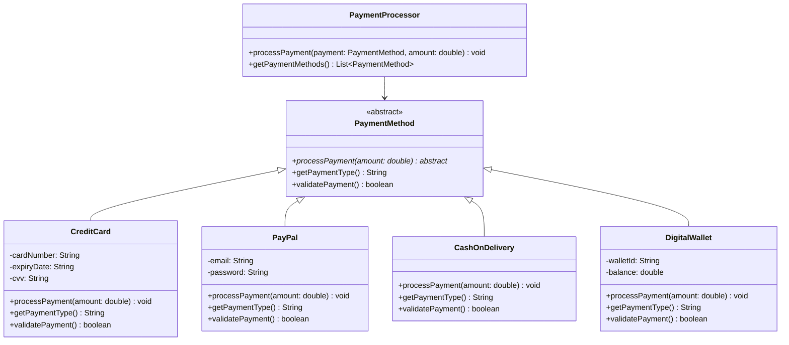

### Scenario 2: Notification System
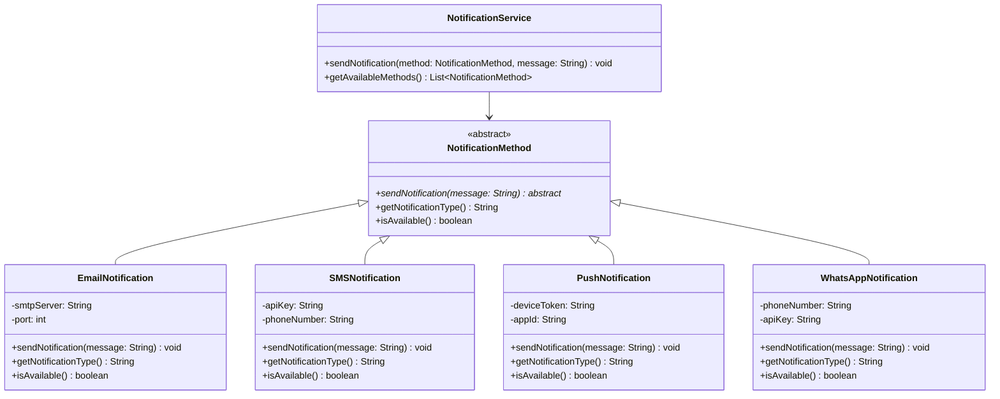

## 4. Liskov Substitution Principle (LSP)

**Definition**: Subtypes must be substitutable for their base types without altering the correctness of the program.

**Key Concepts**:
- Behavioral compatibility between base and derived classes
- Contracts must be honored
- Prevents inheritance misuse
- Ensures polymorphism works correctly

**Example Scenarios**:

### Scenario 1: User Management System
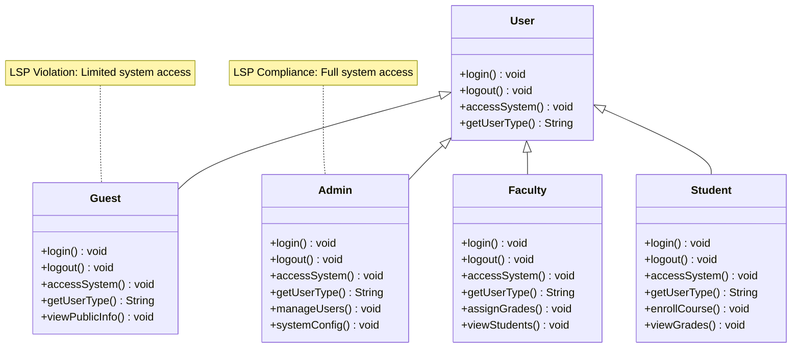

**Better Design Following LSP**:
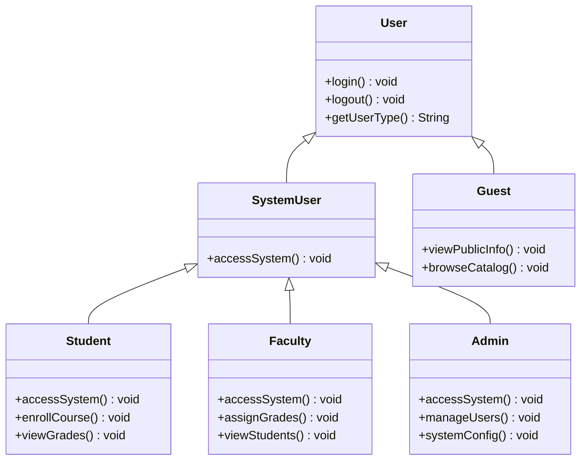

### Scenario 2: Vehicle Management System
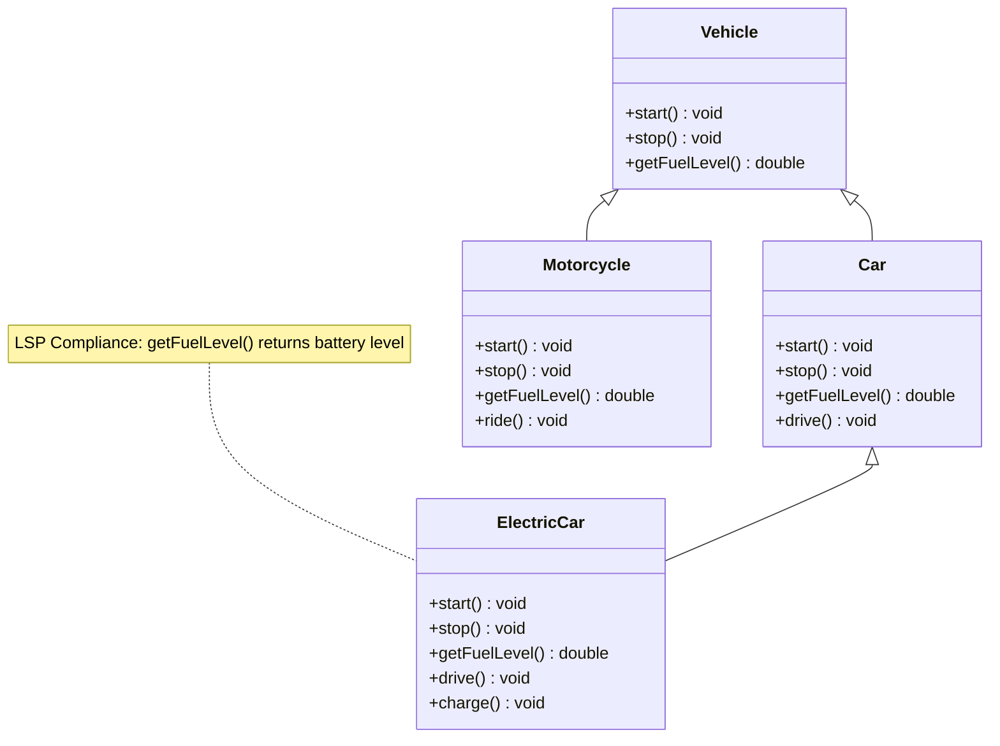

## 5. Interface Segregation Principle (ISP)

**Definition**: Clients should not be forced to depend on interfaces they do not use.

**Key Concepts**:
- Create specific interfaces for specific clients
- Avoid fat interfaces
- Promote loose coupling
- Make interfaces focused and cohesive

**Example Scenarios**:

### Scenario 1: Restaurant Staff Management
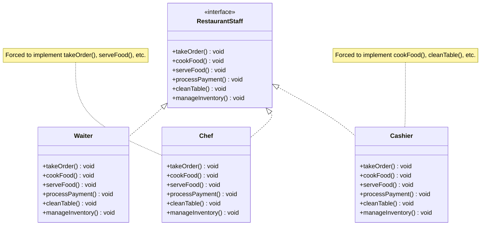

**Better Design Following ISP**:
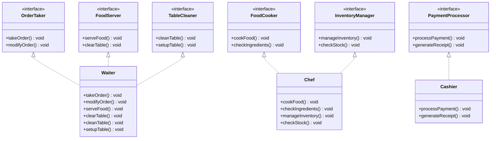

### Scenario 2: University System Interfaces
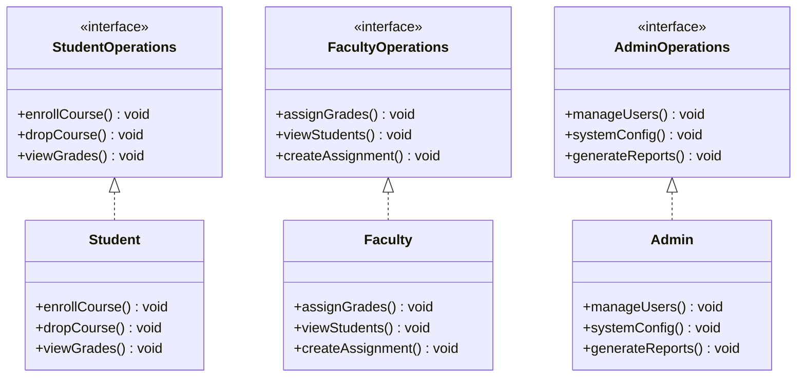

## 6. Dependency Inversion Principle (DIP)

**Definition**: High-level modules should not depend on low-level modules. Both should depend on abstractions.

**Key Concepts**:
- Depend on abstractions, not concretions
- Inversion of control
- Promotes loose coupling and testability
- Enables flexibility and extensibility

**Example Scenarios**:

### Scenario 1: Data Access Layer
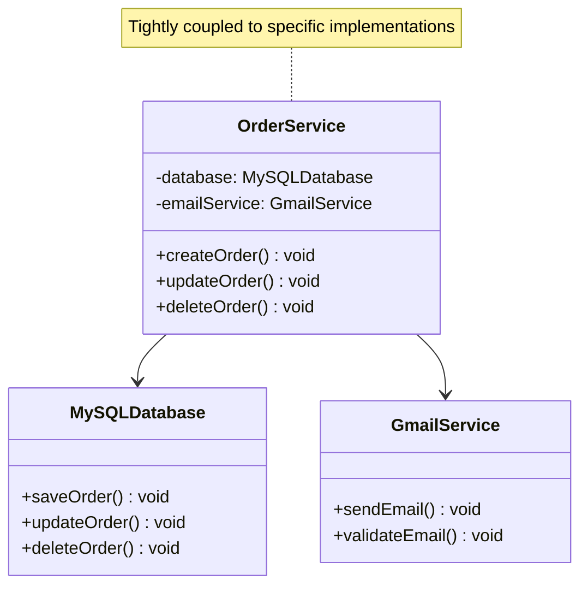

**Better Design Following DIP**:
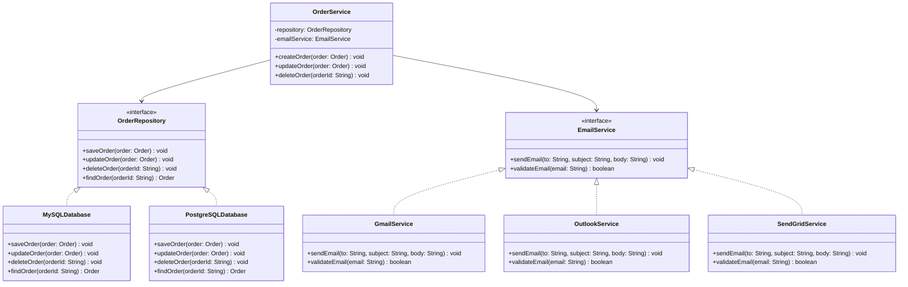

### Scenario 2: Payment Processing System
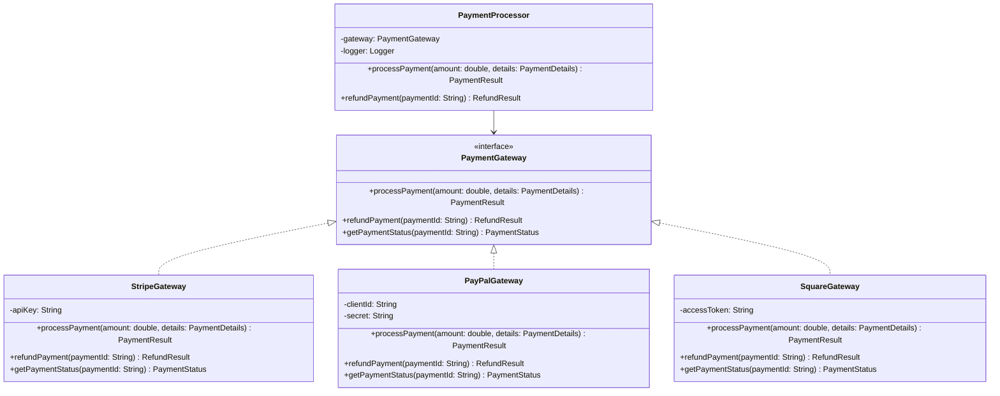

## 7. Additional Design Principles

### 7.1 DRY (Don't Repeat Yourself)
**Definition**: Every piece of knowledge should have a single, unambiguous representation in the system.

**Benefits**:
- Reduces maintenance overhead
- Ensures consistency
- Improves reliability
- Makes changes easier

**Example**: Common validation logic, utility functions, configuration management

### 7.2 KISS (Keep It Simple, Stupid)
**Definition**: Simplicity should be a key goal in design.

**Benefits**:
- Easier to understand and maintain
- Reduces complexity
- Improves reliability
- Faster development

**Example**: Simple class structures, clear method names, straightforward algorithms

### 7.3 YAGNI (You Aren't Gonna Need It)
**Definition**: Don't add functionality until it's necessary.

**Benefits**:
- Reduces complexity
- Saves development time
- Focuses on current requirements
- Prevents over-engineering

**Example**: Avoid premature optimization, don't add features "just in case"

## 8. Visual Summary

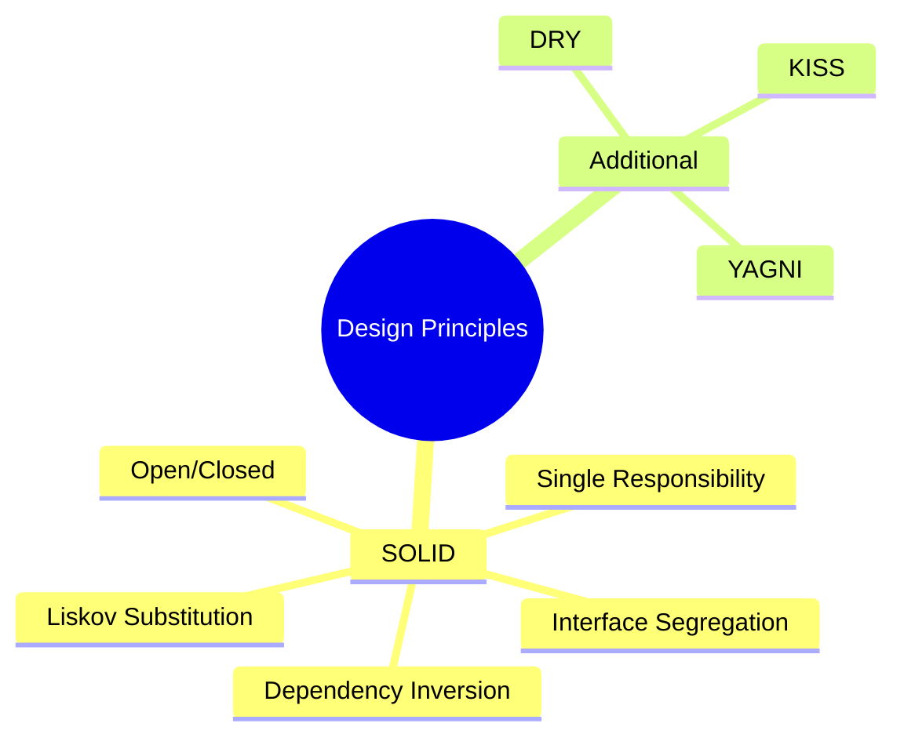

## 9. Key Takeaways

### When to Apply Each Principle:
- **SRP**: When a class has multiple responsibilities
- **OCP**: When you need to add new features without changing existing code
- **LSP**: When using inheritance and polymorphism
- **ISP**: When interfaces are too large or force unwanted dependencies
- **DIP**: When high-level modules depend on low-level modules

### Benefits of Following SOLID Principles:
- **Maintainability**: Easier to modify and extend
- **Testability**: Easier to unit test components
- **Reusability**: Components can be reused in different contexts
- **Flexibility**: Easy to change implementations
- **Scalability**: System can grow without major refactoring

---

**Next:** Design processes will be in a separate file. 