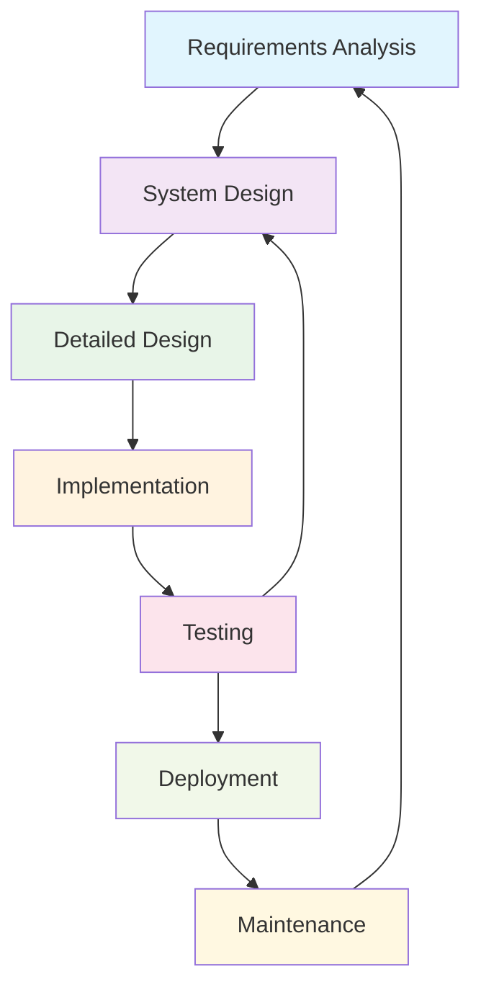
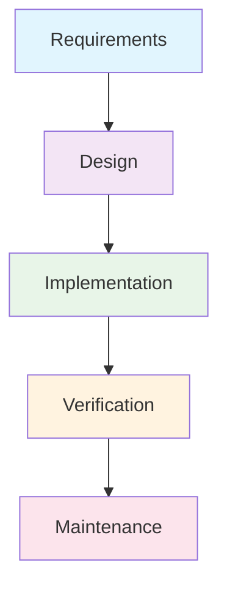
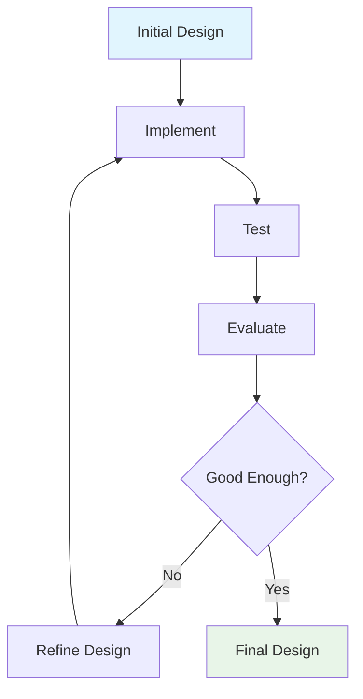
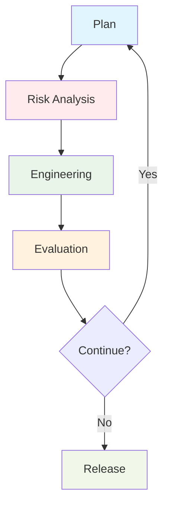
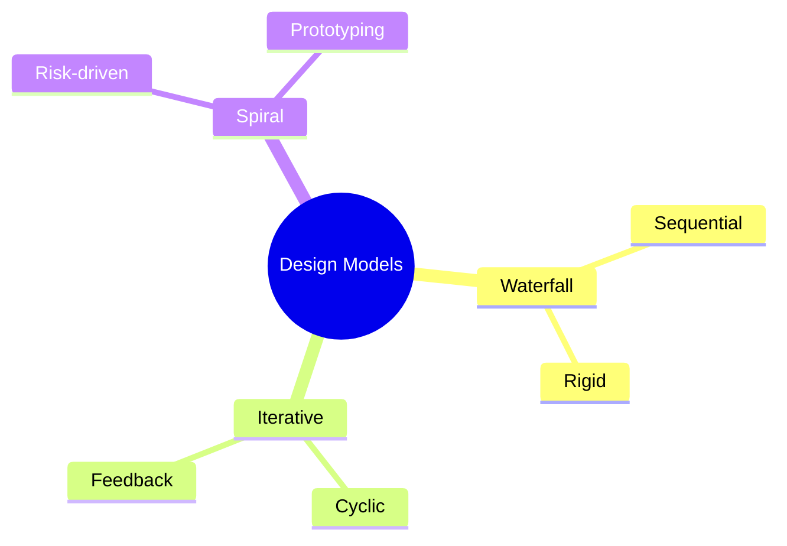

# Unit 1B: Software Design Processes and Models

## 1. Overview of the Design Process

Software design is a systematic process that transforms requirements into a blueprint for constructing software. The process ensures that the final product meets user needs, is maintainable, and is of high quality.

## 2. General Design Process Flow

### Key Steps:
- **Requirements Analysis:** Understand what needs to be built (functional and non-functional requirements).
- **System Design:** High-level structure, architecture, and main components.
- **Detailed Design:** Specifics of modules, classes, and interfaces.
- **Implementation:** Actual coding and construction.
- **Testing:** Verifying correctness and quality.
- **Deployment:** Releasing the product to users.
- **Maintenance:** Ongoing support and updates.

## 3. Software Design Process Models

### 3.1 Waterfall Model
- Linear and sequential approach.
- Each phase must be completed before the next begins.
- Best for well-understood, low-change projects.

### 3.2 Iterative Model
- Develops the system through repeated cycles (iterations).
- Allows feedback and refinement at each stage.
- Suitable for projects where requirements may evolve.

### 3.3 Spiral Model
- Combines iterative development with systematic risk analysis.
- Each loop (spiral) involves planning, risk analysis, engineering, and evaluation.
- Useful for large, high-risk projects.

## 4. Comparison Table

| Model      | Structure      | Feedback | Risk Handling | Best Use Case                |
|------------|---------------|----------|---------------|------------------------------|
| Waterfall  | Sequential    | Late     | Low           | Stable, well-defined projects |
| Iterative  | Cyclic        | Early    | Medium        | Evolving requirements         |
| Spiral     | Cyclic+Risk   | Early    | High          | Large, high-risk projects     |

## 5. Visual Summary

---

**Next:** Practice questions and solutions for design processes will be in a separate file. 