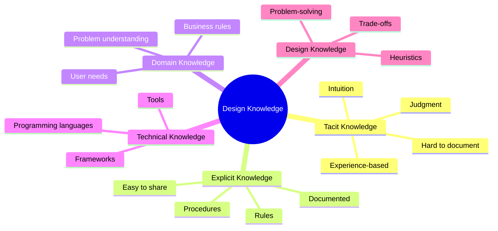
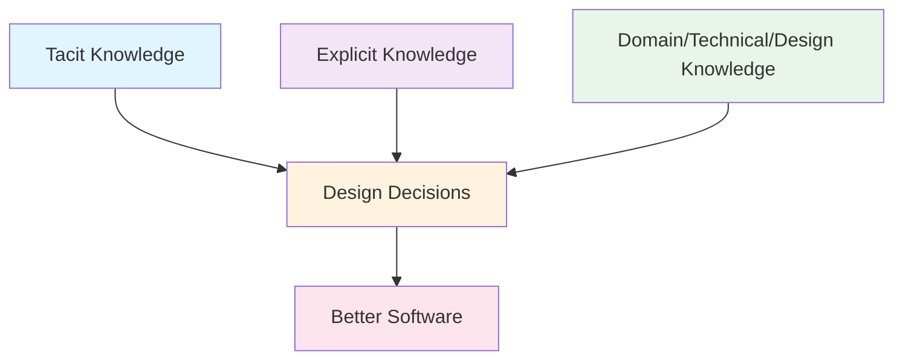

# Unit 1C: Design Knowledge in Software Engineering

## 1. What is Design Knowledge?
Design knowledge is the set of information, experience, and principles that guide software designers in making effective decisions. It helps ensure that solutions are practical, maintainable, and meet user needs.

## 2. Types of Design Knowledge

### 2.1 Tacit Knowledge
- Based on personal experience and intuition
- Hard to formalize or communicate
- Example: An experienced designer's gut feeling about what will work

### 2.2 Explicit Knowledge
- Can be written down and shared
- Includes rules, guidelines, and best practices
- Example: Design pattern documentation, checklists

### 2.3 Domain Knowledge
- Understanding the specific problem area (e.g., food delivery, university management)
- Includes business rules, user needs, and industry standards
- Example: Knowing how restaurant orders flow from customer to kitchen to delivery

### 2.4 Technical Knowledge
- Knowledge of programming languages, frameworks, and tools
- Helps in choosing the right technology for the problem
- Example: Knowing when to use a relational database vs. a NoSQL database

### 2.5 Design Knowledge
- Understanding of design principles, patterns, and heuristics
- Guides the structure and organization of software
- Example: Applying the Observer pattern for notifications in an app

## 3. How Design Knowledge is Used

### 3.1 In Requirements Analysis
- Domain knowledge helps clarify what the system must do
- Technical knowledge helps assess feasibility

### 3.2 In System and Detailed Design
- Design knowledge guides the choice of patterns and principles
- Tacit knowledge helps in making trade-offs and resolving ambiguities

### 3.3 In Communication
- Explicit knowledge (like diagrams and documents) helps teams share understanding
- Domain knowledge ensures all stakeholders are on the same page

## 4. Visual Summary

---

**Next:** Practice questions and solutions for design knowledge will be in a separate file. 