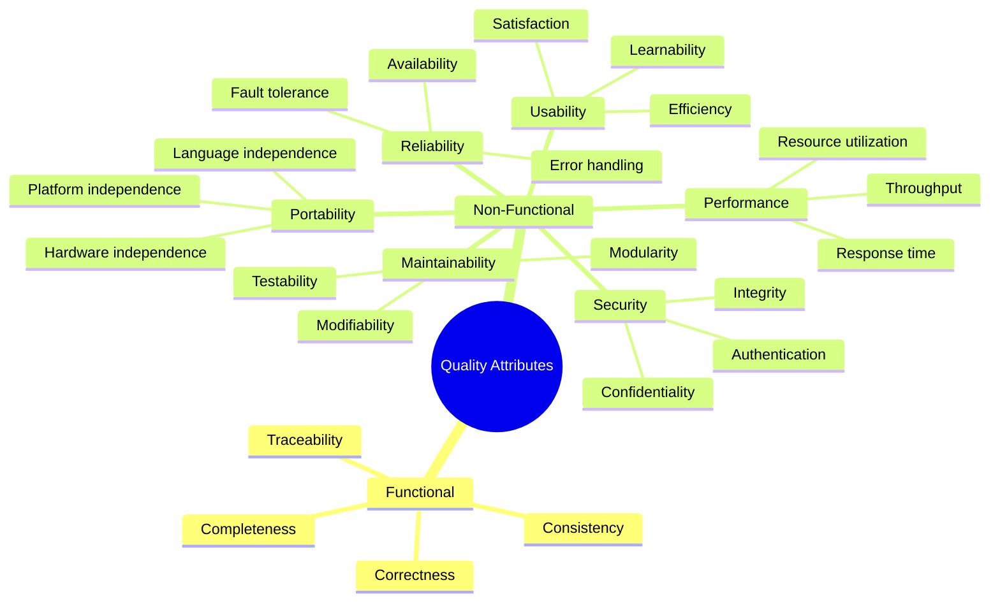
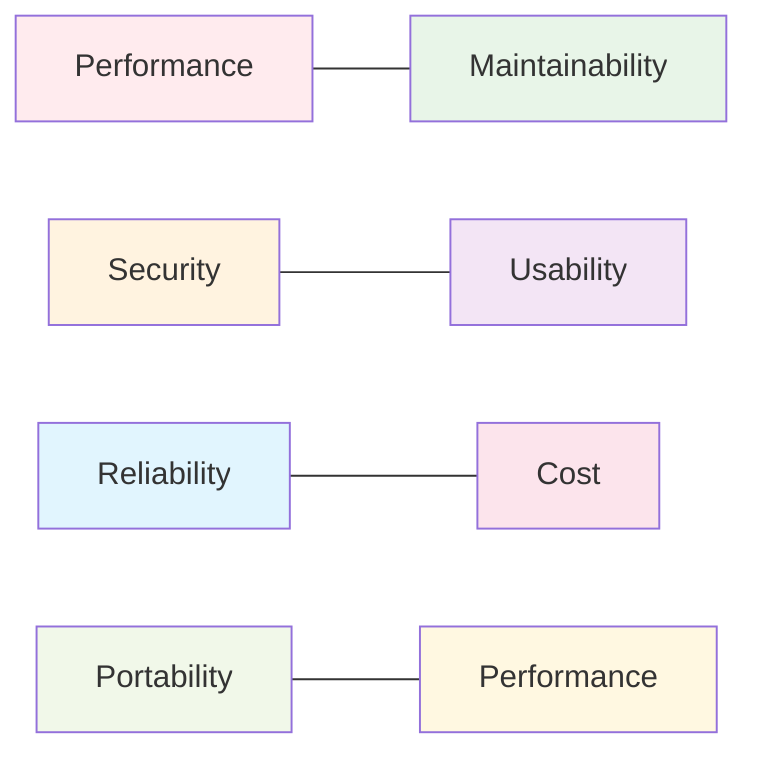

# Unit 1D: Software Design Quality Attributes

## 1. What are Quality Attributes?
Quality attributes are the non-functional requirements that define how well a software system performs its functions. They are critical for user satisfaction, system performance, and long-term maintainability.

## 2. Types of Quality Attributes

### 2.1 Functional Quality Attributes
- **Correctness:** The system does what it is supposed to do.
- **Completeness:** All required features are present.
- **Consistency:** The system behaves the same way in similar situations.
- **Traceability:** Requirements can be traced through design, implementation, and testing.

### 2.2 Non-Functional Quality Attributes
- **Performance:** Speed, response time, and resource usage.
- **Reliability:** The system works without failure.
- **Usability:** The system is easy to use and learn.
- **Maintainability:** The system can be easily modified and tested.
- **Portability:** The system can run on different platforms.
- **Security:** The system protects data and resists attacks.

## 3. Trade-offs Between Quality Attributes

Improving one quality attribute can sometimes negatively impact another. Understanding these trade-offs is essential for good design.

| Attribute      | Positive Impact                | Potential Trade-off           |
|---------------|-------------------------------|------------------------------|
| Performance   | Fast, responsive system        | May reduce maintainability   |
| Security      | Protects data, prevents misuse | May reduce usability         |
| Usability     | Easy to use, user satisfaction | May reduce performance       |
| Maintainability| Easy to update and fix        | May increase initial cost    |
| Reliability   | Fewer failures, more trust     | May increase complexity      |
| Portability   | Runs on many platforms         | May reduce performance       |

**Diagram: Trade-off Relationships**

## 4. Why Quality Attributes Matter
- They influence architecture and design decisions.
- They affect user satisfaction and business success.
- They determine the system's ability to evolve and scale.

## 5. Example: Quality Attributes in a Food Delivery App
- **Performance:** Fast order placement and tracking.
- **Reliability:** Orders are never lost, even if a server fails.
- **Usability:** Simple, intuitive interface for customers and delivery staff.
- **Security:** Protects user payment and address information.
- **Maintainability:** Easy to add new features (e.g., new payment methods).

---

**Next:** Practice questions and solutions for quality attributes will be in a separate file. 