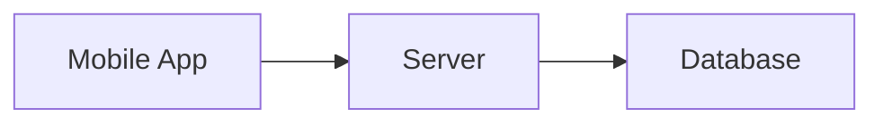
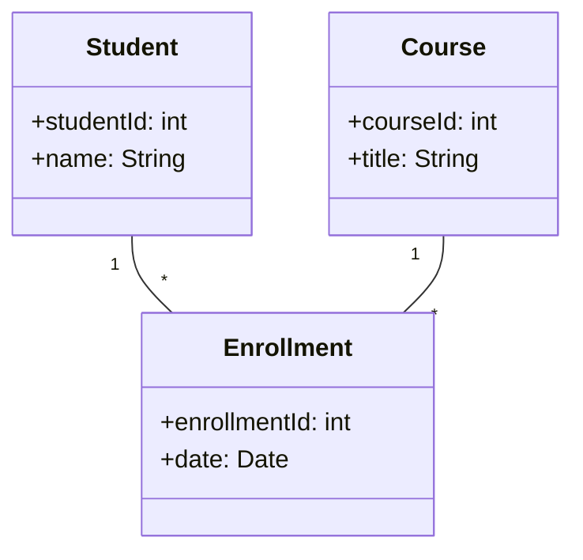

# Unit 2: Practice Questions and Solutions

## 1. Architecture Styles

### Q1: Which architecture style is best for a university management system that needs to separate user interface, business logic, and data storage?

**Solution:**
- **Style:** Layered Architecture
- **Reason:** Each layer (presentation, business logic, data) is separated, making the system easier to maintain and scale.

---

### Q2: Draw a client-server architecture for a food delivery app.

**Solution:**

---

## 2. Architecture Patterns

### Q3: How does the MVC pattern help in a restaurant management system?

**Solution:**
- **Explanation:** MVC separates the user interface (View), business logic (Model), and input control (Controller), making the system modular and easier to update.

---

### Q4: Give an example of the Observer pattern in a food delivery app.

**Solution:**
- **Example:** When an order status changes, all subscribed users (customer, restaurant, delivery) are notified automatically.

---

## 3. Modeling Tools

### Q5: Draw a class diagram for a simple university management system with Student, Course, and Enrollment classes.

**Solution:**

---

### Q6: What is the purpose of a deployment diagram in a restaurant app?

**Solution:**
- **Purpose:** Shows how software components are deployed on hardware (e.g., web server, database server, client devices), helping to plan infrastructure and scalability. 