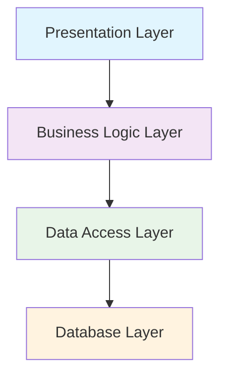
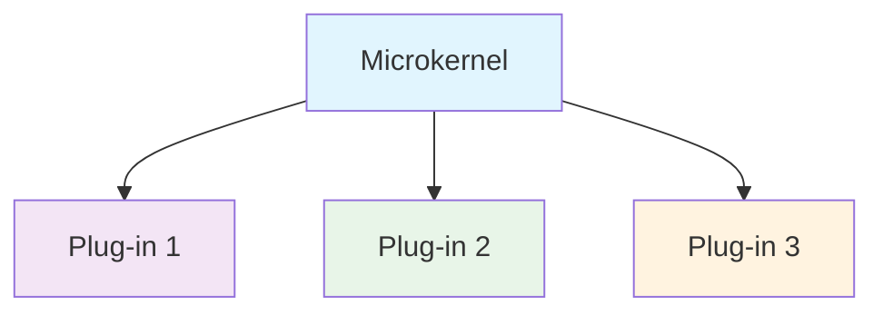
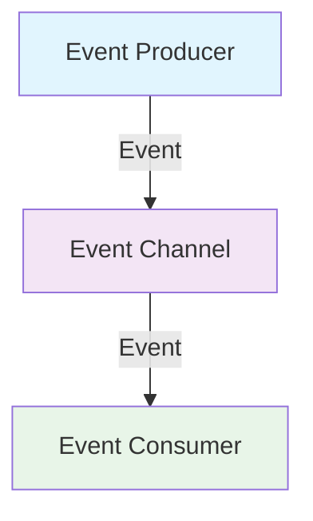
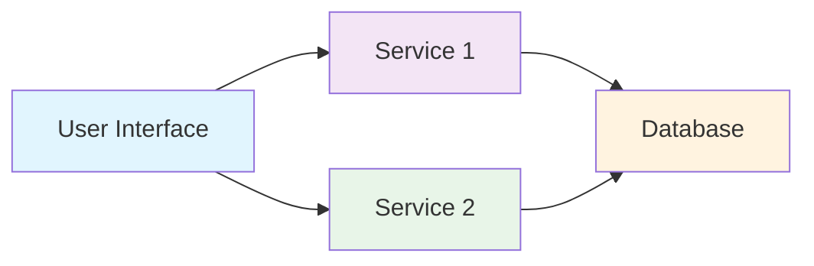
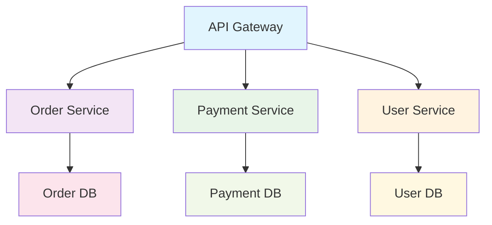
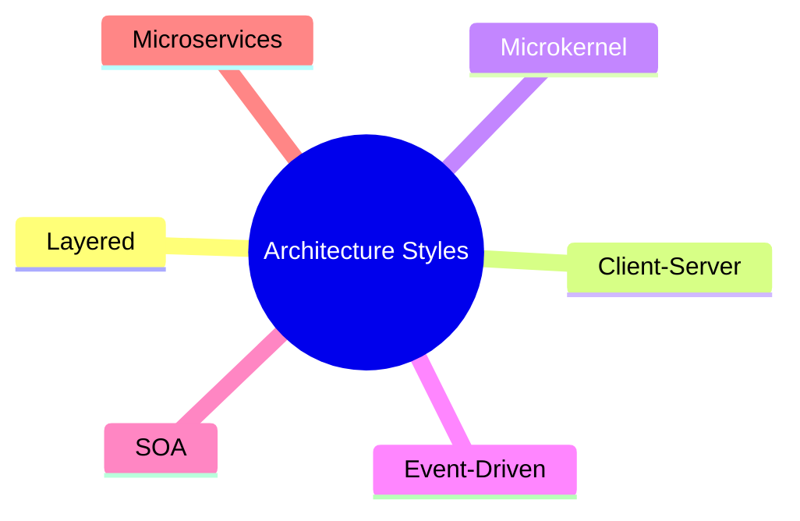

# Unit 2A: Software Architecture Styles

## 1. What is Software Architecture Style?
A software architecture style is a reusable solution for organizing system components and their interactions. Each style has its own strengths, weaknesses, and best-use scenarios.

## 2. Major Architecture Styles

### 2.1 Layered Architecture
- Organizes the system into layers, each with a specific responsibility.
- Common layers: Presentation, Business Logic, Data Access, Database.
- Each layer communicates only with its adjacent layers.

**Use Case:** Web applications, university management systems.

---

### 2.2 Client-Server Architecture
- Divides the system into clients (requesters) and servers (providers).
- Clients send requests; servers process and respond.

**Use Case:** Online food delivery apps, restaurant ordering systems.

---

### 2.3 Microkernel Architecture
- Core system (microkernel) provides minimal functionality.
- Additional features are implemented as plug-in modules.

**Use Case:** Operating systems, extensible applications.

---

### 2.4 Event-Driven Architecture
- Components communicate by producing and consuming events.
- Decouples event producers from event consumers.

**Use Case:** Notification systems, real-time analytics, restaurant order tracking.

---

### 2.5 Service-Oriented Architecture (SOA)
- System is composed of loosely coupled, reusable services.
- Services communicate over a network using standard protocols.

**Use Case:** Large enterprise systems, university management platforms.

---

### 2.6 Microservices Architecture
- System is built as a suite of small, independent services.
- Each service is self-contained and deployable.

**Use Case:** Modern scalable web apps, food delivery platforms.

---

## 3. Visual Summary

---

**Next:** Architecture patterns will be in a separate file. 