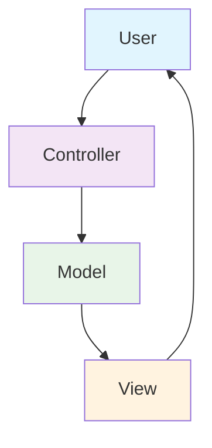
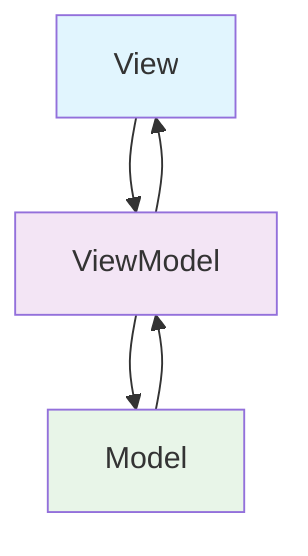
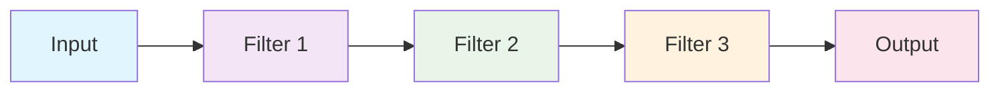
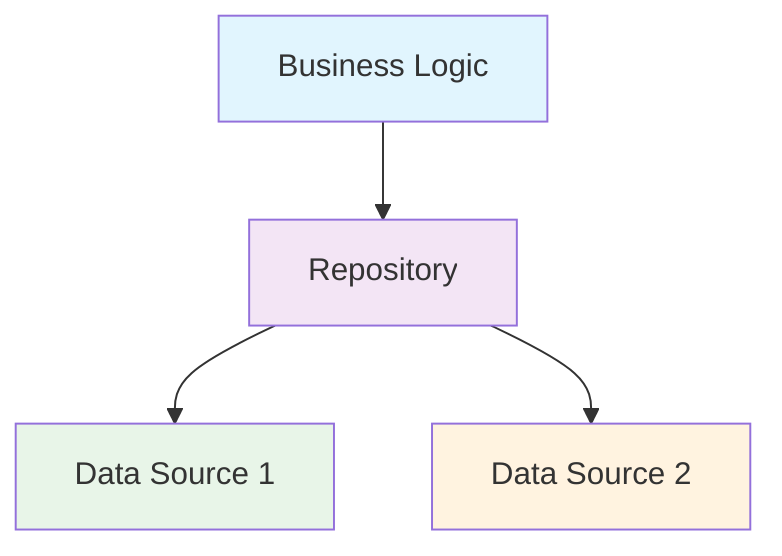
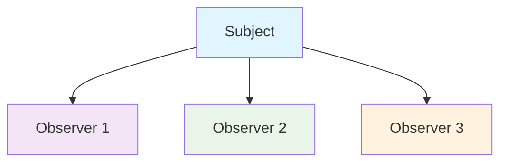
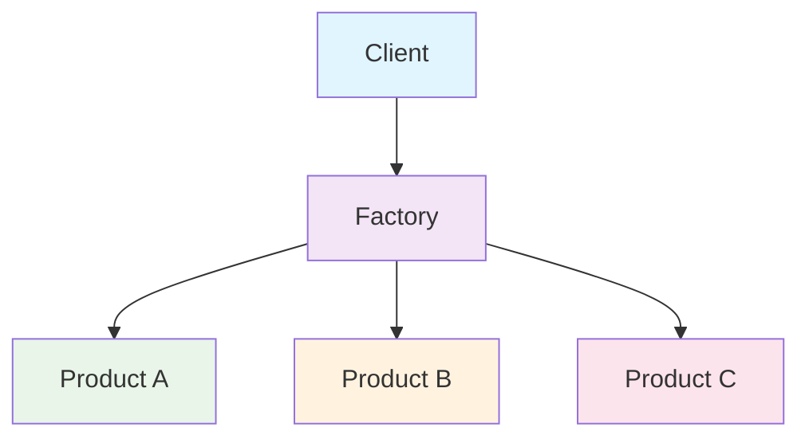
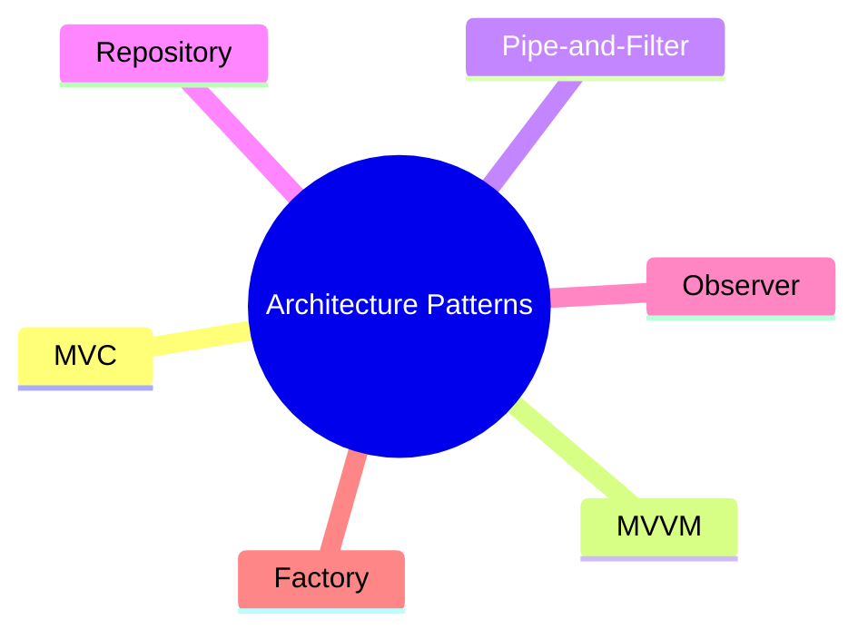

# Unit 2B: Software Architecture Patterns

## 1. What are Architecture Patterns?
Architecture patterns are reusable solutions to common design problems. They provide a structured approach to organizing components and their interactions within a system.

## 2. Common Architecture Patterns

### 2.1 Model-View-Controller (MVC)
- Separates the application into three interconnected components.
- **Model:** Represents data and business logic.
- **View:** Displays data to the user.
- **Controller:** Handles user input and updates the model/view.

**Use Case:** Web applications, restaurant management systems.

---

### 2.2 Model-View-ViewModel (MVVM)
- Similar to MVC but with a ViewModel that manages the state and behavior of the view.
- **Model:** Data and business logic.
- **View:** User interface.
- **ViewModel:** Connects the model and view, handles view logic.

**Use Case:** Modern web applications, mobile apps.

---

### 2.3 Pipe-and-Filter Pattern
- Data flows through a series of processing steps (filters) connected by pipes.
- Each filter processes the data and passes it to the next filter.

**Use Case:** Data processing pipelines, image processing systems.

---

### 2.4 Repository Pattern
- Abstracts data access logic from business logic.
- Provides a centralized interface for data operations.

**Use Case:** Applications with multiple data sources, university management systems.

---

### 2.5 Observer Pattern
- Defines a one-to-many dependency between objects.
- When one object changes state, all its dependents are notified.

**Use Case:** Event handling systems, notification systems in food delivery apps.

---

### 2.6 Factory Pattern
- Creates objects without specifying their exact class.
- Provides a common interface for creating objects.

**Use Case:** Creating different types of payment methods, user interfaces.

---

## 3. Visual Summary

---

**Next:** Modeling tools will be in a separate file. 