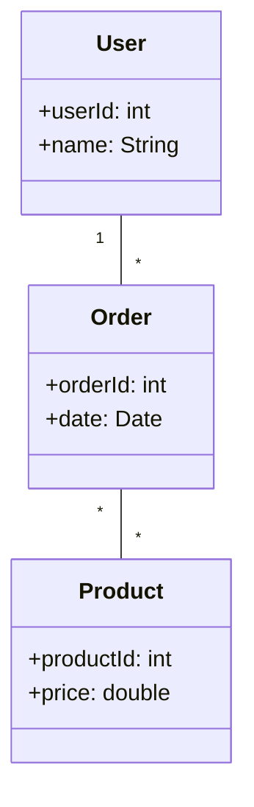
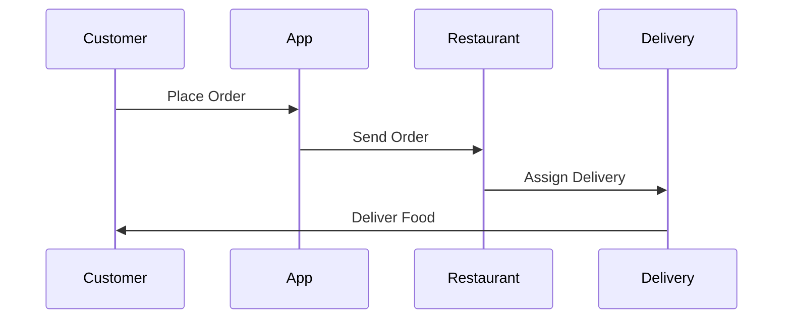
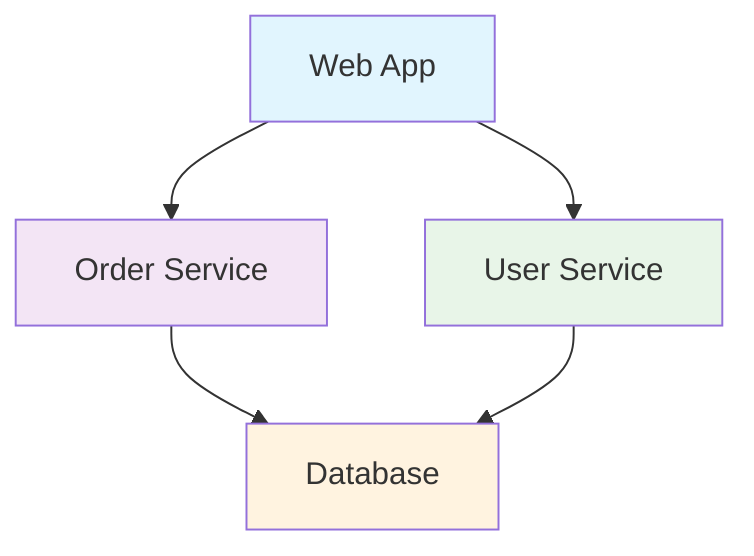
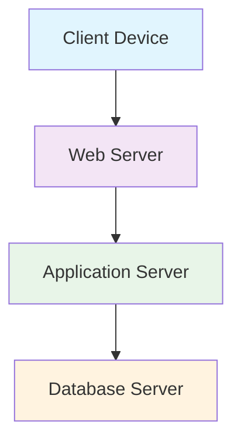
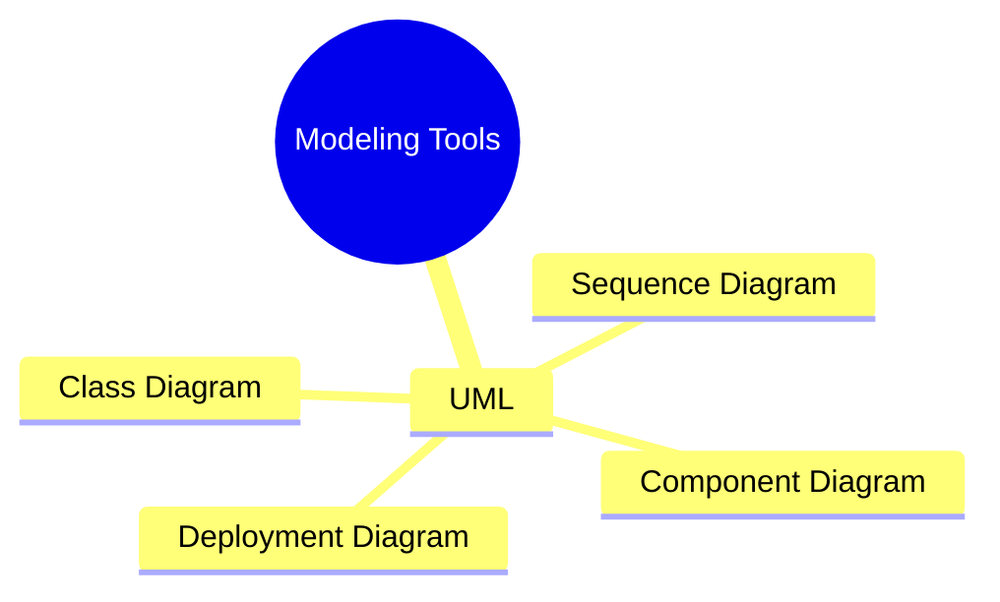

# Unit 2C: Modeling Tools for Software Architecture

## 1. What are Modeling Tools?
Modeling tools help visualize, specify, construct, and document the structure and behavior of software systems. The most common modeling language is UML (Unified Modeling Language).

## 2. Common UML Diagrams

### 2.1 Class Diagram
- Shows the static structure of classes and their relationships.
- Useful for representing the domain model and system structure.

---

### 2.2 Sequence Diagram
- Shows how objects interact in a particular scenario of a use case.
- Focuses on the order of messages exchanged.

---

### 2.3 Component Diagram
- Shows how a system is divided into components and how they interact.
- Useful for visualizing high-level structure.

---

### 2.4 Deployment Diagram
- Shows the physical deployment of artifacts on nodes (hardware).
- Useful for understanding system infrastructure.

---

## 3. Best Practices for Modeling
- Use clear, consistent notation.
- Focus on key elements relevant to your audience.
- Avoid unnecessary complexity.
- Use diagrams to support communication and documentation.

## 4. Visual Summary

---

**Next:** Practice questions and solutions for modeling tools will be in a separate file. 