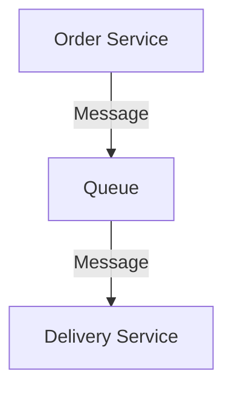
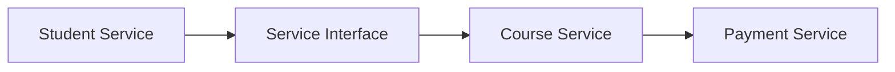
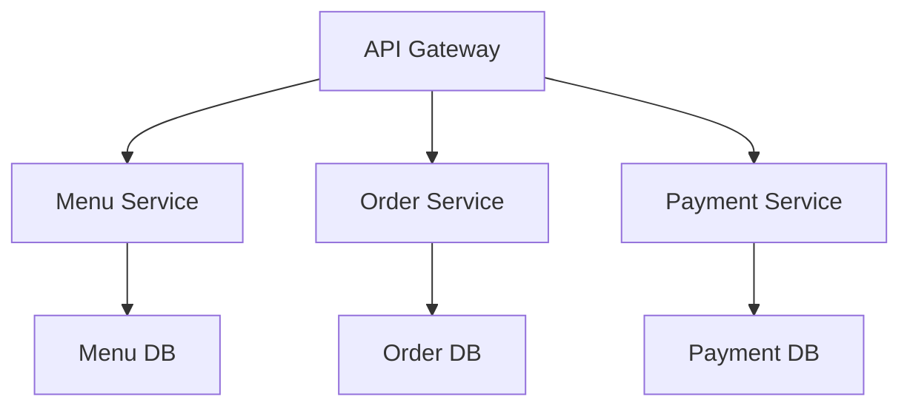

# Unit 3: Practice Questions and Solutions

## 1. Middleware Architecture

### Q1: What is the role of middleware in a university management system?
**Solution:**
- Middleware connects different modules (e.g., student, course, payment) and enables communication, data exchange, and security between them.

---

### Q2: Draw a message-oriented middleware diagram for a food delivery app.
**Solution:**

---

## 2. Service Oriented Architecture (SOA)

### Q3: List two benefits of using SOA in a restaurant management system.
**Solution:**
- Flexibility: Services can be reused and updated independently.
- Integration: Different systems (ordering, payment, kitchen) can communicate via standard interfaces.

---

### Q4: Draw a simple SOA diagram for a university management system.
**Solution:**

---

## 3. Microservices Architecture

### Q5: What is a key advantage of microservices over monolithic architecture in a food delivery app?
**Solution:**
- Each service (orders, payments, users) can be developed, deployed, and scaled independently, improving flexibility and reliability.

---

### Q6: Draw a microservices architecture for a restaurant platform.
**Solution:**
