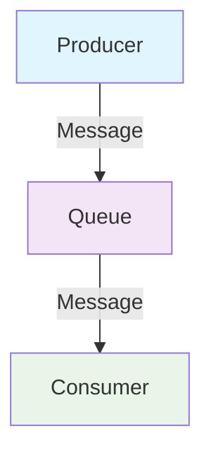
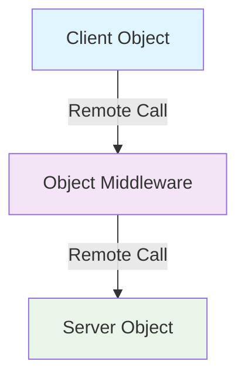
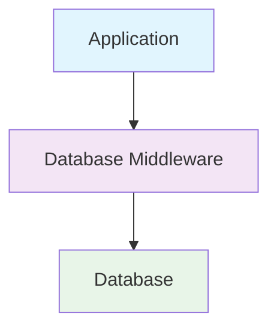
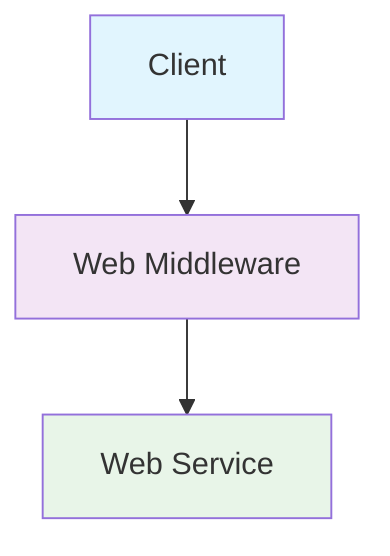
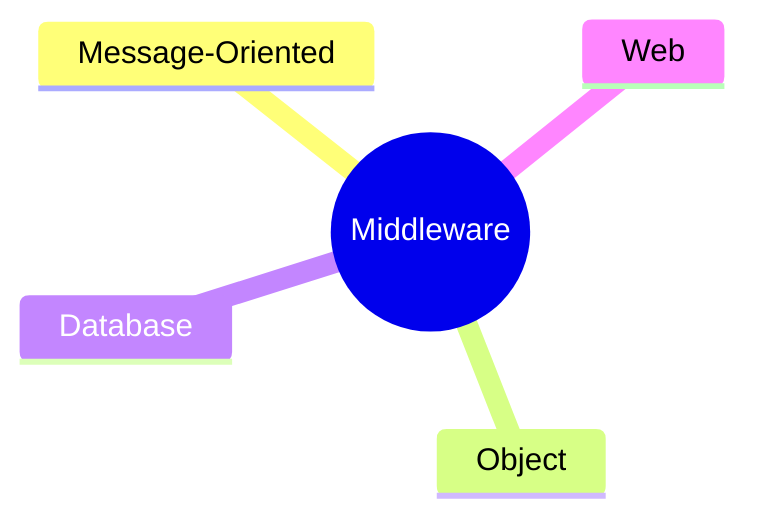

# Unit 3A: Middleware Architecture

## 1. What is Middleware?
Middleware is software that connects different components or applications, enabling communication and data management in distributed systems. It acts as a bridge between the operating system, database, and applications.

## 2. Roles of Middleware
- Facilitates communication between distributed components
- Manages data exchange and transactions
- Provides services like authentication, logging, and messaging
- Hides complexity of underlying network and protocols

## 3. Types of Middleware

### 3.1 Message-Oriented Middleware (MOM)
- Enables asynchronous communication via message queues.
- Example: RabbitMQ, Apache Kafka

---

### 3.2 Object Middleware
- Supports communication between distributed objects.
- Example: CORBA, Java RMI

---

### 3.3 Database Middleware
- Provides access to databases across distributed systems.
- Example: ODBC, JDBC

---

### 3.4 Web Middleware
- Supports web-based communication (HTTP, REST APIs).
- Example: Web servers, API gateways

## 4. Visual Summary

---

**Next:** Service Oriented Architecture (SOA) will be in a separate file. 