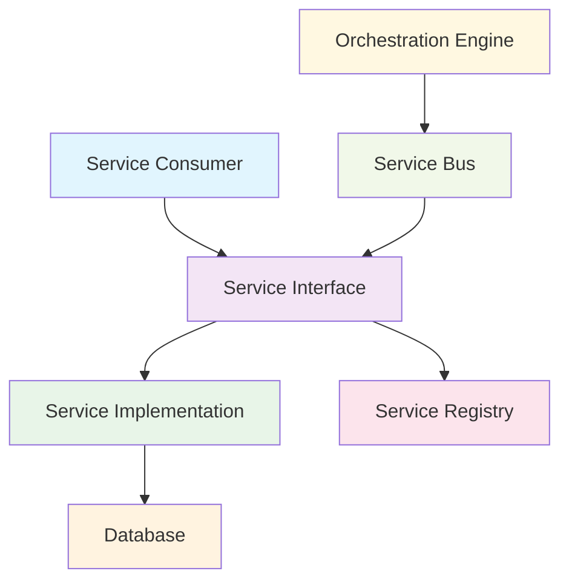
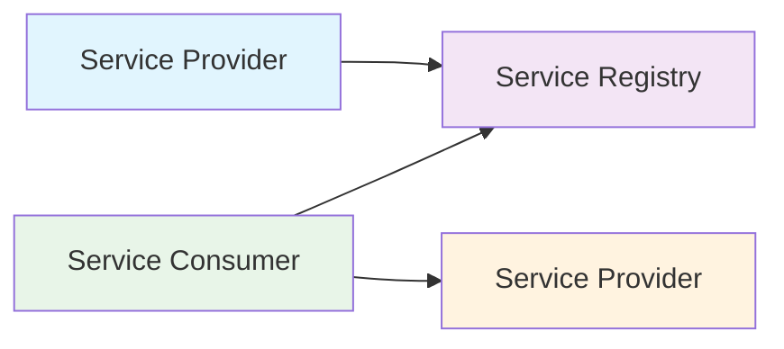
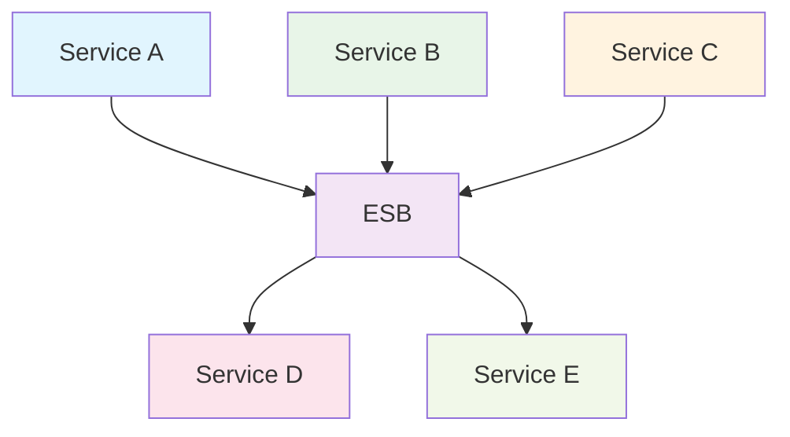
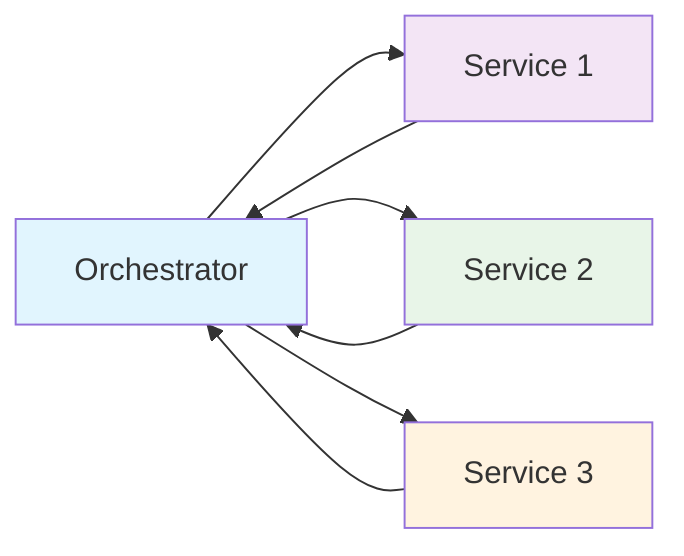
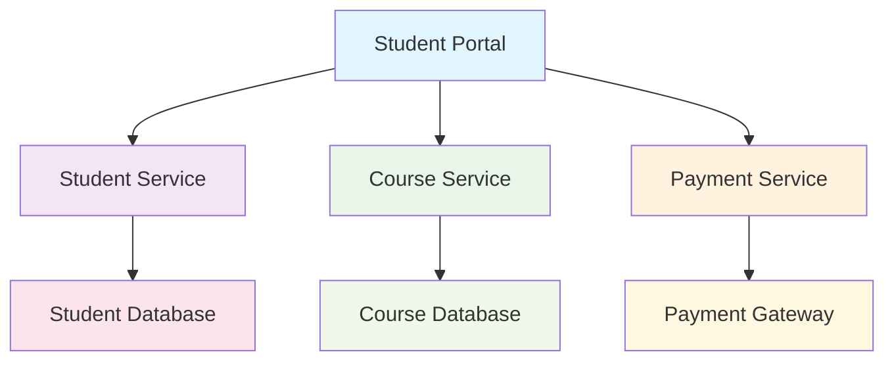
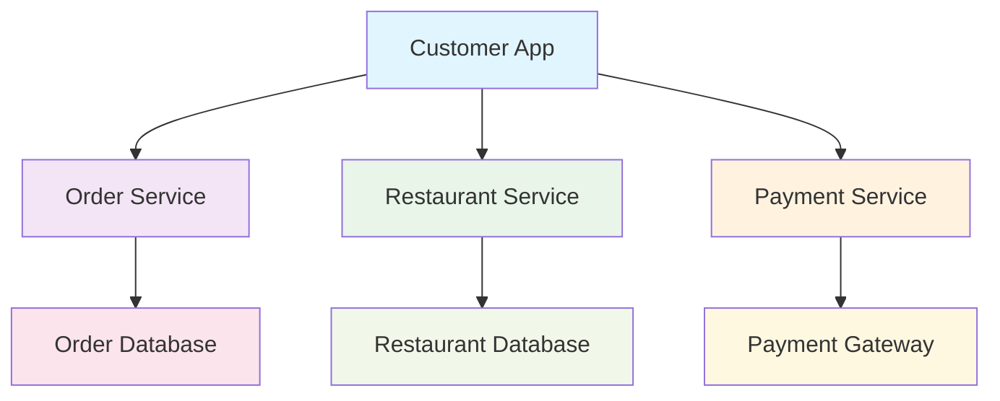
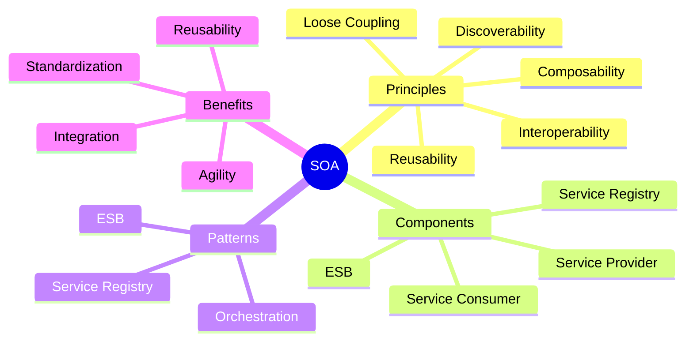

# Unit 3B: Service Oriented Architecture (SOA)

## 1. What is Service Oriented Architecture (SOA)?
Service Oriented Architecture (SOA) is an architectural style where software components (services) provide functionality to other components over a network. Each service is independent, reusable, and loosely coupled. SOA enables organizations to integrate existing systems and build new applications by combining services.

## 2. Key Principles of SOA

### 2.1 Loose Coupling
- Services interact with minimal dependencies
- Changes in one service don't affect others
- Services can be modified independently

### 2.2 Reusability
- Services are designed for reuse in different contexts
- Business logic is encapsulated in services
- Reduces development time and cost

### 2.3 Interoperability
- Services use standard protocols (HTTP, SOAP, REST)
- Platform and language independent
- Enables integration of heterogeneous systems

### 2.4 Discoverability
- Services can be found and used by others
- Service registry maintains service descriptions
- Self-describing services

### 2.5 Composability
- Services can be combined to create new applications
- Orchestration and choreography patterns
- Business process automation

## 3. SOA Architecture Components

## 4. SOA Layers

### 4.1 Consumer Layer
- Applications that consume services
- User interfaces, mobile apps, web applications
- Initiates service requests

### 4.2 Process Layer
- Business process orchestration
- Workflow management
- Service composition

### 4.3 Service Layer
- Business services
- Technical services
- Data services

### 4.4 Integration Layer
- Enterprise Service Bus (ESB)
- Message routing and transformation
- Protocol mediation

### 4.5 Data Layer
- Databases, file systems
- Legacy systems
- External data sources

## 5. SOA vs Microservices Comparison

| Aspect | SOA | Microservices |
|--------|-----|---------------|
| **Service Size** | Large, coarse-grained | Small, fine-grained |
| **Data Storage** | Shared databases | Independent databases |
| **Communication** | ESB, SOAP, REST | REST, gRPC, messaging |
| **Deployment** | Monolithic deployment | Independent deployment |
| **Technology** | Heterogeneous | Homogeneous |
| **Governance** | Centralized | Decentralized |

## 6. SOA Implementation Patterns

### 6.1 Service Registry Pattern

### 6.2 Enterprise Service Bus (ESB) Pattern

### 6.3 Orchestration Pattern

## 7. Real-World Examples

### 7.1 University Management System

**Services:**
- **Student Service**: Manages student information, enrollment
- **Course Service**: Handles course catalog, scheduling
- **Payment Service**: Processes fees, refunds
- **Notification Service**: Sends emails, SMS

### 7.2 Food Delivery Platform

## 8. Benefits of SOA

### 8.1 Business Benefits
- **Agility**: Quick response to business changes
- **Reusability**: Reduce development costs
- **Integration**: Connect existing systems
- **Standardization**: Consistent interfaces

### 8.2 Technical Benefits
- **Scalability**: Scale services independently
- **Maintainability**: Easier to maintain and update
- **Reliability**: Fault isolation
- **Security**: Centralized security management

## 9. Challenges of SOA

### 9.1 Technical Challenges
- **Complexity**: ESB and service management
- **Performance**: Network overhead
- **Testing**: Distributed system testing
- **Security**: Service-to-service security

### 9.2 Organizational Challenges
- **Governance**: Service ownership and management
- **Skills**: SOA expertise required
- **Change Management**: Cultural shift needed
- **Cost**: Initial investment and maintenance

## 10. SOA Implementation Best Practices

### 10.1 Service Design
- Design services around business capabilities
- Use standard interfaces and protocols
- Implement proper error handling
- Document service contracts

### 10.2 Governance
- Establish service ownership
- Define service standards
- Monitor service performance
- Manage service lifecycle

### 10.3 Security
- Implement authentication and authorization
- Use secure communication protocols
- Monitor service access
- Regular security audits

## 11. Visual Summary

## 12. Key Takeaways

### When to Use SOA:
- **Enterprise Integration**: Connecting existing systems
- **Business Process Automation**: Orchestrating complex workflows
- **Legacy System Modernization**: Gradually replacing old systems
- **Multi-Platform Integration**: Heterogeneous technology environments

### Success Factors:
- **Clear Business Objectives**: Align with business goals
- **Proper Governance**: Establish service management
- **Incremental Implementation**: Start small, scale gradually
- **Technology Standards**: Use consistent protocols and tools

---

**Next:** Microservices architecture will be in a separate file. 