# Unit 3C: Microservices Architecture

## 1. What is Microservices Architecture?
Microservices architecture is an approach where an application is built as a suite of small, independent services, each running in its own process and communicating via lightweight mechanisms (often HTTP APIs). Each service is responsible for a specific business capability and can be developed, deployed, and scaled independently.

## 2. Key Characteristics

### 2.1 Service Independence
- Each service can be developed and deployed independently
- Services can use different technologies and programming languages
- Independent scaling based on demand
- Fault isolation - failure in one service doesn't bring down the entire system

### 2.2 Business Capability Focus
- Services are organized around business capabilities
- Each service handles a specific domain or function
- Clear boundaries between services
- Domain-driven design principles

### 2.3 Decentralized Data Management
- Each service owns its data
- No shared database between services
- Data consistency through eventual consistency
- Polyglot persistence (different databases for different services)

### 2.4 Resilience and Scalability
- Services can fail independently
- Circuit breakers and fallback mechanisms
- Horizontal scaling of individual services
- Load balancing and service discovery

### 2.5 Technology Diversity
- Freedom to choose the best technology for each service
- Polyglot programming and persistence
- Independent technology evolution
- Best-of-breed technology selection

## 3. Microservices Architecture Components

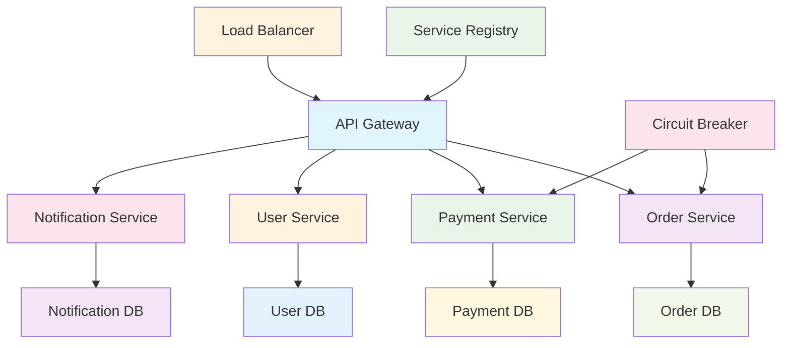

## 4. Microservices Patterns

### 4.1 API Gateway Pattern
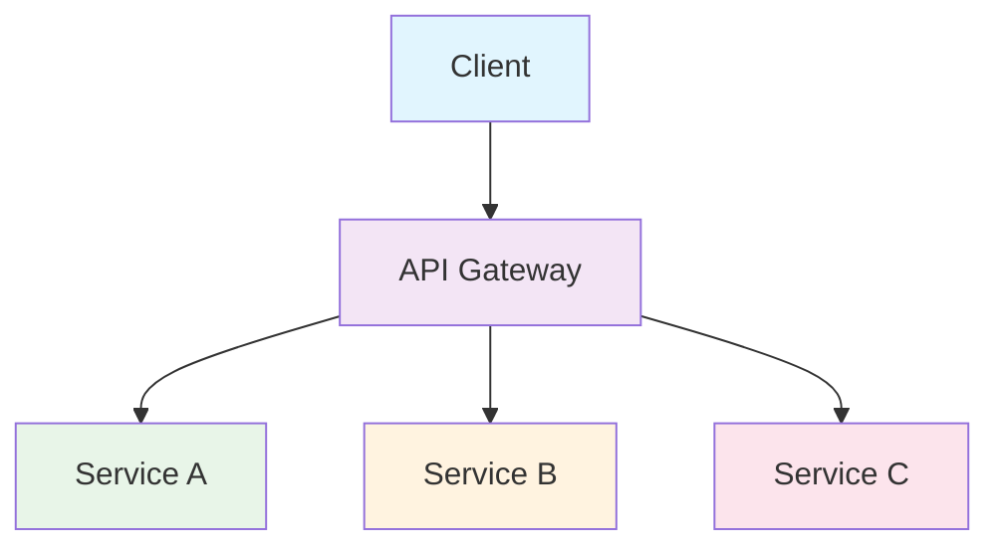

**Benefits:**
- Single entry point for all clients
- Authentication and authorization
- Rate limiting and throttling
- Request routing and load balancing

### 4.2 Service Discovery Pattern
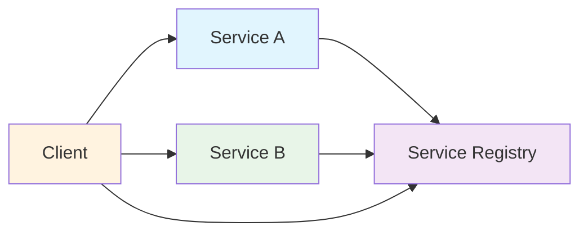

**Benefits:**
- Dynamic service discovery
- Load balancing
- Health checking
- Automatic failover

### 4.3 Circuit Breaker Pattern
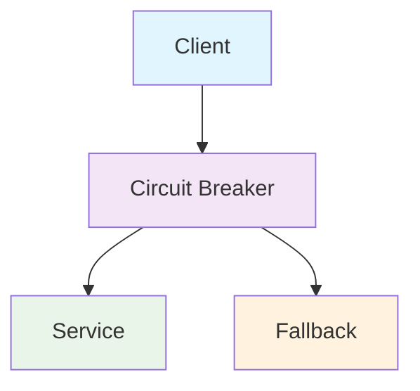

**Benefits:**
- Prevents cascading failures
- Provides fallback mechanisms
- Improves system resilience
- Reduces response times

### 4.4 Event-Driven Pattern
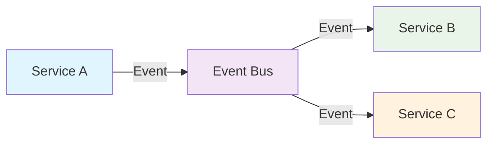

**Benefits:**
- Loose coupling between services
- Asynchronous communication
- Scalability and reliability
- Event sourcing capabilities

## 5. Communication Patterns

### 5.1 Synchronous Communication (REST/gRPC)
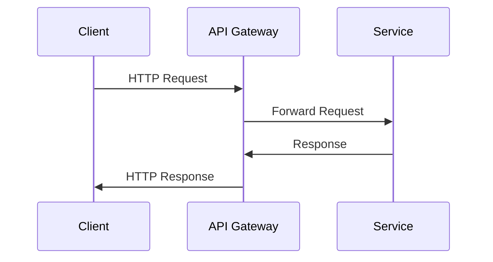

### 5.2 Asynchronous Communication (Message Queues)
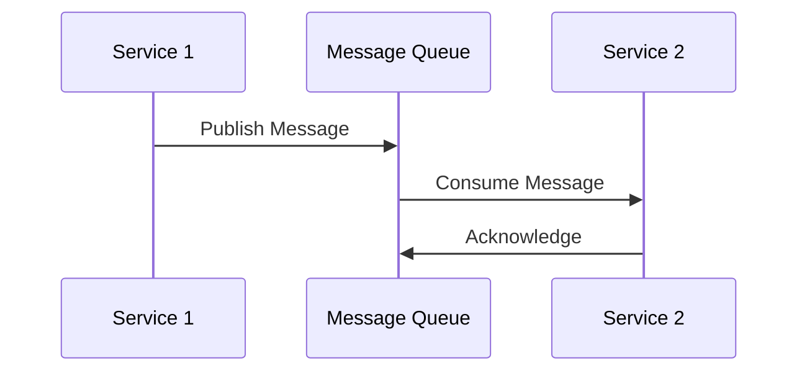

## 6. Data Management Patterns

### 6.1 Database per Service
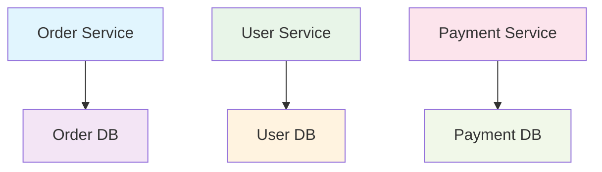

### 6.2 Saga Pattern for Distributed Transactions
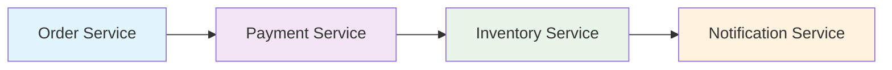

## 7. Real-World Examples

### 7.1 Food Delivery Platform
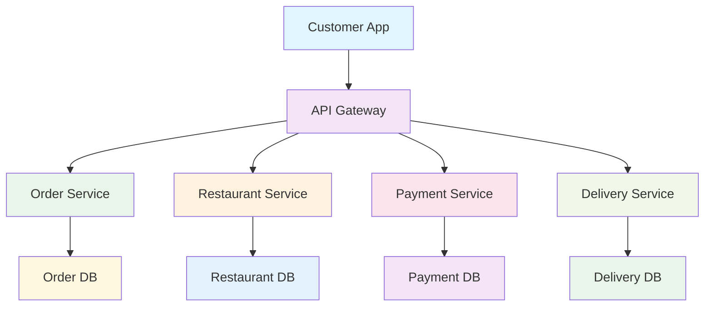

**Services:**
- **Order Service**: Manages order lifecycle
- **Restaurant Service**: Handles restaurant information and menu
- **Payment Service**: Processes payments and refunds
- **Delivery Service**: Manages delivery tracking and driver assignment
- **Notification Service**: Sends real-time updates

### 7.2 University Management System
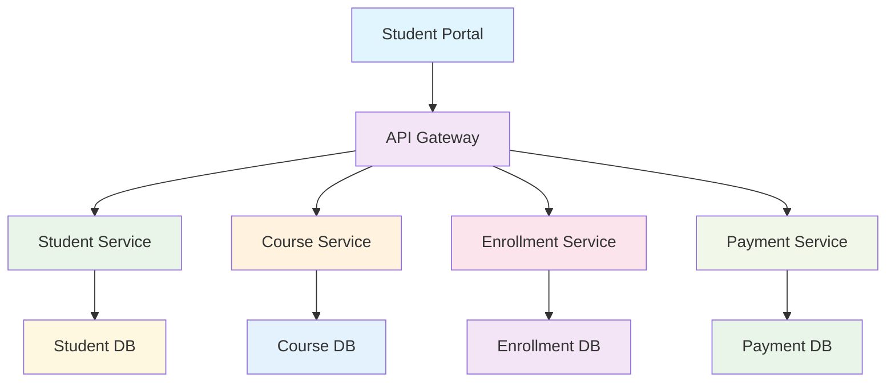

## 8. Benefits of Microservices

### 8.1 Technical Benefits
- **Scalability**: Scale individual services based on demand
- **Fault Isolation**: Failure in one service doesn't affect others
- **Technology Diversity**: Use best technology for each service
- **Independent Deployment**: Deploy services without affecting others
- **Easier Testing**: Test services in isolation

### 8.2 Business Benefits
- **Faster Development**: Teams can work independently
- **Better Maintainability**: Smaller, focused codebases
- **Improved Reliability**: Fault isolation and resilience
- **Technology Evolution**: Update services independently
- **Team Autonomy**: Teams own their services end-to-end

## 9. Challenges of Microservices

### 9.1 Technical Challenges
- **Distributed System Complexity**: Network latency, failures
- **Data Consistency**: Eventual consistency challenges
- **Service Communication**: Network overhead and reliability
- **Testing Complexity**: Integration testing across services
- **Monitoring and Debugging**: Distributed tracing and logging

### 9.2 Operational Challenges
- **Deployment Complexity**: Multiple services to deploy
- **Infrastructure Management**: More infrastructure to manage
- **Service Discovery**: Dynamic service location
- **Configuration Management**: Distributed configuration
- **Security**: Service-to-service authentication

### 9.3 Organizational Challenges
- **Team Structure**: Cross-functional teams required
- **Skills**: Distributed system expertise needed
- **Communication**: Inter-team coordination
- **Governance**: Service ownership and standards

## 10. Microservices vs. Monolithic Architecture

| Aspect | Monolithic | Microservices |
|--------|------------|---------------|
| **Size** | Large, single application | Small, focused services |
| **Deployment** | Single deployment unit | Independent deployment |
| **Scaling** | Scale entire application | Scale individual services |
| **Technology** | Single technology stack | Multiple technologies |
| **Team Structure** | Large teams | Small, autonomous teams |
| **Development Speed** | Slower due to coordination | Faster due to independence |
| **Testing** | Easier integration testing | Complex distributed testing |
| **Fault Tolerance** | Single point of failure | Fault isolation |

## 11. Migration Strategies

### 11.1 Strangler Fig Pattern
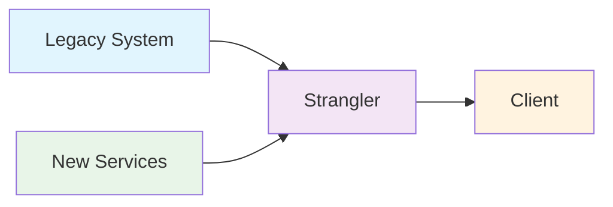

### 11.2 Incremental Migration
1. **Identify Bounded Contexts**: Define service boundaries
2. **Extract Services**: Gradually extract functionality
3. **Implement API Gateway**: Route requests appropriately
4. **Migrate Data**: Implement data migration strategies
5. **Decommission Legacy**: Remove old functionality

## 12. Best Practices

### 12.1 Service Design
- Keep services small and focused
- Design around business capabilities
- Use domain-driven design principles
- Implement proper error handling
- Design for failure

### 12.2 Communication
- Use lightweight protocols (HTTP, gRPC)
- Implement circuit breakers
- Use asynchronous communication when appropriate
- Implement proper retry mechanisms
- Monitor service communication

### 12.3 Data Management
- Each service owns its data
- Use eventual consistency
- Implement proper data migration strategies
- Consider polyglot persistence
- Design for data locality

### 12.4 Operations
- Implement comprehensive monitoring
- Use centralized logging
- Implement distributed tracing
- Automate deployment and testing
- Use infrastructure as code

## 13. Visual Summary

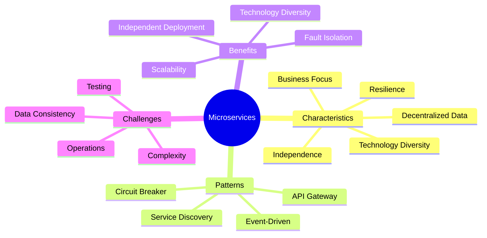

## 14. Key Takeaways

### When to Use Microservices:
- **Large Applications**: Complex systems with multiple domains
- **Team Autonomy**: Organizations with multiple development teams
- **Technology Diversity**: Need for different technologies
- **Scalability Requirements**: Need to scale components independently
- **Fault Tolerance**: High availability requirements

### Success Factors:
- **Clear Service Boundaries**: Well-defined domain boundaries
- **Team Structure**: Autonomous, cross-functional teams
- **Infrastructure**: Proper containerization and orchestration
- **Monitoring**: Comprehensive observability
- **Culture**: DevOps and continuous delivery practices

---

**Next:** Practice questions and solutions for Unit 3 will be in a separate file. 