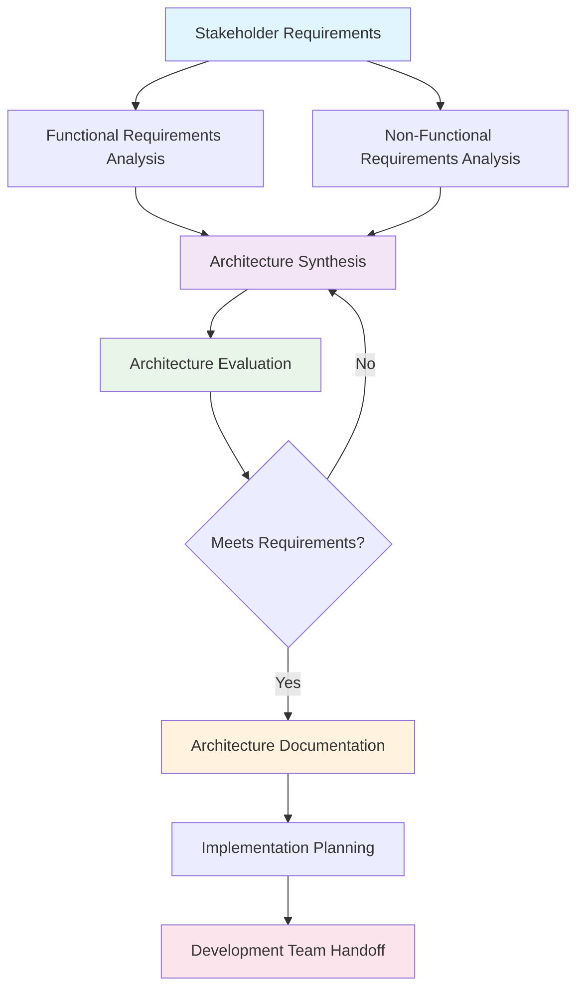
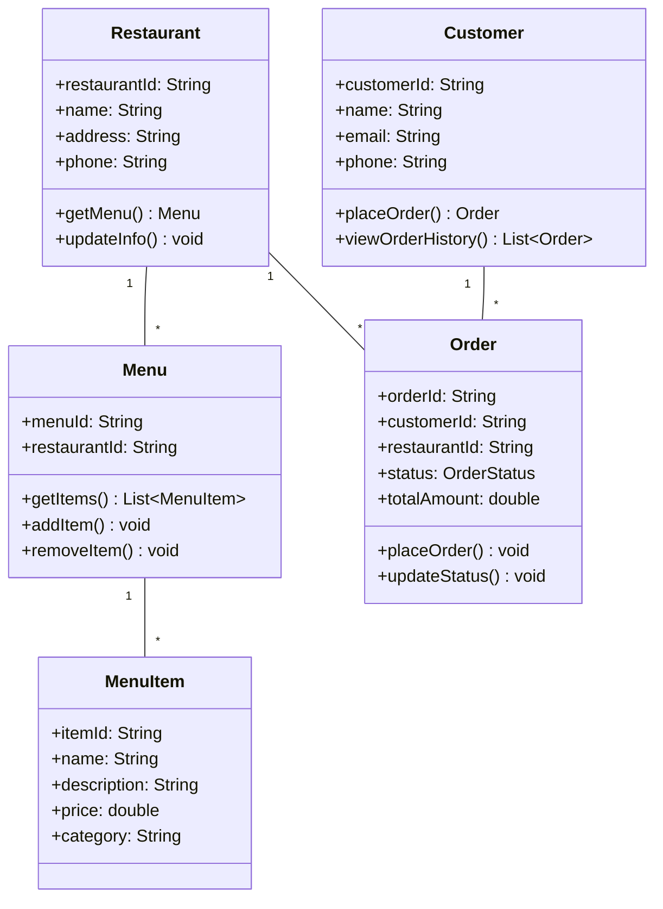
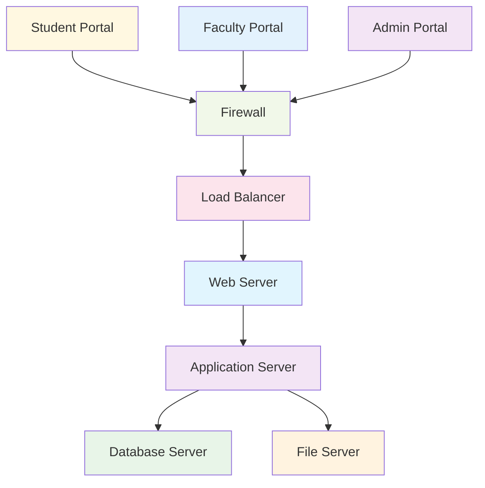

# Unit 4: Practice Questions and Solutions

## 1. Architecture Processes

### Q1: What are the main steps in a software architecture process?
**Solution:**
- **Analysis**: Gather and document requirements (functional and non-functional)
- **Synthesis**: Develop architectural solutions that address requirements
- **Evaluation**: Assess architecture against requirements and quality attributes
- **Documentation**: Create comprehensive architecture documentation
- **Implementation**: Guide the development team in implementing the architecture

---

### Q2: Draw a detailed process flow for architecture design in a university management system.
**Solution:**

---

### Q3: Explain the difference between architectural analysis and synthesis.
**Solution:**
- **Analysis**: Focuses on understanding requirements, constraints, and stakeholder needs. It involves gathering information about what the system should do and how it should behave.
- **Synthesis**: Focuses on creating architectural solutions. It involves designing the system structure, selecting patterns, and making architectural decisions to meet the analyzed requirements.

---

### Q4: What evaluation methods can be used to assess architecture quality?
**Solution:**
- **Scenario-based evaluation**: Using specific scenarios to test architecture
- **Checklist-based evaluation**: Using predefined criteria to assess architecture
- **Architecture reviews**: Peer reviews and stakeholder reviews
- **Prototyping**: Building prototypes to validate architectural decisions
- **Performance testing**: Testing architecture under load conditions

---

## 2. Architecture Documentation

### Q5: Why is architecture documentation important in a food delivery app?
**Solution:**
- **Communication**: Helps communicate the system structure to developers, stakeholders, and new team members
- **Implementation Guidance**: Provides clear guidance for development teams
- **Maintenance**: Assists in future maintenance and system evolution
- **Onboarding**: Helps new developers understand the system quickly
- **Decision Tracking**: Documents architectural decisions and their rationale

---

### Q6: List and explain four types of architecture views and their purpose.
**Solution:**

#### 1. Logical View
- **Purpose**: Shows key abstractions and their relationships
- **Components**: Classes, objects, interfaces, packages
- **Use Case**: Understanding system structure and design patterns

#### 2. Physical View
- **Purpose**: Shows deployment on hardware infrastructure
- **Components**: Servers, databases, networks, deployment units
- **Use Case**: Planning infrastructure and deployment

#### 3. Process View
- **Purpose**: Shows runtime behavior and concurrency
- **Components**: Processes, threads, communication patterns
- **Use Case**: Understanding system performance and scalability

#### 4. Development View
- **Purpose**: Shows organization of software modules
- **Components**: Modules, packages, dependencies
- **Use Case**: Organizing development work and team structure

---

### Q7: Draw a logical view diagram for a restaurant management system.
**Solution:**

---

### Q8: What are the key components of architecture documentation?
**Solution:**
- **Architecture Overview**: High-level description of the system
- **Stakeholder Concerns**: Requirements and constraints from different stakeholders
- **Architecture Views**: Multiple views (logical, physical, process, development)
- **Quality Attributes**: How the architecture addresses non-functional requirements
- **Architecture Decisions**: Rationale behind key architectural decisions
- **Implementation Guidelines**: Guidelines for developers
- **Evolution Plan**: How the architecture will evolve over time

---

### Q9: Explain the importance of documenting architectural decisions.
**Solution:**
- **Knowledge Preservation**: Captures the reasoning behind decisions for future reference
- **Team Alignment**: Ensures all team members understand why certain choices were made
- **Change Management**: Helps evaluate the impact of proposed changes
- **Onboarding**: Helps new team members understand the system's design rationale
- **Compliance**: Provides evidence for regulatory or audit requirements

---

### Q10: Draw a physical view diagram for a university management system.
**Solution:**

---

## 3. Architecture Evaluation

### Q11: How would you evaluate the performance of a food delivery app architecture?
**Solution:**
- **Load Testing**: Simulate high order volumes to test system performance
- **Response Time Analysis**: Measure API response times under different loads
- **Scalability Testing**: Test how the system scales with increased load
- **Database Performance**: Analyze query performance and database bottlenecks
- **Network Latency**: Test performance across different network conditions
- **Mobile App Performance**: Test app performance on different devices and networks

---

### Q12: What quality attributes should be considered when designing a university management system?
**Solution:**
- **Performance**: Fast response times for student registration and grade queries
- **Security**: Protection of student data and academic records
- **Availability**: High uptime during registration and exam periods
- **Scalability**: Ability to handle increased load during peak periods
- **Usability**: Intuitive interface for students, faculty, and administrators
- **Maintainability**: Easy to update and modify system features
- **Interoperability**: Integration with existing university systems

---

## 4. Scenario-Based Questions

### Q13: A restaurant chain wants to implement a new ordering system. What architecture process would you follow?
**Solution:**

#### Step 1: Analysis
- **Stakeholder Interviews**: Talk to restaurant managers, staff, and customers
- **Requirements Gathering**: Functional (order placement, payment) and non-functional (performance, security)
- **Constraint Analysis**: Budget, timeline, existing systems

#### Step 2: Synthesis
- **Architecture Style Selection**: Microservices for scalability and flexibility
- **Component Design**: Order service, payment service, notification service
- **Technology Selection**: Cloud-based deployment, mobile-first approach

#### Step 3: Evaluation
- **Performance Testing**: Simulate peak ordering times
- **Security Review**: Payment processing security
- **Usability Testing**: Staff and customer interface testing

#### Step 4: Documentation
- **Architecture Views**: Logical, physical, and process views
- **Implementation Guidelines**: Development standards and practices
- **Deployment Plan**: Rollout strategy and timeline

---

### Q14: How would you document the architecture of a food delivery platform for a development team?
**Solution:**

#### Documentation Structure:
1. **Executive Summary**: High-level overview for stakeholders
2. **Architecture Overview**: System goals and key decisions
3. **Stakeholder Concerns**: Requirements from different perspectives
4. **Architecture Views**:
   - **Logical View**: Service boundaries and relationships
   - **Physical View**: Deployment architecture
   - **Process View**: Runtime behavior and communication
   - **Development View**: Code organization and team structure
5. **Quality Attributes**: How requirements are addressed
6. **Architecture Decisions**: Rationale for key decisions
7. **Implementation Guidelines**: Coding standards and practices
8. **Testing Strategy**: How to test the architecture
9. **Deployment Guide**: How to deploy the system
10. **Maintenance Guide**: How to maintain and evolve the system

---

## 5. Advanced Questions

### Q15: Compare and contrast different architecture evaluation methods.
**Solution:**

| Method | Advantages | Disadvantages | Best For |
|--------|------------|---------------|----------|
| **Scenario-based** | Realistic, comprehensive | Time-consuming, subjective | Complex systems |
| **Checklist-based** | Quick, systematic | May miss important issues | Initial screening |
| **Prototyping** | Validates assumptions | Expensive, time-consuming | High-risk decisions |
| **Reviews** | Multiple perspectives | Depends on reviewer expertise | All types of systems |
| **Performance Testing** | Quantitative results | Limited scope | Performance-critical systems |

---

### Q16: What are the challenges in maintaining architecture documentation?
**Solution:**
- **Keeping it Updated**: Documentation becomes outdated as the system evolves
- **Time Constraints**: Development teams prioritize coding over documentation
- **Tool Limitations**: Available tools may not support all documentation needs
- **Stakeholder Involvement**: Different stakeholders need different levels of detail
- **Version Control**: Managing documentation versions alongside code versions
- **Accessibility**: Making documentation easily accessible to all team members

**Mitigation Strategies:**
- **Automated Documentation**: Generate documentation from code and models
- **Regular Reviews**: Schedule regular documentation review sessions
- **Documentation Standards**: Establish clear documentation standards and templates
- **Tool Integration**: Integrate documentation tools with development workflow
- **Training**: Train team members on documentation importance and practices 