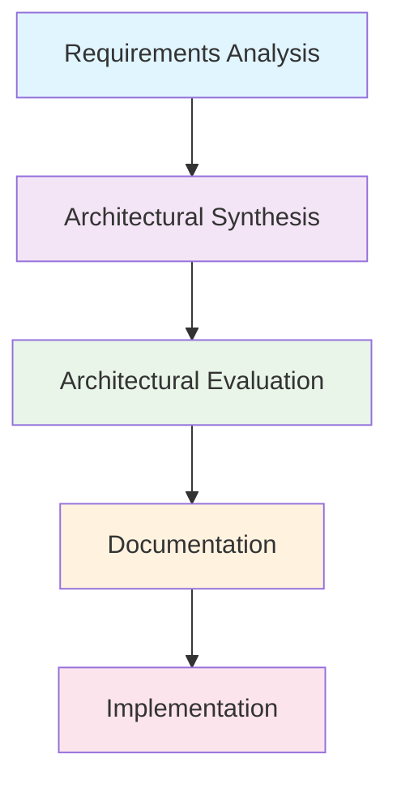
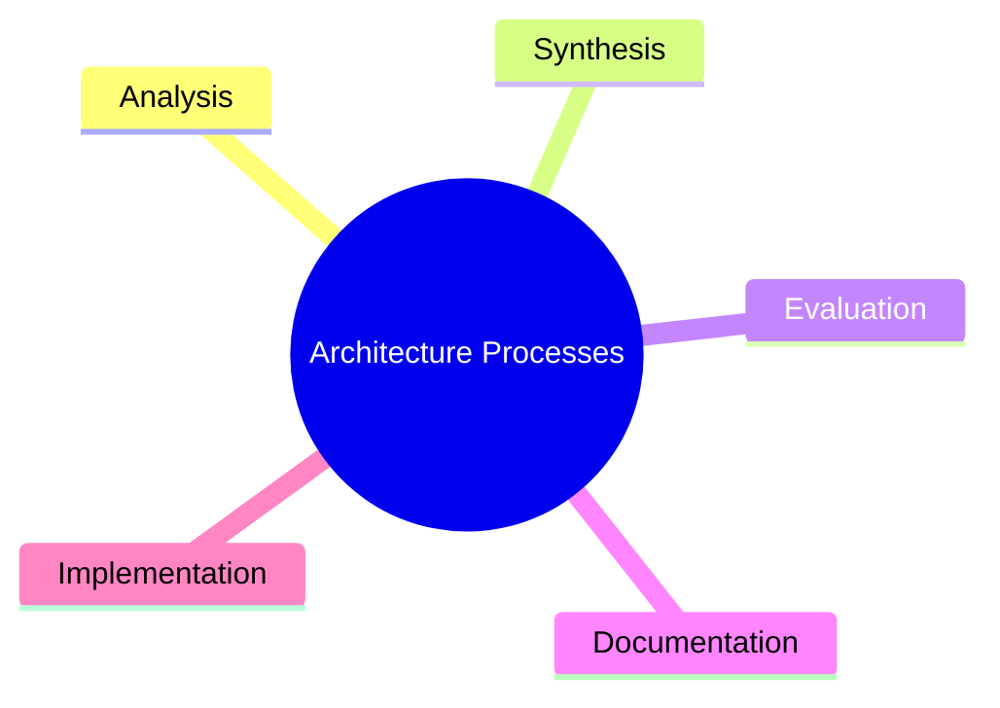

# Unit 4A: Software Architecture Processes

## 1. What are Architecture Processes?
Architecture processes are systematic approaches to designing, evaluating, and documenting software architectures. They ensure that the architecture meets requirements and quality attributes.

## 2. Key Steps in Architecture Processes

### 2.1 Architectural Analysis
- Understand and document requirements (functional and non-functional).
- Identify constraints and stakeholders.

### 2.2 Architectural Synthesis
- Develop architectural solutions that address requirements.
- Select architecture styles and patterns.

### 2.3 Architectural Evaluation
- Assess the architecture against requirements and quality attributes.
- Use scenarios, checklists, and reviews.

## 3. Architecture Process Flow Diagram

## 4. Visual Summary

---

**Next:** Architecture documentation will be in a separate file. 