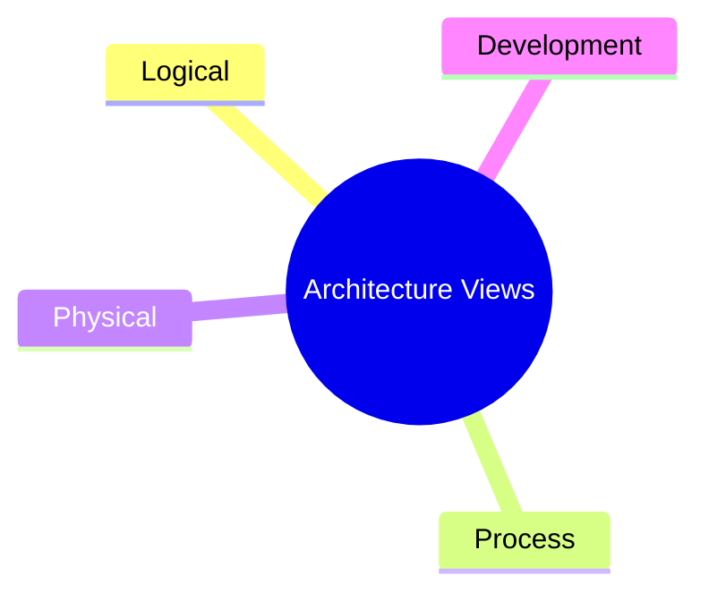

# Unit 4B: Software Architecture Documentation

## 1. What is Architecture Documentation?
Architecture documentation is the collection of artifacts that describe the structure, behavior, and key decisions of a software system. It helps communicate the architecture to stakeholders and guides development.

## 2. Types of Architecture Documentation

### 2.1 Views
- **Logical View:** Shows key abstractions (e.g., classes, objects).
- **Process View:** Shows runtime processes and interactions.
- **Physical View:** Shows hardware and deployment.
- **Development View:** Shows software module organization.

### 2.2 Diagrams
- Class diagrams, component diagrams, deployment diagrams, sequence diagrams, etc.

### 2.3 Specifications
- Written descriptions of components, interfaces, and interactions.

## 3. Best Practices
- Keep documentation clear and concise.
- Use standard notations (e.g., UML).
- Update documentation as the system evolves.
- Tailor documentation to the audience (developers, managers, users).

## 4. Example: Documentation for a Food Delivery App
- **Logical View:** Class diagram of Order, User, Delivery.
- **Process View:** Sequence diagram of order placement.
- **Physical View:** Deployment diagram of servers and databases.
- **Development View:** Component diagram of modules.

---

**Next:** Practice questions and solutions for Unit 4 will be in a separate file. 