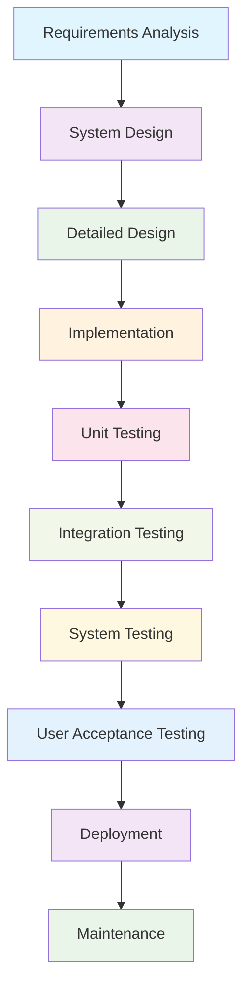
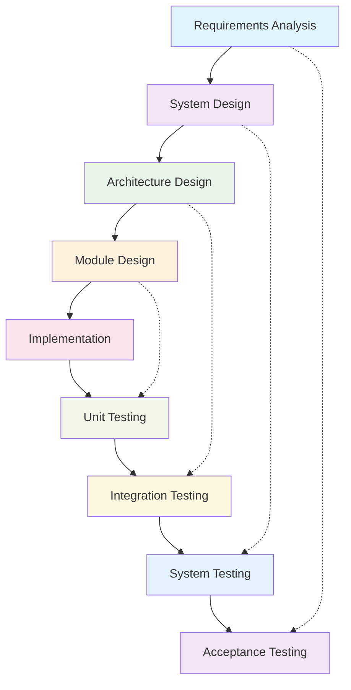

# Unit 5: Practice Questions and Solutions

## 1. Plan-Driven Design Fundamentals

### Q1: What is the main characteristic of plan-driven software design?
**Solution:**
- **Sequential Process**: The development process follows a linear, sequential approach
- **Comprehensive Planning**: All requirements are gathered and documented before design begins
- **Minimal Changes**: Changes are discouraged once the plan is established
- **Documentation Focus**: Heavy emphasis on documentation at each phase
- **Predictable Timeline**: Clear milestones and deliverables for each phase

---

### Q2: Compare plan-driven and agile approaches for different project types.
**Solution:**

| Project Type | Plan-Driven | Agile | Reasoning |
|--------------|-------------|-------|-----------|
| **Safety-Critical Systems** | ✅ Better | ❌ Risky | Regulatory compliance, thorough testing required |
| **Well-Understood Requirements** | ✅ Suitable | ✅ Suitable | Clear scope, predictable outcomes |
| **Rapidly Changing Requirements** | ❌ Inflexible | ✅ Better | Need for frequent adaptation |
| **Large Teams** | ✅ Structured | ⚠️ Challenging | Coordination and communication needs |
| **Fixed Budget/Time** | ✅ Predictable | ⚠️ Variable | Clear scope and deliverables |

---

### Q3: Draw the Waterfall model for a university management system.
**Solution:**

**Phase Details:**
- **Requirements Analysis**: Gather student, faculty, and administrative needs
- **System Design**: Design overall system architecture
- **Detailed Design**: Design individual modules and interfaces
- **Implementation**: Code the system components
- **Testing Phases**: Verify each component and integration
- **Deployment**: Install and configure the system
- **Maintenance**: Ongoing support and updates

---

## 2. V-Model Analysis

### Q4: What is the advantage of the V-Model over the Waterfall model?
**Solution:**
- **Early Validation**: Emphasizes verification and validation at each stage
- **Parallel Activities**: Testing activities are planned alongside development
- **Quality Focus**: Built-in quality checks at each phase
- **Risk Reduction**: Catches issues earlier in the development process
- **Clear Traceability**: Links requirements to test cases

---

### Q5: Draw and explain the V-Model for a restaurant management system.
**Solution:**

**Validation Activities:**
- **Requirements Analysis** ↔ **Acceptance Testing**: Verify system meets user needs
- **System Design** ↔ **System Testing**: Verify system integration
- **Architecture Design** ↔ **Integration Testing**: Verify component integration
- **Module Design** ↔ **Unit Testing**: Verify individual modules

---

### Q6: Explain the relationship between development and testing phases in the V-Model.
**Solution:**
- **Parallel Planning**: Each development phase has a corresponding testing phase
- **Validation Focus**: Testing validates that the development phase meets requirements
- **Early Detection**: Issues are identified as early as possible
- **Quality Assurance**: Built-in quality checks at each level
- **Traceability**: Clear links between requirements and test cases

---

## 3. Plan-Driven Design Applications

### Q7: When is plan-driven design most suitable?
**Solution:**
- **Stable Requirements**: When requirements are well-understood and unlikely to change
- **Regulatory Compliance**: When strict documentation and traceability are required
- **Safety-Critical Systems**: When thorough testing and validation are essential
- **Large Teams**: When coordination and communication need structure
- **Fixed Constraints**: When budget and timeline are strictly defined
- **Mature Domains**: When the problem domain is well-understood

---

### Q8: What are the key deliverables in each phase of the Waterfall model?
**Solution:**

| Phase | Key Deliverables |
|-------|------------------|
| **Requirements** | Requirements specification document, use cases, user stories |
| **Design** | System architecture document, database design, interface specifications |
| **Implementation** | Source code, unit tests, technical documentation |
| **Testing** | Test plans, test cases, test results, bug reports |
| **Deployment** | Installation guide, user manual, system configuration |
| **Maintenance** | Bug fixes, feature updates, system enhancements |

---

### Q9: Compare the Waterfall and V-Model approaches.
**Solution:**

| Aspect | Waterfall | V-Model |
|--------|-----------|---------|
| **Testing Approach** | Sequential testing after development | Parallel testing with development |
| **Quality Focus** | Testing at the end | Quality built into each phase |
| **Risk Management** | Late issue detection | Early issue detection |
| **Documentation** | Heavy documentation | Heavy documentation with validation |
| **Flexibility** | Low flexibility | Low flexibility |
| **Suitability** | Well-understood projects | Quality-critical projects |

---

## 4. Real-World Scenarios

### Q10: A bank wants to develop a new online banking system. Would you recommend plan-driven design?
**Solution:**
**Yes, plan-driven design would be appropriate for the following reasons:**

#### Why Plan-Driven is Suitable:
- **Regulatory Compliance**: Banking systems require strict documentation and audit trails
- **Security Requirements**: Thorough security analysis and testing needed
- **Stable Requirements**: Banking processes are well-defined and regulated
- **Risk Management**: High stakes require careful planning and validation
- **Large Scale**: Banking systems typically involve large teams and complex integration

#### Implementation Approach:
1. **Requirements Phase**: Detailed analysis of banking regulations and user needs
2. **Design Phase**: Security-focused architecture design
3. **Implementation Phase**: Strict coding standards and security practices
4. **Testing Phase**: Comprehensive security and compliance testing
5. **Deployment Phase**: Phased rollout with extensive monitoring

---

### Q11: Design a plan-driven approach for a university course registration system.
**Solution:**

#### Phase 1: Requirements Analysis (4 weeks)
- **Stakeholder Interviews**: Students, faculty, administrators
- **Requirements Documentation**: Functional and non-functional requirements
- **Use Case Development**: Registration, course management, grade processing
- **Constraints Analysis**: Budget, timeline, existing systems

#### Phase 2: System Design (6 weeks)
- **Architecture Design**: Layered architecture with web interface
- **Database Design**: Student, course, enrollment, grade tables
- **Interface Design**: User interface mockups and specifications
- **Security Design**: Authentication, authorization, data protection

#### Phase 3: Detailed Design (4 weeks)
- **Module Design**: Individual component specifications
- **API Design**: Service interface definitions
- **Integration Design**: Component interaction patterns
- **Test Planning**: Test strategy and test case design

#### Phase 4: Implementation (12 weeks)
- **Coding**: Development of system components
- **Unit Testing**: Individual component testing
- **Code Review**: Quality assurance and security review
- **Documentation**: Technical documentation and user guides

#### Phase 5: Testing (6 weeks)
- **Integration Testing**: Component integration testing
- **System Testing**: End-to-end system testing
- **Performance Testing**: Load and stress testing
- **User Acceptance Testing**: Stakeholder validation

#### Phase 6: Deployment (2 weeks)
- **Environment Setup**: Production environment configuration
- **Data Migration**: Existing data transfer and validation
- **User Training**: Staff and student training
- **Go-Live**: System activation and monitoring

---

## 5. Challenges and Mitigation

### Q12: What are the main challenges of plan-driven design and how to mitigate them?
**Solution:**

#### Challenges:
1. **Inflexibility**: Difficulty adapting to changing requirements
2. **Late Feedback**: Issues discovered late in the process
3. **Documentation Overhead**: Time-consuming documentation requirements
4. **Risk of Scope Creep**: Requirements may expand during development
5. **Team Coordination**: Complex coordination for large teams

#### Mitigation Strategies:
1. **Thorough Requirements Analysis**: Invest time in comprehensive requirements gathering
2. **Prototyping**: Build prototypes to validate requirements early
3. **Change Control Process**: Establish formal change management procedures
4. **Regular Reviews**: Conduct regular milestone reviews
5. **Risk Management**: Identify and plan for potential risks
6. **Stakeholder Involvement**: Maintain regular communication with stakeholders

---

### Q13: How would you handle requirement changes in a plan-driven project?
**Solution:**

#### Change Control Process:
1. **Change Request**: Formal documentation of the requested change
2. **Impact Analysis**: Assess impact on timeline, budget, and scope
3. **Stakeholder Review**: Review with all affected stakeholders
4. **Approval Process**: Formal approval from project sponsor
5. **Implementation Planning**: Plan how to implement the change
6. **Documentation Update**: Update all affected documentation
7. **Testing**: Ensure the change doesn't break existing functionality

#### Best Practices:
- **Freeze Requirements**: Establish a requirements freeze date
- **Change Board**: Form a change control board for major decisions
- **Version Control**: Maintain version control for all documents
- **Communication**: Communicate changes to all team members
- **Training**: Update training materials for affected users

---

## 6. Advanced Questions

### Q14: Compare plan-driven design with other software development methodologies.
**Solution:**

| Methodology | Flexibility | Documentation | Risk Management | Team Size | Project Type |
|-------------|-------------|---------------|-----------------|-----------|--------------|
| **Plan-Driven** | Low | Heavy | Late | Large | Stable requirements |
| **Agile** | High | Light | Continuous | Small-Medium | Changing requirements |
| **Spiral** | Medium | Medium | Iterative | Medium | High-risk projects |
| **RAD** | High | Light | Continuous | Small | Prototype-focused |
| **Incremental** | Medium | Medium | Iterative | Medium | Large systems |

---

### Q15: What metrics would you use to measure the success of a plan-driven project?
**Solution:**

#### Schedule Metrics:
- **On-time Delivery**: Percentage of milestones met on schedule
- **Schedule Variance**: Difference between planned and actual completion dates
- **Phase Duration**: Time spent in each development phase

#### Quality Metrics:
- **Defect Density**: Number of defects per lines of code
- **Test Coverage**: Percentage of code covered by tests
- **Requirements Traceability**: Percentage of requirements with test cases

#### Cost Metrics:
- **Budget Variance**: Difference between planned and actual costs
- **Cost per Phase**: Cost breakdown by development phase
- **Return on Investment**: Value delivered vs. cost invested

#### Stakeholder Satisfaction:
- **User Acceptance**: Stakeholder satisfaction with delivered system
- **Requirements Fulfillment**: Percentage of requirements successfully implemented
- **Documentation Quality**: Completeness and accuracy of documentation 