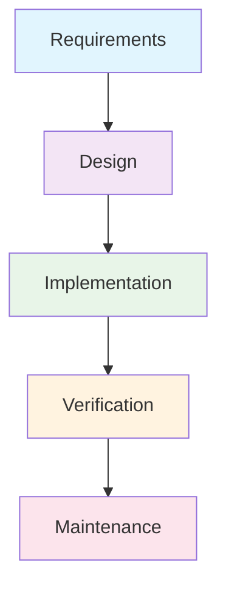
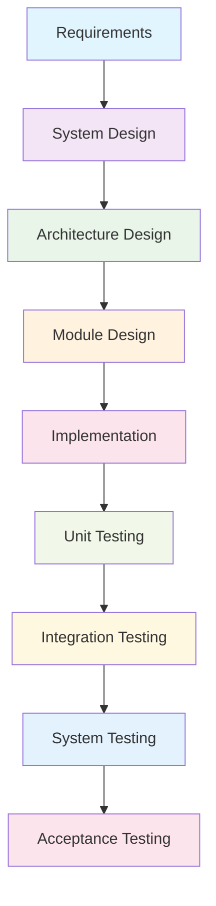
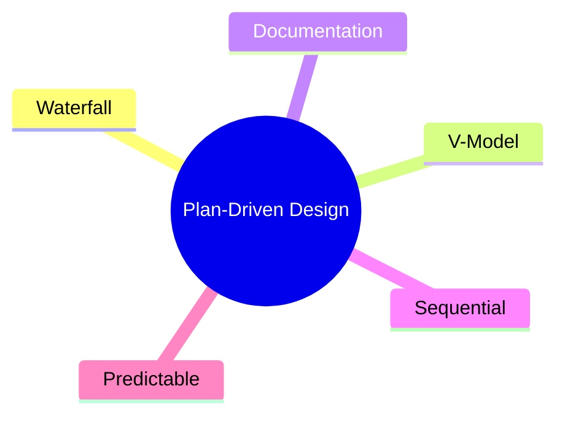

# Unit 5A: Plan-Driven Software Design

## 1. What is Plan-Driven Software Design?
Plan-driven design is a traditional approach where the software development process is carefully planned and documented before implementation begins. Changes are minimized once the plan is set.

## 2. Key Models

### 2.1 Waterfall Model
- Sequential phases: requirements, design, implementation, verification, maintenance.
- Each phase must be completed before the next begins.

### 2.2 V-Model
- Extension of Waterfall; emphasizes verification and validation at each stage.

## 3. Advantages
- Well-defined stages and deliverables
- Easy to manage and track progress
- Good for projects with stable requirements

## 4. Disadvantages
- Inflexible to changes after planning
- Late discovery of issues
- Not suitable for projects with evolving requirements

## 5. Visual Summary

---

**Next:** Practice questions and solutions for Unit 5 will be in a separate file. 