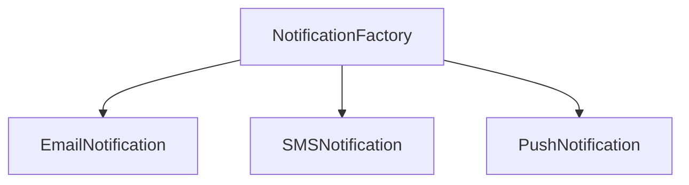
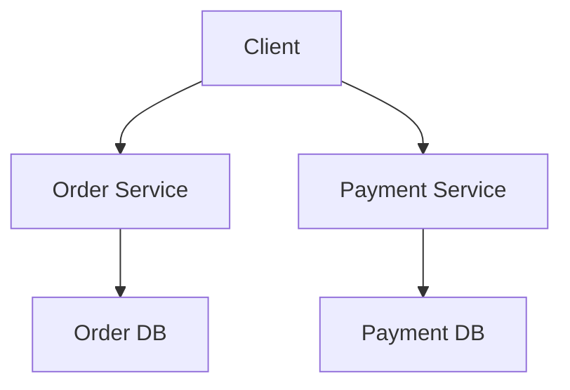

# Unit 6: Practice Questions and Solutions

## 1. Design Patterns

### Q1: What is the purpose of the Singleton pattern in a university management system?
**Solution:**
- Ensures only one instance of a class (e.g., configuration manager) exists, providing a global point of access.

---

### Q2: Draw a Factory pattern for creating different types of notifications in a food delivery app.
**Solution:**

---

## 2. Components and Services

### Q3: What is the advantage of component-based design in a restaurant management system?
**Solution:**
- Components can be developed, tested, and replaced independently, improving maintainability and scalability.

---

### Q4: Draw a service-based design for a food delivery platform.
**Solution:**
