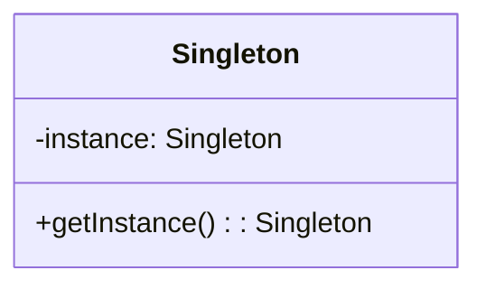
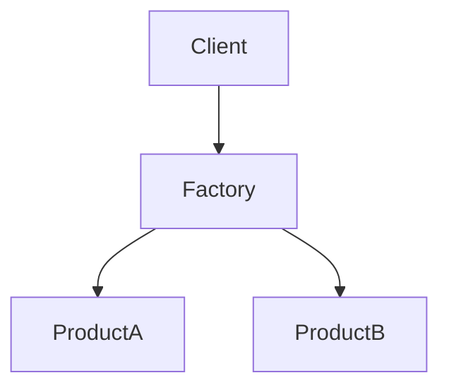
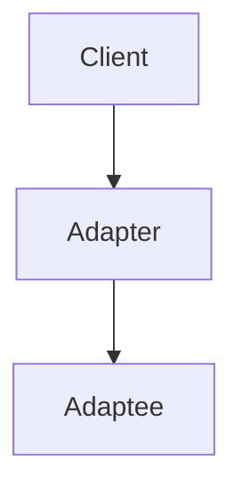
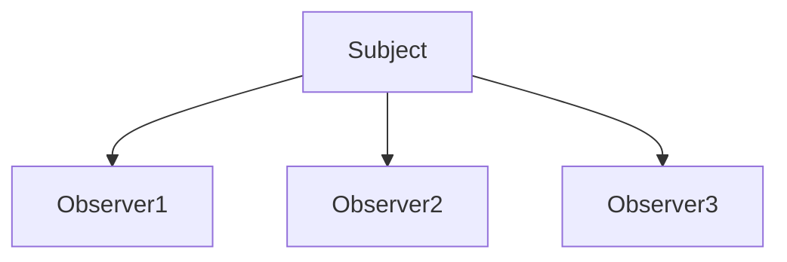
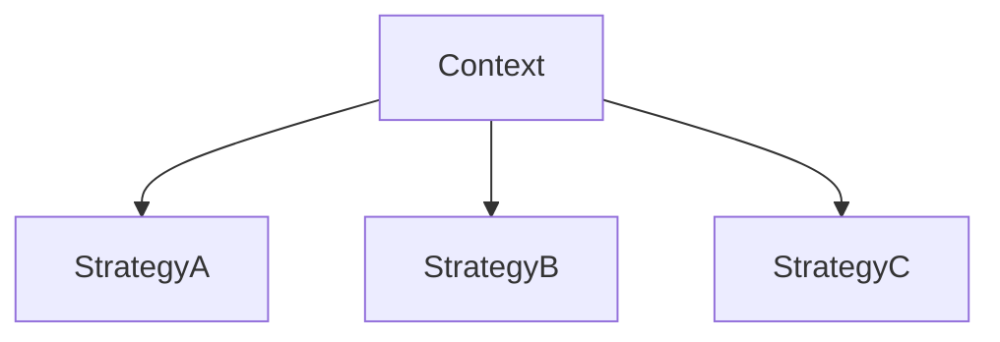
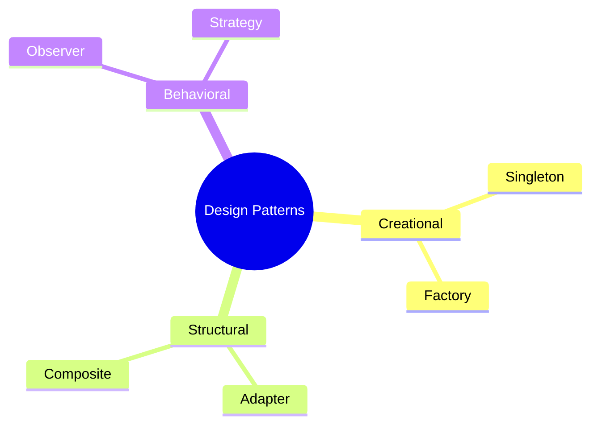

# Unit 6A: Designing with Patterns

## 1. What are Design Patterns?
Design patterns are general, reusable solutions to common problems in software design. They provide templates for structuring code and interactions between components.

## 2. Types of Design Patterns

### 2.1 Creational Patterns
- Deal with object creation mechanisms.
- Examples: Singleton, Factory, Abstract Factory, Builder, Prototype.

#### Singleton Pattern
- Ensures a class has only one instance and provides a global point of access.

#### Factory Pattern
- Defines an interface for creating objects, but lets subclasses decide which class to instantiate.

---

### 2.2 Structural Patterns
- Deal with object composition and relationships.
- Examples: Adapter, Composite, Proxy, Facade, Decorator.

#### Adapter Pattern
- Allows incompatible interfaces to work together.

---

### 2.3 Behavioral Patterns
- Deal with object interaction and responsibility.
- Examples: Observer, Strategy, Command, State, Template Method.

#### Observer Pattern
- Defines a one-to-many dependency so that when one object changes state, all its dependents are notified.

#### Strategy Pattern
- Defines a family of algorithms, encapsulates each one, and makes them interchangeable.

## 3. Visual Summary

---

**Next:** Components and services will be in a separate file. 