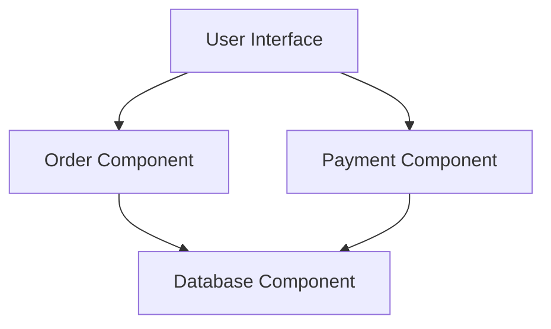
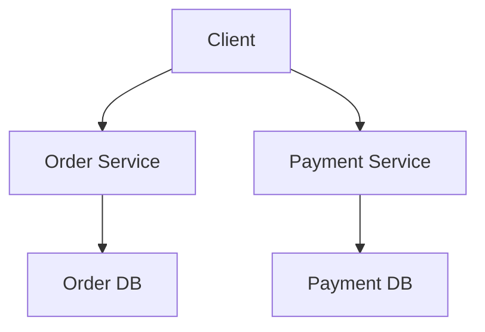
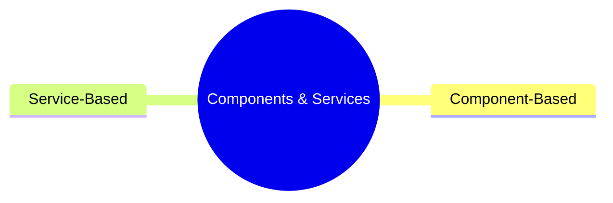

# Unit 6B: Components and Services

## 1. What are Components?
Components are modular, replaceable, and reusable parts of a system that encapsulate implementation and expose interfaces.

### Key Features
- Encapsulation
- Reusability
- Replaceability
- Independence

## 2. Component-Based Design
- Systems are built by assembling components.
- Components interact via well-defined interfaces.

## 3. What are Services?
Services are self-contained units of functionality that can be accessed remotely and acted upon independently.

### Key Features
- Loose coupling
- Discoverability
- Reusability
- Composability

## 4. Service-Based Design
- Systems are built by composing services, often over a network.

## 5. Visual Summary

---

**Next:** Practice questions and solutions for Unit 6 will be in a separate file. 